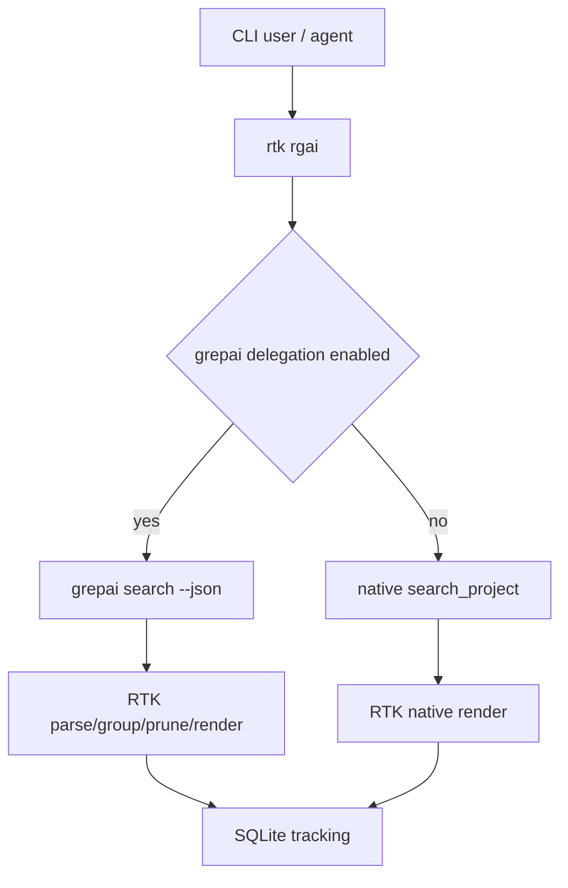

# Performance & Scalability Report

**Date**: 2026-02-16 23:54:21
**Current Users**: 3 (локальная разработка / агент)
**Target Scale**: 100 и 1000 активных пользователей CLI

## Architecture Scalability Flow

## Database Analysis

### Schema Review

- Трекинг сохраняет `original_cmd`, `rtk_cmd`, вход/выход токены, `% savings`.
- После изменения `run()` в grepai-пути в трекер корректно попадают **разные** `input` и `output`.

### Query Performance

| Query Pattern | Current Impact | At 1000 Users | Recommendation |
| ------------- | -------------- | ------------- | -------------- |
| Insert tracking row per command | Низкий | Средний (I/O contention) | Батчить записи или async writer queue |
| `gain --history` analytics reads | Низкий | Средний | Индексы по времени/команде, пагинация |

### Indexing Strategy

- Для масштабирования 1000+ пользователей полезны индексы по `timestamp` и `rtk_cmd` (если их еще нет).

## Frontend Performance

### Bundle Analysis

- N/A (CLI-only feature).

### Rendering Performance

- Рендер в памяти линейный по числу хитов (`O(n)` + сортировки `O(n log n)` по файлам/чанкам).
- При текущих лимитах (`-n` обычно <= 10) это дёшево.

### State Management

- Stateful-компонентов нет; pipeline stateless на один запрос.

## Backend Performance

### Request Handling

- Основная стоимость в subprocess `grepai search` и JSON parse.
- Локальные замеры показали стабильную компрессию в text/compact режимах.

### Resource Utilization

- CPU: низкий/умеренный (serde + сортировки).
- RAM: низкий при текущих лимитах; потенциально растет при больших `-n` и длинном `content`.

### Caching Strategy

- Кэширования результатов запроса нет.
- На росте нагрузки можно добавить cache по `(query,path,max,compact,json)` на короткий TTL.

## Empirical Efficiency Check

Замерено на этом репозитории (raw = `grepai search --json`, output = `rtk rgai`):

| Query | Raw bytes | Text bytes | Compact bytes | JSON bytes |
| ----- | --------- | ---------- | ------------- | ---------- |
| `token savings` | 17981 | 1454 (8%) | 825 (5%) | 28% |
| `auth refresh token` | 8149 | 2150 (26%) | 1163 (14%) | 88% |
| `sqlite tracker` | 21420 | 659 (3%) | 419 (2%) | 10% |
| `grepai delegation` | 11996 | 3027 (25%) | 1371 (11%) | 61% |

Вывод: идея отлично работает для text/compact. JSON-режим по части запросов даёт существенно меньшую экономию (до ~12% savings).

## Scalability Projections

| Metric | 3 Users | 100 Users | 1000 Users | Mitigation |
| ------ | ------- | --------- | ---------- | ---------- |
| grepai subprocess latency | Незаметно | Умеренно | Существенно | warm pool / daemonized integration |
| JSON parse/render CPU | Низко | Низко | Средне | ограничить `-n`, early-prune |
| SQLite tracking contention | Низко | Низко/средне | Средне/высоко | async writes, WAL tuning |
| Token savings consistency | Высокая (text/compact) | Высокая | Средняя | schema parity + stricter fallback |

## Risk Matrix

| Risk | Probability  | Impact       | Priority | Mitigation |
| ---- | ------------ | ------------ | -------- | ---------- |
| Смещение line numbers (+2) | High | High | P1 | исключить служебные строки grepai из line offset |
| JSON schema mismatch vs builtin | High | Medium/High | P1 | унифицировать JSON-ключи и структуру |
| Non-JSON fallback при `--json` | Medium | Medium | P2 | возвращать всегда валидный JSON |
| Нестабильная JSON-компрессия | Medium | Medium | P2 | сокращать поля/snippets в json-mode |

## Action Items

### Immediate (P1)

1. Исправить расчет line number в `parse_grepai_content()`.
2. Выровнять JSON-контракт grepai-ветки с builtin.

### Short-term (P2)

1. Изменить fallback parse error для `--json` на контрактно-валидный JSON.
2. Добавить интеграционные тесты на schema parity и line-number correctness.

### Long-term (P3)

1. Оптимизировать json-mode (optional compact-json профиль).
2. Рассмотреть кэширование и/или daemon режим для grepai при высокой частоте запросов.
