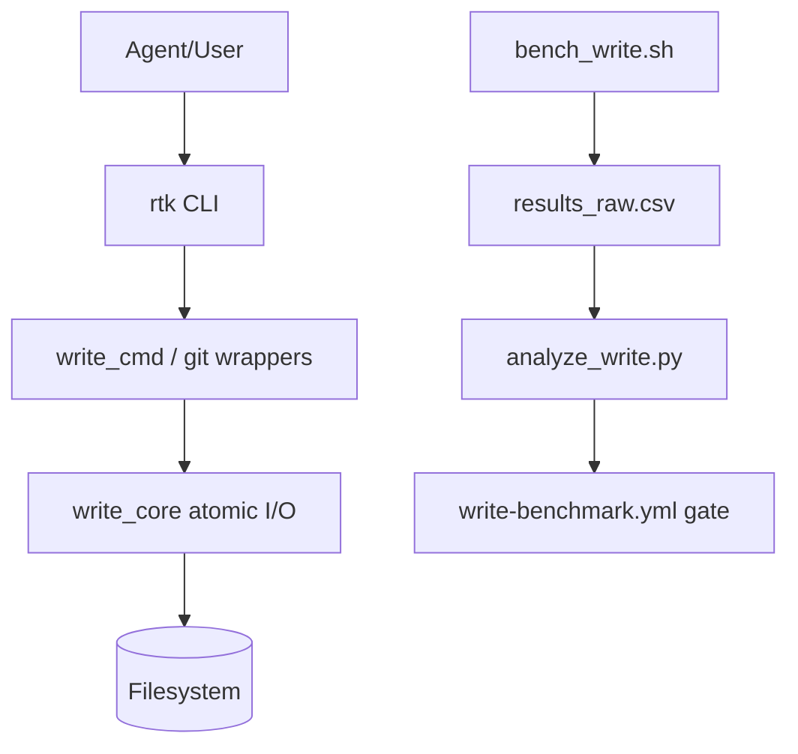

# Performance & Scalability Report

**Date**: 2026-02-17 13:47:31
**Current Users**: 3 (локальная команда/агенты)
**Target Scale**: 1000 (много параллельных CI + локальных запусков)

## Architecture Scalability Flow

## Database Analysis

### Schema Review

- Для write-improvements путь не зависит от DB hot-path.
- Риск масштабирования DB для этой фичи минимален; основной bottleneck в filesystem I/O и процесс-спавне.

### Query Performance

| Query Pattern | Current Impact | At 1000 Users | Recommendation |
| ------------- | -------------- | ------------- | -------------- |
| SQLite tracking writes | Low | Medium | Батчировать/ограничивать tracking для benchmark режимов, если появится contention. |

### Indexing Strategy

- Не применимо к основному write-path.

## Frontend Performance

### Bundle Analysis

- Не применимо (CLI-проект).

### Rendering Performance

- Не применимо.

### State Management

- Не применимо.

## Backend Performance

### Request Handling

- Эквивалент request-handling здесь — выполнение CLI команд + файловые операции.
- Durable path показывает ожидаемую стоимость fsync; fast path существенно быстрее для small/medium writes.

### Resource Utilization

- CPU: low/medium, ограничение в syscall/fsync latency.
- Disk I/O: основная стоимость на durable path.
- Memory: низкая; данные пишутся эффективно, но `write set` оперирует целиком файлом в памяти.

### Caching Strategy

- Идемпотентный skip эффективно выступает как content-aware cache layer для unchanged writes.

## Scalability Projections

| Metric | 3 Users | 100 Users | 1000 Users | Mitigation |
| ------ | ------- | --------- | ---------- | ---------- |
| Durable write latency (small) | Stable | Stable/Minor jitter | Noticeable jitter under IO pressure | Ограничить частоту durable write, вводить batching где возможно. |
| Hook rewrite determinism | Stable | Stable | Stable | Оставлять mutating guard default-off до полного parity gate. |
| Benchmark reproducibility | High | Medium | Medium | Выносить long-run benches в nightly + хранить trend history. |
| CI gate stability | High | Medium | Medium/Flaky risk | Фиксировать runner class и/или допуск по variance при необходимости. |

## Risk Matrix

| Risk | Probability  | Impact       | Priority | Mitigation |
| ---- | ------------ | ------------ | -------- | ---------- |
| Потеря форматирования/комментариев в `write set` | High | High | P1 | Перейти на non-destructive TOML/JSON editing (AST/edit-based). |
| Неполное доказательство parity для mutating rewrite | Medium | High | P1 | Реализовать parity matrix benchmarks и side-effect diff checks. |
| Отсутствие fault-injection crash validation | Medium | High | P1 | Добавить crash/fault bench suite и CI отчёт corruption=0 gate. |
| Flaky microbench thresholds на shared runner | Medium | Medium | P2 | Накопление baseline history, при необходимости robust percentile policy. |
| Warning-noise в CI снижает обнаружение реальных проблем | High | Medium | P2 | Постепенная очистка dead_code/unused, выделение deny-list для новых warning. |

## Action Items

### Immediate (P1)

1. Доработать `write set` до non-destructive изменения конфигов.
2. Добавить parity benchmark suite для mutating git wrappers (exit + side-effects + stderr signals).
3. Реализовать fault-injection durability benchmarks (before/after rename failure windows).

### Short-term (P2)

1. Добавить трендовый отчёт по benchmark history (сравнение с предыдущим baseline).
2. Снизить warning-noise в релевантных модулях write/hook/git.

### Long-term (P3)

1. Добавить batch write режим с группировкой fsync(parent dir) для multi-file сценариев.
2. Подготовить controlled rollout-процедуру для `RTK_REWRITE_MUTATING=1` только после полного parity gate.
