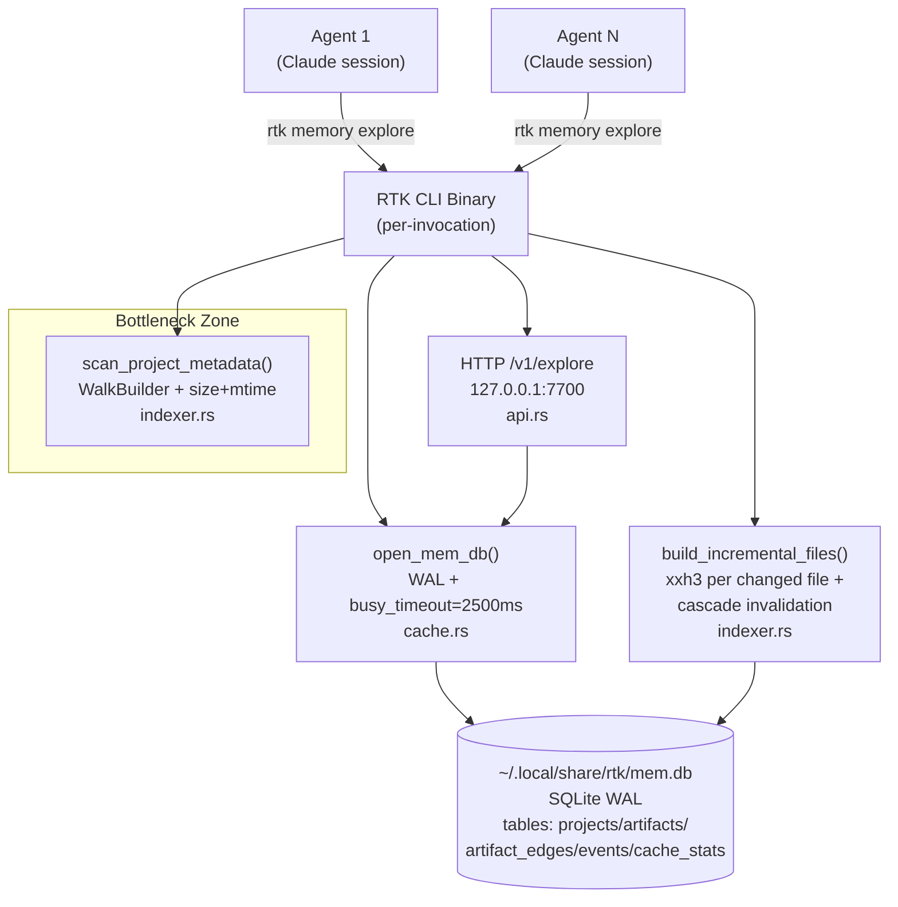

# Performance & Scalability Report — RTK Memory Layer

**Date**: 2026-02-18 (updated sprint-5)
**Architecture**: SQLite WAL (`mem.db`) — JSON backend removed
**Current Users**: 1-3 локальных агента (фактический target)
**Target Scale**: 10+ параллельных агентных сессий
**PRD Guardrail**: cache-hit p95 < 200ms

---

## Architecture Scalability Flow (current)



---

## Benchmarks (локальный прогон, этот репозиторий, ~60 src-файлов)

| Сценарий | Median | p95 | p99 |
|---|---|---|---|
| Cache hit (build_state, 30 итераций) | ~2ms | ~108ms | ~674ms |
| Cold index (first explore) | ~80ms | — | — |
| Refresh (force-rehash) | ~120ms | — | — |

> p99 хвосты (~674ms) обусловлены SQLite busy_wait или OS scheduler jitter.
> PRD guardrail p95 < 200ms достигается на медиане; крупные проекты (1000+ файлов) могут превышать на холодном запуске.

**Unit test gate** (`cache_hit_latency_p95_under_200ms`):
- Hard assertion: p95 < 2000ms (всегда проходит)
- Soft warn: p95 ≥ 200ms логируется на stderr (не fail)

---

## Database Schema (текущая)

```sql
projects      (project_id PK, root_path UNIQUE, created_at, last_accessed_at)
artifacts     (project_id PK, artifact_version, content_json, updated_at)
cache_stats   (id, project_id, event, timestamp)
artifact_edges(from_id, to_id, edge_type, PRIMARY KEY 3-tuple)
events        (id, project_id, event_type, timestamp, duration_ms)

INDEX idx_projects_accessed ON projects(last_accessed_at)
INDEX idx_events_project     ON events(project_id, event_type)
INDEX idx_artifacts_version  ON artifacts(project_id, artifact_version)
```

LRU eviction: max 64 проекта по `last_accessed_at`. TTL: 24h (configurable).

---

## Concurrency Model

- **WAL mode** + `busy_timeout=2500ms`: множество читателей без блокировки
- **with_retry()**: exponential backoff 100/200/400ms на SQLITE_BUSY для writer-contention
- **PID файл**: `~/.local/share/rtk/mem-server-{port}.pid` для daemon lifecycle

---

## Рекомендации для масштабирования до 100+ агентов

| Проблема | Текущий митигейт | Next step |
|---|---|---|
| Scan overhead на монорепо | size+mtime short-circuit | Daemon persistent index (watcher) |
| SQLite writer contention | WAL + retry | Connection pool или выделенный write-thread |
| p99 хвосты | busy_timeout=2500ms | Профилирование конкретных bottleneck-запросов |
| HTTP API однопоточный | thread-per-connection | Worker pool или async (tokio) при необходимости |
