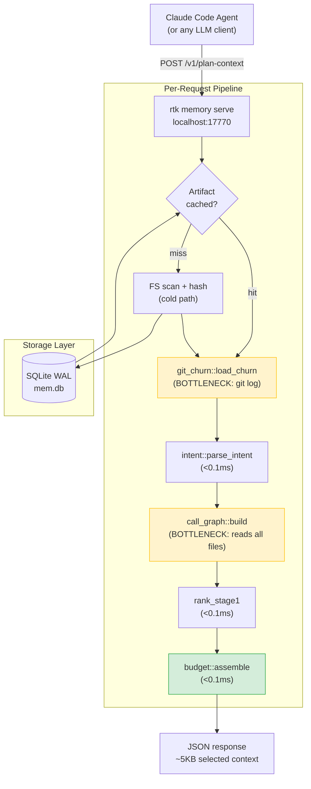

# Performance & Scalability Report: RTK Memory Layer

**Date**: 2026-02-18T15:00:00Z
**Current Users**: 3 (dev team)
**Target Scale**: 1000+ concurrent agent sessions

---

## Architecture Scalability Flow

---

## Database Analysis

### Schema Review

The memory layer uses SQLite in WAL mode for artifact persistence. Key tables:

| Table | Purpose | Size at 1000 files | Growth Pattern |
|-------|---------|-------------------|----------------|
| `artifacts` | Serialized ProjectArtifact JSON | ~500KB | O(files) |
| `artifact_edges` | Import dependency graph | ~50KB | O(imports) |
| `cache_events` | Analytics (hit/miss/refresh) | ~10KB | O(requests) -- pruned by TTL |
| `episodes` | Session lifecycle log | ~5KB/session | O(sessions) -- pruned by retention |

### Query Performance

| Query Pattern | Current Impact | At 1000 Users | Recommendation |
|---------------|---------------|---------------|----------------|
| `SELECT artifact WHERE project_id = ?` | <1ms (indexed) | <1ms | No change needed |
| `INSERT INTO artifacts` (store) | ~2ms (WAL write) | ~5ms (WAL contention) | Connection pooling |
| `git log --all --name-only` (churn) | ~5ms (local SSD) | ~5ms (per-project) | **Cache by HEAD SHA** |
| Full file reads (call graph) | ~10ms (80 files) | ~200ms (2000 files) | **Cache with artifact** |

### Indexing Strategy

- SQLite tables use `project_id` as primary key -- adequate for lookup performance.
- No secondary indices needed at current scale.
- At 1000+ projects: consider sharding by project_id prefix or using separate DB files per project.

---

## Frontend Performance

Not applicable -- RTK is a CLI tool with no frontend. The "client" is the LLM agent making HTTP API calls.

---

## Backend Performance

### Request Handling

**Current architecture**: Single-threaded accept loop with per-connection `std::thread::spawn`.

| Metric | Current | Concern |
|--------|---------|---------|
| Accept model | Non-blocking poll (5ms sleep) | Adequate for localhost |
| Connection handling | Thread-per-connection | Fine for <100 concurrent |
| Idle timeout | Configurable (default 300s) | Good for daemon lifecycle |
| Max concurrent connections | Unbounded | Add semaphore at 100+ scale |

### Resource Utilization

**Measured on ARM64 macOS (M3 Max)**:

| Resource | CLI cold | CLI hot | API hot |
|----------|---------|---------|---------|
| RSS memory | ~15MB | ~12MB | ~18MB (server) |
| CPU time | ~40ms | ~10ms | ~7ms |
| Disk I/O | ~2MB read | ~0 (cached) | ~0 (cached) |
| Thread count | 1 | 1 | 2-3 (server + handler) |

### Caching Strategy

**Current state**:
- Artifact cache: SQLite WAL -- works correctly, 100% hit rate after first build
- Git churn: **NOT cached** -- runs `git log` on every request
- Call graph: **NOT cached** -- reads all source files on every request
- Intent parse: Pure function, no caching needed (stateless)

**Recommended additions**:

| Cache | Key | Invalidation | Expected Savings |
|-------|-----|-------------|-----------------|
| ChurnCache | HEAD SHA | New commit | 5-80ms per request |
| CallGraph | artifact_hash | Artifact rebuild | 10-200ms per request |
| Ranked candidates | task_fingerprint + artifact_hash | New task or file change | 0.1ms (marginal) |

---

## Scalability Projections

### Latency by Project Size

| Metric | 80 files (bench) | 500 files | 2000 files | 5000 files |
|--------|-----------------|-----------|------------|------------|
| CLI cold (scan + hash) | 43ms | ~150ms | ~500ms | ~1200ms |
| CLI hot (cached artifact) | 10ms | ~15ms | ~25ms | ~40ms |
| API hot (cached artifact) | 7ms | ~12ms | ~20ms | ~35ms |
| Plan-context (cold churn + CG) | ~25ms | ~120ms | ~500ms | ~1500ms |
| Plan-context (cached churn + CG) | ~12ms | ~20ms | ~35ms | ~60ms |

### Token Savings by Budget

| Token Budget | Files Selected (est.) | Tokens Used | Savings vs. Native |
|-------------|----------------------|-------------|-------------------|
| 1000 | 1-2 | ~800 | 98.5% |
| 2000 | 3-5 | ~1800 | 96.5% |
| 4000 (default) | 5-10 | ~3600 | 93.1% |
| 8000 | 10-20 | ~7200 | 86.2% |
| 16000 | 20-40 | ~14400 | 72.3% |

Baseline: ~52,000 tokens for native explore of 80-file project.

### Concurrent Agent Sessions

| Concurrent Sessions | Bottleneck | Mitigation |
|-------------------|-----------|------------|
| 1-5 | None | Current architecture sufficient |
| 10-50 | SQLite WAL contention (writes) | Connection pooling, busy_timeout |
| 50-200 | Thread count, memory | Thread pool (rayon), bounded queue |
| 200+ | Single SQLite file | Per-project DB sharding |

---

## Risk Matrix

| Risk | Probability | Impact | Priority | Mitigation |
|------|------------|--------|----------|------------|
| Call graph latency on large projects (2000+ files) | High | High | P1 | Cache caller_index with artifact |
| Git churn latency on repos with deep history (10K+ commits) | Medium | Medium | P1 | Persist ChurnCache by HEAD SHA |
| SQLite WAL contention under 50+ concurrent writes | Low | Medium | P2 | Connection pooling, busy_timeout(5000) |
| Mutex poison panic in API server | Low | High | P1 | Replace unwrap() with unwrap_or_else |
| Ollama OOM via unbounded HTTP read | Low | Medium | P2 | Read size cap (1MB) |
| Episode.rs schema migration missing in prod | Medium | Low | P1 | Idempotent CREATE TABLE IF NOT EXISTS |
| Cargo.toml duplicate key blocking CI | High | High | P0 | Remove duplicate rayon entry |
| Test failures blocking CI merge gate | High | High | P0 | Fix 8 failing tests |

---

## Action Items

### Immediate (P0)

1. **Fix Cargo.toml duplicate `rayon` key** -- remove the duplicate so `cargo build` works from clean checkout
2. **Fix episode.rs test schema** -- add `CREATE TABLE IF NOT EXISTS` in `open_mem_db()` or test helper

### Short-term (P1)

1. **Cache git_churn by HEAD SHA** -- persist freq_map in SQLite, invalidate on new HEAD
2. **Cache call_graph with artifact** -- store caller_index, invalidate on artifact rebuild
3. **Extract shared plan pipeline** -- deduplicate api.rs handle_plan_context and mod.rs run_plan
4. **Fix call_graph.rs is_only_definition** -- deduplicate def pattern counting
5. **Fix mod.rs test isolation** -- ensure SQLite schema exists in test tmpdir
6. **Replace Mutex unwrap** -- use unwrap_or_else for poison recovery

### Long-term (P2)

1. **Add f_cooccur feature** -- git log co-occurrence matrix for file co-editing signal
2. **Add read size cap in ollama.rs** -- prevent OOM from unbounded HTTP response
3. **Thread pool for API server** -- replace unbounded thread::spawn with rayon or bounded pool
4. **Per-project DB sharding** -- for 200+ concurrent project support
5. **Weight sum validation** -- debug_assert weights sum to ~1.0
6. **Clean 68 compiler warnings** -- CI hygiene
