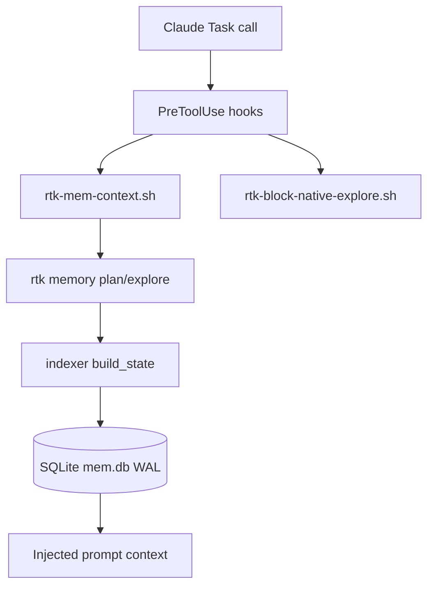

# Performance & Scalability Report

**Date**: 2026-02-19 11:52:00
**Current Users**: 3
**Target Scale**: 1000

## Architecture Scalability Flow

## Database Analysis

### Schema Review

- SQLite WAL + `busy_timeout=2500` и retry дают хороший baseline для multi-session.
- Схема включает `projects/artifacts/cache_stats/artifact_edges/events/episodes/...` и подходит для shared cache.
- Главный bottleneck не в БД, а в orchestration hooks и несогласованной установке policy/context hooks.

### Query Performance

| Query Pattern | Current Impact | At 1000 Users | Recommendation |
| ------------- | -------------- | ------------- | -------------- |
| `load_artifact` + десериализация JSON | Низкий при cache-hit | Средний (рост contention на WAL writer) | Перейти на один daemon-путь (`memory serve`) для горячих сценариев Task hooks |
| `store_artifact` при miss/dirty | Средний | Высокий при burst изменениях | Ввести write-coalescing (debounce) и предпочтительно фоновый `watch` процесс |
| Hook patch/read settings.json | Низкий, редкий | Низкий | Не критично для runtime; важнее consistency логики установки |

### Indexing Strategy

- Incremental hashing + cascade invalidation корректны для medium-size репозиториев.
- Для 1000 пользователей критичен не CPU индексации, а доля лишних re-runs из-за policy gaps (не все subagents получают memory upfront).

## Frontend Performance

- N/A (CLI toolchain).

## Backend Performance

### Request Handling

- Hook path добавляет синхронный вызов `rtk memory plan/explore` на Task-события.
- При полном покрытии всех subagents это станет постоянным hot-path и должен быть стабилен/детерминирован.

### Resource Utilization

- DB footprint умеренный; JSON artifact в `content_json` удобен, но не оптимален для selective reads.
- При 1000 users и множестве репозиториев возрастает I/O и lock contention при rebuild bursts.

### Caching Strategy

- Стратегия strong (TTL + dirty detection + shared DB).
- Основной риск: часть subagent-сценариев проходит без mem-context из-за partial hook policy.

## Scalability Projections

| Metric | 3 Users | 100 Users | 1000 Users | Mitigation |
| ------ | ------- | --------- | ---------- | ---------- |
| Hook consistency (init vs memory install) | Терпимо вручную | Начинает ломать onboarding | Массовые неконсистентные setup | Единый installer-пайплайн и единая проверка `init --show` |
| Task subagent memory coverage | Частично работает | Пропуски заметны | Систематический policy drift | Default-on для всех `Task` subagent types |
| SQLite write contention | Низкий | Средний | Средне-высокий в пиках | Daemonized API + coalesced writes + watch-first strategy |
| Token efficiency stability | Высокая | Средняя | Средняя/низкая при coverage gaps | Enforcement + тесты на все subagent_type |

## Risk Matrix

| Risk | Probability  | Impact       | Priority | Mitigation |
| ---- | ------------ | ------------ | -------- | ---------- |
| `rtk memory install-hook` ставит не все обещанные hooks | High | High | P1 | Объединить установку policy+context в одной функции |
| Policy только для `Explore`, не для всех Task subagents | High | High | P1 | Перейти на universal Task policy с allow-list исключений |
| Uninstall/cleanup оставляет `rtk-mem-context` | Medium | Medium | P2 | Добавить mem-context во все remove/check списки |
| Документация рассинхронизирована с кодом | High | Medium | P2 | Обновить `MEMORY_LAYER.md`, `INSTALL.md`, `README.md`, `RTK.md` template |
| Runtime overhead при full Task coverage | Medium | Medium | P3 | Предпочесть `memory serve` и планировать hook path на API вызовы |

## Action Items

### Immediate (P1)

1. Сделать единый installer для Task hooks: `rtk-mem-context.sh` + `rtk-block-native-explore.sh` в одном потоке.
2. Обеспечить policy на все `Task` subagent types (требование «обязательно для всех субагентов»).
3. Синхронизировать CLI help/README/MEMORY_LAYER контракты с реальным поведением.

### Short-term (P2)

1. Расширить uninstall/cleanup/show-checks на `rtk-mem-context.sh`.
2. Добавить интеграционные тесты setup matrix: `init-only`, `memory-only`, `init+memory`, `uninstall`.
3. Добавить regression-тест для новых/неизвестных `subagent_type`.

### Long-term (P3)

1. Перевести hook runtime на `memory serve` API для стабильного latency под нагрузкой.
2. Ввести метрики по hook-hit-rate и memory-context-injection-rate для observability.
