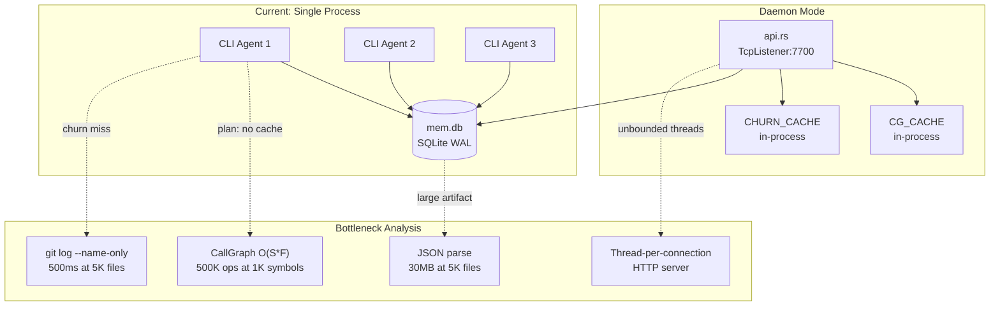

# Performance & Scalability Report: RTK Memory Layer

**Date**: 2026-02-19T12:00:00
**Reviewer**: IT Architect Agent (Claude Opus 4.6)
**Current Scale**: Single developer, ~67 modules (~15,000 LOC Rust)
**Target Scale**: Multi-agent, 500-5,000 file projects

---

## Architecture Scalability Flow



---

## Database Analysis

### Schema Review

The memory layer uses 8 tables across 2 functional groups:

**Core tables** (cache pipeline):
- `projects` -- LRU metadata, indexed by `last_accessed_at`
- `artifacts` -- JSON blob storage, indexed by `(project_id, artifact_version)`
- `artifact_edges` -- import graph for cascade invalidation
- `cache_stats` -- analytics (hit/miss/rebuild events)
- `events` -- lifecycle events with duration_ms

**Episode tables** (unused):
- `episodes` -- session lifecycle
- `episode_events` -- per-session events
- `causal_links` -- issue/commit associations

**Assessment**: Core schema is clean and well-indexed. Episode tables add schema bloat (3 extra CREATE TABLE + 2 indexes on every `open_mem_db()` call) for functionality that is never used in practice.

### Query Performance

| Query Pattern | Current Impact | At 5,000 Files | Recommendation |
|---|---|---|---|
| `SELECT content_json FROM artifacts WHERE project_id = ?` | <1ms (single row) | ~5ms (30MB JSON parse) | Consider binary format (bincode/MessagePack) |
| `INSERT OR REPLACE INTO artifacts (content_json)` | ~2ms | ~15ms (30MB serialize + write) | Acceptable with WAL |
| `DELETE + INSERT artifact_edges` | ~1ms (142 edges) | ~10ms (5000 edges) | Wrap in transaction |
| `SELECT from_id FROM artifact_edges WHERE to_id = ?` | <1ms | ~2ms | Already indexed by PK |
| `SELECT COUNT(*) FROM projects` (prune check) | <1ms | <1ms | Single aggregate |

### Indexing Strategy

Current indexes:
```sql
idx_projects_accessed    ON projects(last_accessed_at)     -- LRU eviction
idx_events_project       ON events(project_id, event_type) -- event queries
idx_artifacts_version    ON artifacts(project_id, artifact_version) -- version check
idx_episodes_project     ON episodes(project_id, started_at)
idx_episode_events_session ON episode_events(session_id)
```

**Missing indexes**:
- `artifact_edges(to_id)` -- cascade invalidation queries use `WHERE to_id = ?` but the PK is `(from_id, to_id, edge_type)`. SQLite can use the PK for exact matches on `from_id` but not `to_id`.
  ```sql
  CREATE INDEX IF NOT EXISTS idx_edges_to ON artifact_edges(to_id);
  ```
  This would improve `get_dependents()` from table scan to index lookup at scale.

---

## Frontend Performance

*Not applicable -- RTK is a CLI tool with no web frontend.*

---

## Backend Performance

### Request Handling (HTTP API)

| Metric | Current | At 10 concurrent | At 100 concurrent |
|---|---|---|---|
| Thread creation | 1 per request | 10 threads | 100 threads (OS limit risk) |
| Memory per thread | ~8MB stack | 80MB | 800MB |
| Idle timeout check | 5ms poll loop | Same | Same |
| Response latency (cache hit) | 7.3ms p50 | ~10ms (lock contention) | ~50ms+ (thread thrashing) |

**Bottleneck**: The `std::thread::spawn` per connection model does not scale beyond ~50 concurrent connections. The `ACCEPT_POLL_SLEEP = 5ms` adds up to 5ms latency to every request even under zero load.

### Resource Utilization

| Resource | Current Usage | Scaling Factor |
|---|---|---|
| mem.db file size | ~200KB | Linear with project count (64 max, LRU evicted) |
| tracking.db file size | ~50KB per 90 days | Linear with command count |
| Process RSS | ~15MB | +~2MB per loaded artifact in CG_CACHE |
| File descriptors | 2 (mem.db WAL + shm) | +1 per concurrent HTTP connection |
| CPU (cache hit) | ~0.5ms single core | Negligible |
| CPU (cold index) | ~43ms single core | ~3s for 5000 files (rayon bounded) |

### Caching Strategy

| Cache | Location | Invalidation | TTL | Scope |
|---|---|---|---|---|
| Artifact cache | SQLite `artifacts` table | mtime/size change, ARTIFACT_VERSION bump | 24h (configurable) | Cross-session, cross-agent |
| CG_CACHE | api.rs `OnceLock<Mutex<HashMap>>` | Artifact rebuild (`!state.cache_hit`) | Process lifetime | API daemon only |
| CHURN_CACHE | git_churn.rs `OnceLock<Mutex<HashMap>>` | HEAD SHA change | Process lifetime | Per-process |
| Read cache (rtk read) | Separate file-based cache | File mtime/size change | Session | CLI only |

**Gap**: CLI `run_plan` has no call graph cache. Every invocation rebuilds the full call graph from disk. For the daemon (`api.rs`), the `CG_CACHE` correctly persists across requests.

---

## Scalability Projections

| Metric | 67 files (current) | 500 files | 1,000 files | 5,000 files | Mitigation |
|---|---|---|---|---|---|
| Cold index latency | 43ms | ~300ms | ~600ms | ~3s | Already uses rayon; acceptable |
| Cache hit latency | 10ms | ~15ms | ~25ms | ~50ms | Binary format (bincode) for artifact |
| CallGraph build | ~5ms | ~200ms | ~800ms | ~20s | Inverted symbol index + hash map |
| Artifact JSON size | ~300KB | ~3MB | ~6MB | ~30MB | Compression or binary format |
| git log time | ~50ms | ~100ms | ~200ms | ~500ms | Already cached by HEAD; acceptable |
| cascade invalidation | ~1ms | ~5ms | ~10ms | ~50ms | Needs `to_id` index at scale |
| Plan-context rank | ~5ms | ~20ms | ~40ms | ~200ms | Dominated by CallGraph; fix that first |

---

## Risk Matrix

| Risk | Probability | Impact | Priority | Mitigation |
|---|---|---|---|---|
| Unbounded HTTP body allocation (DoS) | Medium | High (OOM crash) | P1 | Add MAX_BODY_SIZE = 1MB |
| Thread exhaustion on HTTP server | Low | High (process hang) | P1 | Bounded thread pool |
| CallGraph timeout on large projects | Medium | Medium (slow plan) | P2 | Inverted index, cache in CLI |
| Artifact JSON parse overhead at scale | Low | Medium (50ms+ latency) | P3 | Binary serialization |
| store_artifact_edges race condition | Low | Low (stale cascade) | P2 | Transaction wrapper |
| Episode table schema bloat | Low | Low (unused DDL) | P3 | Remove or gate behind flag |
| fs2 dependency unmaintained | Low | Low (still works) | P3 | Migrate to fd-lock |

---

## Action Items

### Immediate (P1)

1. **Add `MAX_BODY_SIZE` constant** to `api.rs::parse_request` -- reject requests with `Content-Length > 1MB` returning HTTP 413.
2. **Add connection limit** -- track active connections with `Arc<AtomicUsize>`, reject above threshold (e.g., 32).

### Short-term (P2)

3. **Add index on `artifact_edges(to_id)`** -- improves cascade invalidation lookup from O(N) to O(log N) at scale.
4. **Cache CallGraph in CLI path** -- use file-backed or in-process cache keyed by artifact hash.
5. **Wrap `store_artifact_edges` in a transaction** -- prevents empty-edges race under concurrent writes.

### Long-term (P3)

6. **Evaluate binary artifact format** -- bincode or MessagePack instead of JSON for large projects (>1000 files).
7. **Optimize CallGraph to O(F * avg_symbols)** -- pre-build an inverted index of symbol->files during extraction, then lookup per query tag instead of scanning all pairs.
8. **Remove unused episode tables** from default schema (or gate behind `[mem.features] episode = true`).
9. **Replace `ACCEPT_POLL_SLEEP` polling** with `epoll`/`kqueue` event notification for the TCP listener (or switch to `tokio`/`mio` if the API grows beyond its current scope).
