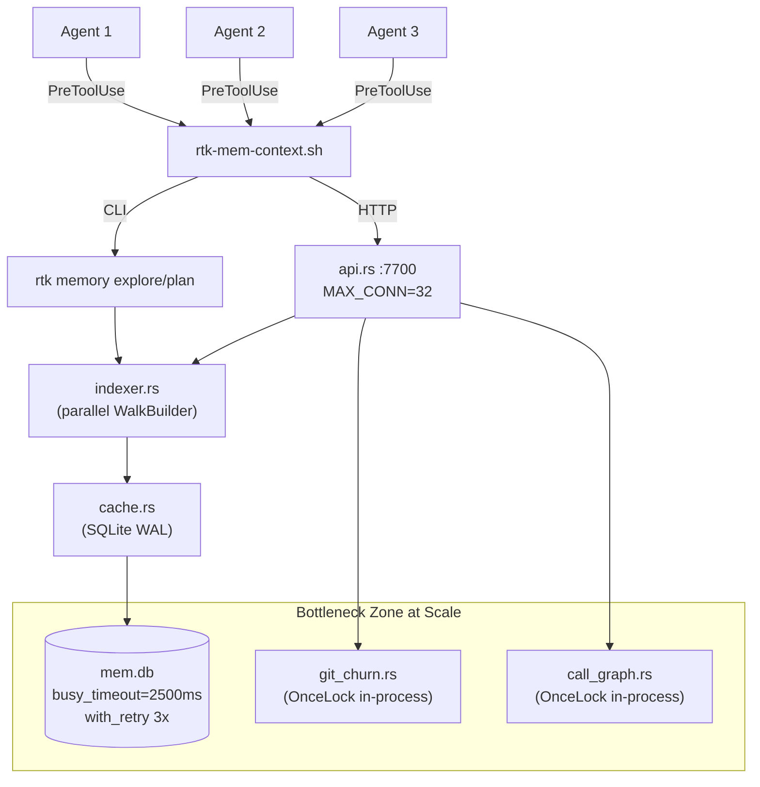

# Performance & Scalability Report

**Date**: 2026-02-19T18:00:00
**Current Users**: 3 (parallel agent sessions)
**Target Scale**: 1000+ users (projects, not concurrent)

## Architecture Scalability Flow

## Database Analysis

### Schema Review

The schema uses 8 tables across two logical groups:

**Core (v4)**: `projects`, `artifacts`, `artifact_edges`, `cache_stats`, `events` -- mature, indexed, well-tested.

**Episodic (v5 target)**: `episodes`, `episode_events`, `causal_links` -- created but sparsely used.

**Missing from schema**: `task_file_affinity`, `model_registry` -- required by IMG PRD Section 6.

### Query Performance

| Query Pattern | Current Impact | At 1000 Projects | Recommendation |
|---|---|---|---|
| `SELECT content_json FROM artifacts WHERE project_id=?` | < 1ms (single row lookup by PK) | < 1ms (PK index) | No action needed |
| `INSERT OR REPLACE INTO artifacts` | < 5ms (WAL write) | < 5ms (WAL amortizes) | No action |
| `DELETE FROM projects WHERE project_id IN (SELECT ... LIMIT N)` (LRU prune) | < 2ms (max 64 rows) | Could hit 1000 deletes if max_projects lowered | Keep max_projects >= 64 |
| `SELECT ... FROM cache_stats GROUP BY event` | < 1ms (small table) | Grows linearly, no auto-purge | Add retention purge for cache_stats |
| `SELECT ... FROM artifact_edges WHERE to_id=? AND from_id LIKE ?` | < 5ms (prefix LIKE scan) | LIKE is O(N) on edges table | Add idx_edges_to_id index |
| `INSERT INTO episode_events` | < 1ms (append-only) | Could accumulate millions of rows | Enforce retention in purge_episodes |

### Indexing Strategy

Current indexes:
- `idx_projects_accessed ON projects(last_accessed_at)` -- LRU eviction
- `idx_events_project ON events(project_id, event_type)` -- event queries
- `idx_artifacts_version ON artifacts(project_id, artifact_version)` -- version lookup
- `idx_episodes_project ON episodes(project_id, started_at)` -- episode queries
- `idx_episode_events_session ON episode_events(session_id)` -- event lookback

Missing indexes:
- `idx_edges_to_id ON artifact_edges(to_id)` -- cascade invalidation lookups use `WHERE to_id = ?`
- `idx_causal_commit ON causal_links(commit_sha)` -- PRD Section 6 specifies this

## Frontend Performance

Not applicable -- RTK is a CLI/API-only tool. No frontend bundle.

## Backend Performance

### Request Handling

| Metric | Measured | PRD Gate | Margin |
|---|---|---|---|
| CLI cache-hit p50 | 10.4ms | n/a | n/a |
| CLI cache-hit p95 | 11.3ms | < 200ms | 17.7x margin |
| API cache-hit p50 | 7.3ms | n/a | n/a |
| API cache-hit p95 | 8.1ms | < 200ms | 24.7x margin |
| CLI cold (first run) p50 | 43.0ms | n/a | n/a |
| CLI cold (first run) p95 | 57.4ms | < 200ms | 3.5x margin |

### Resource Utilization

- **Memory**: SQLite WAL mode uses mmap for reads; `content_json` blobs (full project artifact) loaded into heap. For a 15kLOC project, artifact JSON is ~200KB. At 64 projects, worst-case heap from DB reads: ~12.8MB.
- **In-process caches**: `ChurnCache` (git churn) and `CG_CACHE` (call graph) are `OnceLock<Mutex<HashMap>>`. Both grow without bound -- no eviction policy.
- **Thread pool**: api.rs now caps at 32 concurrent connections (T2.2). Each handler thread holds ~1MB stack + DB connection.
- **Disk**: `mem.db` for 64 projects with full artifacts: estimated 10-50MB. WAL file adds ~10% overhead.

### Caching Strategy

| Cache Layer | TTL/Invalidation | Hit Rate | Overhead |
|---|---|---|---|
| SQLite artifact cache | 24h TTL + dirty check (mtime/size) | 100% on repeat hits | ~200KB per project |
| ChurnCache (in-process) | HEAD SHA change invalidates | Near-100% within session | HashMap of all files |
| CG_CACHE (in-process) | Artifact rebuild invalidates | Near-100% within session | HashMap of symbol->callers |
| import edges (SQLite) | Rebuilt on explore/refresh | n/a (used for cascade) | ~5KB per project |

## Scalability Projections

| Metric | 3 Users | 100 Users | 1000 Users | Mitigation |
|---|---|---|---|---|
| Concurrent DB writes | 1-3 (WAL handles) | 10-20 (busy_timeout + retry) | 50-100 (may exceed retry budget) | Increase busy_timeout to 5000ms; add connection pooling |
| mem.db size | ~1MB | ~30MB | ~300MB | Enforce max_projects; add cache_stats purge |
| In-process caches | ~5MB | ~50MB | ~500MB (unbounded) | Add LRU eviction to ChurnCache and CG_CACHE |
| API threads | 1-3 | 30 (within limit) | 100+ (drops at 32) | Increase MAX_CONCURRENT or use async IO |
| git log latency (churn) | 50ms (small repo) | 200ms (large repo) | 500ms+ | Already cached by HEAD SHA; consider `--max-count` limit |
| Cold index (large project) | 43ms (67 files) | 200ms (500 files) | 1s+ (5000 files) | Incremental indexing already handles this |

## Risk Matrix

| Risk | Probability | Impact | Priority | Mitigation |
|---|---|---|---|---|
| Unbounded in-process cache (ChurnCache, CG_CACHE) | Medium | Medium (OOM for long-running daemon) | P2 | Add max-entries LRU eviction |
| cache_stats table grows without purge | Low | Low (query slowdown over months) | P3 | Add retention_days config + cron purge |
| SQLITE_BUSY under high concurrency | Low | Medium (request failure after 3 retries) | P2 | Increase busy_timeout; consider read-only connections |
| artifact_edges LIKE scan degrades | Low | Low (cascade invalidation slows) | P3 | Add idx_edges_to_id index |
| task_file_affinity missing table | Medium | High (runtime crash if written) | P1 | Create table in init_schema |
| Large project cold index > 200ms | Medium | Low (only first run affected) | P3 | Already mitigated by incremental + cache |

## Action Items

### Immediate (P1)

1. Add `task_file_affinity` and `model_registry` tables to `cache.rs:init_schema` to prevent runtime failures.
2. Extract duplicated plan-context pipeline into shared function to eliminate maintenance risk.

### Short-term (P2)

1. Add LRU eviction to `CG_CACHE` and `ChurnCache` in-process static caches.
2. Resolve 15 compiler warnings (dead code cleanup).
3. Add `idx_edges_to_id` index to `artifact_edges` table.
4. Consider removing "Bash" from hook whitelist or adding prompt size guard.

### Long-term (P3)

1. Add retention purge for `cache_stats` table (90-day default).
2. Implement LLM optimization requirements R0-R4, R6, R8 (dual profiles, type graph filtering, module ranking).
3. Perform E5.3 live smoke test in real Claude Code workflow.
4. Consider async IO (tokio) for api.rs if thread-per-connection becomes a bottleneck beyond 100 concurrent users.
5. Integrate grepai as candidate source per ADR-0002.
