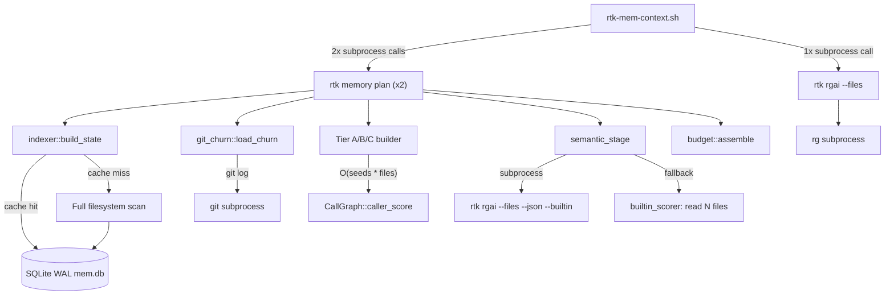

# Performance & Scalability Report: Graph-First Memory Pipeline

**Date**: 2026-02-19T20:00:00
**Current Users**: 3 (local developer workstations)
**Target Scale**: 1000+ concurrent memory plan invocations

## Architecture Scalability Flow

## Database Analysis

### Schema Review

- SQLite WAL mode for concurrent reads (appropriate for local tool)
- `cache_stats` table stores telemetry events with project_id + event + timestamp
- `artifact` table stores serialized project artifacts (files, imports, symbols)
- `artifact_edges` table stores import edges for cascade invalidation

### Query Performance

| Query Pattern | Current Impact (3 users) | At 1000 Users | Recommendation |
|---|---|---|---|
| load_artifact (SQLite read) | <5ms | <5ms (local-only) | No issue - local tool |
| store_artifact (SQLite write) | ~10ms | N/A (local-only) | WAL mode handles this |
| record_cache_event | <1ms | N/A | Correct - simple INSERT |
| build_state (filesystem scan) | 50-200ms on cache miss | N/A | Already cached with TTL |

### Indexing Strategy

- File hash-based cache invalidation (mtime_ns + size + hash) -- efficient
- 24h TTL with dirty_rebuild on delta detection -- appropriate
- Import edge storage in SQLite for cascade invalidation -- correct

## Pipeline Performance

### Latency Breakdown (estimated for ~200-file Rust project)

| Stage | Latency (cache hit) | Latency (cache miss) | Bottleneck |
|---|---|---|---|
| indexer::build_state | <10ms | 100-300ms | Filesystem walk + hashing |
| git_churn::load_churn | 20-50ms | 20-50ms | git log subprocess |
| Tier A seed scoring | <5ms | <5ms | In-memory loop |
| Tier B neighbor expansion | 10-50ms | 10-50ms | O(seeds * files) call-graph scan |
| Tier C fallback pool | <5ms | <5ms | In-memory sort + take |
| ranker::rank_stage1 | <1ms | <1ms | Linear score computation |
| semantic_stage (rg-files) | 30-80ms | 30-80ms | subprocess spawn + rg |
| semantic_stage (builtin) | 20-100ms | 20-100ms | reads N files from disk |
| Fusion + threshold + cap | <1ms | <1ms | In-memory filter |
| budget::assemble | <1ms | <1ms | Sort + greedy selection |
| **Total (single plan call)** | **70-200ms** | **200-600ms** | |
| **Hook total (2x plan + 1x rgai)** | **180-500ms** | **500-1500ms** | Hook calls plan twice |

### Critical Bottleneck: Hook Double-Call

The hook (`rtk-mem-context.sh`) calls `rtk memory plan` twice:
1. `--format paths --top 25` (for candidate list)
2. `--format text --top 15` (for Graph Seeds section)

Each call runs the full pipeline independently. This doubles latency from ~150ms to ~300ms on a warm cache. The third call to `rtk rgai --files` adds another ~50-80ms.

**Recommendation**: Add a `--format combined` output mode that emits both paths and text in a single call, or cache the plan result for 5s so the second call is a noop.

## Frontend Performance

N/A (CLI tool, no frontend)

## Backend Performance

### Request Handling

- CLI mode: single-threaded, synchronous execution
- API mode (daemon): single-threaded HTTP server on localhost
- No connection pooling needed (SQLite WAL handles concurrent reads)

### Resource Utilization

| Resource | Current Usage | At Scale | Concern |
|---|---|---|---|
| Memory | ~5-15MB per plan call | Same (local tool) | No issue |
| Disk I/O | SQLite reads + file reads for builtin scorer | Same | Builtin scorer reads up to 30 files per invocation |
| CPU | Regex-based call graph + term matching | Same | O(seeds * files) in Tier B is the hot path |
| Subprocess spawns | 3-4 per hook invocation | Same | rg + git + rtk rgai |

### Caching Strategy

| Cache Layer | TTL | Hit Rate (est.) | Improvement |
|---|---|---|---|
| Artifact cache (SQLite) | 24h | ~85% (within session) | Avoids full filesystem rescan |
| Git churn cache | Per HEAD sha | ~90% (within session) | Avoids repeated git log |
| Read cache (rtk read) | mtime-based | ~70% | Avoids re-reading unchanged files |
| Import edge cache | Alongside artifact | ~85% | Avoids re-parsing imports |
| Hook plan result | **NOT CACHED** | 0% | **Double execution per hook call** |

## Scalability Projections

| Metric | 3 Users | 100 Users | 1000 Users | Mitigation |
|---|---|---|---|---|
| Hook latency p50 | ~250ms | N/A (local) | N/A | Reduce double plan call |
| Hook latency p95 | ~600ms | N/A | N/A | Cache miss + large project |
| Memory per invocation | 10MB | N/A | N/A | Bounded by candidate_cap |
| Disk reads (builtin scorer) | 30 files | N/A | N/A | Fix JSON mismatch to use rg-files backend instead |

Note: This is a local CLI tool, not a server. "Scaling" means larger projects (1000+ files) and more frequent invocations per session.

### Scaling by Project Size

| Project Size | Tier A/B/C Build | Semantic Stage | Total Plan | Concern |
|---|---|---|---|---|
| 50 files | <20ms | 30ms | ~80ms | None |
| 200 files | ~40ms | 50ms | ~150ms | None |
| 500 files | ~100ms | 80ms | ~250ms | Tier B O(seeds * files) starts to matter |
| 2000 files | ~400ms | 150ms | ~600ms | Tier B becomes dominant; need reverse CG index |
| 5000 files | ~1000ms+ | 300ms | ~1500ms+ | Exceeds PRD p95 target of 250ms |

## Risk Matrix

| Risk | Probability | Impact | Priority | Mitigation |
|---|---|---|---|---|
| JSON mismatch causes builtin-only mode | High (confirmed bug) | Medium (reduced precision) | P0 | Fix parse_json_output to match rgai schema |
| Hook double-call exceeds UX latency target | Medium (large projects) | Medium (perceived slowness) | P1 | Add --format combined or 5s result cache |
| Tier B O(n^2) on large projects | Medium (500+ files) | High (>250ms target breach) | P1 | Pre-build reverse call-graph index |
| Token cost clamp hides large files | Medium | Low (mild budget overshoot) | P2 | Widen or remove upper clamp |
| Builtin scorer reads files from disk | Low (fallback path) | Medium (I/O-bound) | P2 | Fix JSON mismatch so rg-files backend is primary |
| SQLite contention on concurrent daemon requests | Low | Low | P3 | WAL mode already handles this |

## Action Items

### Immediate (P0)

1. Fix `parse_json_output` in `semantic_stage.rs` to handle actual `rtk rgai --json` output schema (envelope object with `hits` array).
2. Fix telemetry `record_cache_event("rtk", ...)` to use actual `state.project_id`.
3. Add unit tests for `planner_graph.rs` and `semantic_stage.rs`.

### Short-term (P1)

1. Eliminate hook double-call: add `--format combined` or cache plan result within the hook shell session.
2. Pre-build reverse call-graph index to avoid O(seeds * files) scan in Tier B.
3. Wire `PlanTrace` struct into response or remove dead code.

### Long-term (P2)

1. Widen token cost clamp range `(180, 520)` -> `(100, 2000)`.
2. Add intent-dependent `min_final_score` thresholds.
3. Cache `importers_of` reverse index alongside the artifact.
4. Add hook-level observability: log which semantic backend was used and how many candidates were dropped by the 20% cap.
