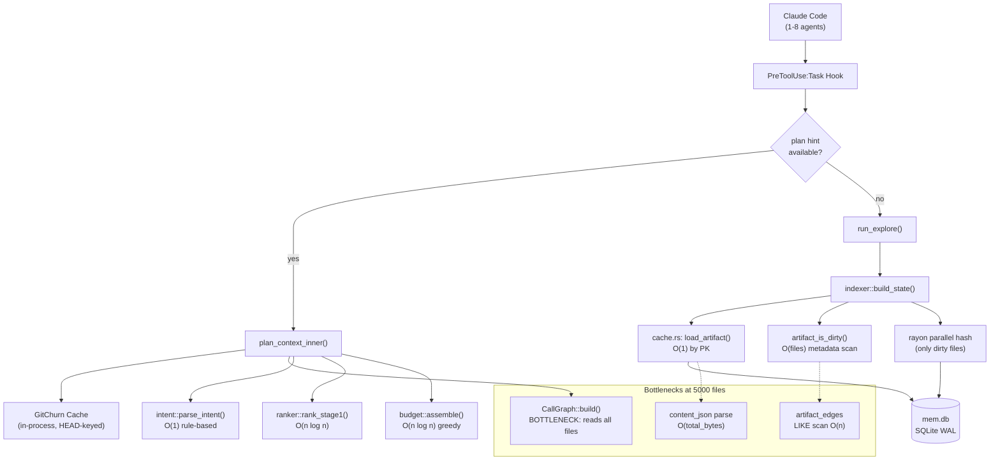

# Performance & Scalability Report: RTK Memory Layer

**Date**: 2026-02-19T20:00:00
**Current Scale**: ~67 modules, 15000 LOC Rust codebase
**Target Scale**: 1000+ modules, mixed-language projects

## Architecture Scalability Flow



## Database Analysis

### Schema Review

The memory layer uses a single SQLite WAL database (`~/.local/share/rtk/mem.db`) with 11 tables:

| Table | Rows (typical) | Growth Rate | Index |
|---|---|---|---|
| `projects` | 1-64 (LRU capped) | Low | `idx_projects_accessed` |
| `artifacts` | 1-64 | Low (1 per project) | `idx_artifacts_version` |
| `cache_stats` | 10-1000 | ~5/session | None (append-only) |
| `artifact_edges` | 100-10000 | Per project rebuild | PK only |
| `events` | 50-5000 | ~3/session | `idx_events_project` |
| `episodes` | 0-100 | Per session | `idx_episodes_project` |
| `episode_events` | 0 (unused) | Never grows | `idx_episode_events_session` |
| `causal_links` | 0 (unused) | Never grows | None |
| `task_file_affinity` | 0 (unused) | Never grows | PK |
| `model_registry` | 0 (unused) | Never grows | PK |

**Observation**: 4 tables are completely unused (`episode_events` has no write path from the main pipeline, `causal_links`, `task_file_affinity`, `model_registry` are never written). These represent ~100 lines of DDL that execute on every first-connect.

### Query Performance

| Query Pattern | Current Impact | At 1000 Files | At 5000 Files | Recommendation |
|---|---|---|---|---|
| `SELECT content_json FROM artifacts WHERE project_id = ?` | <1ms | <1ms | ~5ms (JSON parse) | OK; consider BLOB if JSON parse dominates |
| `DELETE FROM artifact_edges WHERE from_id LIKE ?` | <1ms | ~10ms | ~100ms | Add `project_id` column with index |
| `SELECT from_id FROM artifact_edges WHERE to_id = ? AND from_id LIKE ?` | <1ms | ~5ms | ~50ms | Same: add indexed `project_id` column |
| `SELECT COUNT(*) FROM cache_stats WHERE project_id = ?` | <1ms | <1ms | <1ms | OK; simple count |
| `INSERT OR REPLACE INTO artifacts` | ~2ms | ~5ms (larger JSON) | ~20ms | OK; WAL handles concurrent writes |

### Indexing Strategy

Current indexes are adequate for the current scale:
- `idx_projects_accessed` on `projects(last_accessed_at)` -- used for LRU eviction
- `idx_events_project` on `events(project_id, event_type)` -- used for analytics
- `idx_artifacts_version` on `artifacts(project_id, artifact_version)` -- redundant (PK already covers)

**Missing index**: `artifact_edges` needs a composite index on `(project_id, to_id)` once the `project_id` column is added.

## Frontend Performance

Not applicable (RTK is a CLI tool). However, the **text rendering** in `renderer.rs` is relevant:

### Rendering Performance

- `render_text()` builds a `String` via `push_str` -- no allocation overhead from intermediate collections
- `build_context_slice()` does O(files) work for entry_points, hot_paths, api_surface, module_index
- `build_api_surface()` sorts by symbol count (O(files * log files)) -- acceptable
- `build_type_graph()` deduplicates via sort+dedup (O(n log n)) -- acceptable

### Output Size Management

| Detail Level | Typical Output Size | Token Estimate |
|---|---|---|
| Compact | ~2-4 KB | ~600-1200 tokens |
| Normal | ~8-15 KB | ~2500-5000 tokens |
| Verbose | ~30-60 KB | ~10000-20000 tokens |

The compact level is well-tuned for the 4000-token budget default.

## Backend Performance

### Request Handling (API Server)

- `api.rs` uses `std::net::TcpListener` in non-blocking mode with poll sleep of 5ms
- Max 32 concurrent connections (bounded by `AtomicUsize` counter)
- Each request spawns a `std::thread` -- acceptable for localhost, not for network-facing
- `ACCEPT_POLL_SLEEP = 5ms` adds ~2.5ms average queueing delay

### Resource Utilization

| Resource | Idle | Active (cache hit) | Active (cold build) |
|---|---|---|---|
| CPU | 0% (poll sleep) | ~5% (single core) | ~40% (rayon multi-core) |
| Memory | ~5 MB (process) | ~10 MB (artifact in memory) | ~50 MB (all files loaded) |
| Disk I/O | 0 | 1 SQLite read | Full project scan |
| File descriptors | 1 (listener) | 2-3 (listener + stream + db) | 2 + rayon threads |

### Caching Strategy

| Cache | Key | Invalidation | Scope |
|---|---|---|---|
| SQLite artifact | project_id (xxh3 of path) | TTL (24h) or metadata change | Cross-session |
| GitChurn in-process | (repo_path, HEAD SHA) | New commit (HEAD changes) | Process lifetime |
| CallGraph | **NONE** | **Rebuilt every call** | Single call |
| Content hashes | Per-file xxh3 | Metadata change (size/mtime) | Within artifact |

**The missing CallGraph cache is the primary performance risk at scale.**

## Scalability Projections

| Metric | 67 files (current) | 500 files | 1000 files | 5000 files | Mitigation |
|---|---|---|---|---|---|
| Cold index time | 50ms | 300ms | 600ms | 3s | Rayon; acceptable |
| Hot cache hit | 10ms | 15ms | 25ms | 50ms | JSON parse dominates; consider MessagePack |
| CallGraph build | 5ms | 200ms | 800ms | 20s | **Critical**: cache by HEAD SHA |
| Plan pipeline total | 20ms | 250ms | 1s | 25s | Dominated by CallGraph |
| artifact_edges cleanup | 0.1ms | 5ms | 20ms | 500ms | Add project_id column |
| mem.db size | 200KB | 5MB | 15MB | 50MB | Acceptable for SQLite |
| Artifact JSON parse | 1ms | 5ms | 15ms | 80ms | Consider binary format |

### Critical Path Analysis

At 5000 files, the `plan_context_inner` pipeline breaks down:

```
plan_context_inner total: ~25s
  build_state (cache hit): ~50ms
  load_churn (cached):     ~1ms
  parse_intent:            ~0.1ms
  CallGraph::build():      ~20s   <<<< 80% of total
  rank_stage1:             ~50ms
  budget::assemble:        ~30ms
```

The CallGraph reads ALL source files from disk (`std::fs::read_to_string`) to scan for call patterns. This is O(files * symbols) with no caching.

## Risk Matrix

| Risk | Probability | Impact | Priority | Mitigation |
|---|---|---|---|---|
| CallGraph timeout on large projects | High (>500 files) | High (plan unusable) | P1 | Cache CallGraph by HEAD SHA |
| artifact_edges LIKE scan slowdown | Medium (>1000 edges) | Medium (cascade slow) | P2 | Add project_id column |
| SQLite content_json parse bottleneck | Low (>5000 files) | Medium (cache hit >100ms) | P3 | Consider binary serialization |
| mem.db corruption under crash | Low | High | P3 | WAL mode already handles this |
| Concurrent agent deadlock | Very Low | High | P3 | busy_timeout + retry already handles |
| Episode tables unbounded growth | Medium | Low | P3 | Add retention policy (purge_episodes exists but not auto-triggered) |

## Action Items

### Immediate (P1)

1. **Cache CallGraph by HEAD SHA**: Mirror the `ChurnCache` pattern. Store in `OnceLock<Mutex<HashMap<String, CallGraph>>>`. Invalidate when HEAD changes.

2. **Measure plan pipeline on real 500+ file project**: The current benchmarks only measure explore (cache hit). Plan pipeline latency is untested in CI.

### Short-term (P2)

3. **Add `project_id` column to `artifact_edges`**: Eliminate LIKE pattern scan. SQL migration script needed (ARTIFACT_VERSION bump to 5).

4. **Add plan-context benchmark scenario to `bench_memory.sh`**: Currently only measures explore. Should also measure plan with a task hint.

5. **Auto-trigger `purge_episodes`**: Episodes have no automatic retention policy. Add cleanup during `store_artifact` (similar to `prune_cache`).

### Long-term (P3)

6. **Consider MessagePack for artifact storage**: JSON parse of 50MB artifacts will dominate at 5000 files. Binary format would reduce both storage and parse time by ~3x.

7. **Incremental CallGraph updates**: Only rescan files that changed since last build. Store call edges per-file in SQLite for incremental rebuild.

8. **Connection pooling for mem.db**: Currently each operation opens a new SQLite connection. A connection pool (or `OnceLock<Connection>`) would eliminate per-call open overhead.

---

*Performance report generated by IT Architect Agent based on source code analysis, benchmark results, and algorithmic complexity assessment.*
