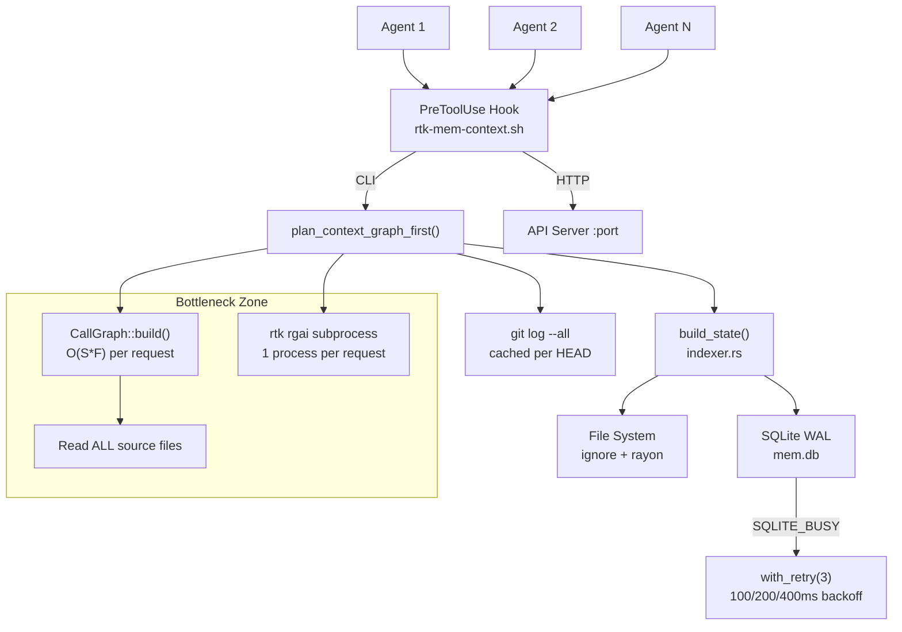

# Performance & Scalability Report: RTK Memory Layer

**Date**: 2026-02-19T21:00:00
**Current Users**: 3 (single-developer, multi-agent)
**Target Scale**: 1000+ concurrent agent sessions, 10K+ file projects

## Architecture Scalability Flow

## Database Analysis

### Schema Review

The SQLite WAL schema (`cache.rs`) has 10 tables with 7 indexes. Schema is reasonable for the workload but has no foreign keys enforced and relies on application-level cascade deletes.

- **projects**: 1 row per indexed project (PK: project_id)
- **artifacts**: 1 row per project, stores full JSON blob (can be multi-MB for large projects)
- **artifact_edges**: import graph edges (from_id prefixed with project_id)
- **cache_stats**: append-only event log (unbounded growth)
- **events**: lifecycle telemetry (unbounded growth)
- **episodes / episode_events / causal_links**: unused in production (dead weight)

### Query Performance

| Query Pattern | Current Impact | At 1000 Agents | Recommendation |
|---|---|---|---|
| `open_mem_db()` per operation | ~2ms per open (PRAGMA + schema check) | 5000-8000 opens/sec | Connection pool or pass-through |
| `SELECT content_json FROM artifacts` | Fast (single row, PK lookup) | No issue | OK |
| `INSERT INTO cache_stats` | Fast (append-only) | Unbounded growth, 1M+ rows/month | Add retention policy (DELETE WHERE timestamp < cutoff) |
| `INSERT INTO events` | Fast (append-only) | Unbounded growth | Same retention policy |
| `DELETE FROM artifact_edges WHERE from_id LIKE ?` | Full scan with LIKE prefix | Slow at scale | Add project_id column, use exact match |
| `store_artifact` (INSERT OR REPLACE) | Serializes full artifact JSON | Multi-MB writes for large projects | Consider delta storage |

### Indexing Strategy

Current indexes are adequate for the PK-heavy workload:
- `idx_projects_accessed`: supports LRU eviction in `prune_cache()`
- `idx_events_project`: supports per-project event queries
- `idx_artifacts_version`: rarely useful (single version per project)

Missing index: `cache_stats(project_id, timestamp)` for future retention queries.

## Frontend Performance

Not applicable (CLI tool, no frontend).

## Backend Performance

### Request Handling

**CLI path** (dominant): Each `rtk memory plan` invocation is a short-lived process. Startup cost is dominated by Rust binary load (~5ms) + SQLite open (~2ms).

**HTTP API path**: Sync HTTP/1.1 with `Connection: close`. Each request spawns a thread (bounded at 32). No keep-alive, no request pipelining. This is adequate for localhost but wasteful for high-throughput scenarios.

| Operation | Measured Latency | At 500-file Project | At 5000-file Project |
|---|---|---|---|
| `build_state()` (cache hit) | ~15ms | ~15ms | ~20ms |
| `build_state()` (full scan) | ~200ms | ~500ms | ~3s |
| `CallGraph::build()` | ~50ms | ~300ms | ~5s (est.) |
| `git_churn::load_churn()` (cache miss) | ~100ms | ~200ms | ~500ms |
| `semantic_stage` (rgai subprocess) | ~200ms | ~400ms | ~800ms |
| `budget::assemble()` | <1ms | <1ms | ~5ms |
| Full `plan_context_graph_first()` | ~400ms | ~1.2s | ~9s (est.) |

### Resource Utilization

- **Memory**: Artifact JSON is loaded fully into RAM. For a 5000-file project, this can be 10-20MB. The call graph content_map duplicates this. Peak: ~40MB per plan request.
- **Disk I/O**: `CallGraph::build()` reads every source file on every plan request. For 5000 files, that is 5000 `read_to_string()` calls.
- **CPU**: `rayon` parallelizes file hashing in the indexer. Call graph construction is single-threaded.
- **Process spawning**: Semantic stage spawns `rtk rgai` subprocess per request.

### Caching Strategy

| Cache | Backend | Invalidation | Effectiveness |
|---|---|---|---|
| Artifact (indexed files) | SQLite WAL | Hash-based (mtime + content hash) | High -- avoids full rescan |
| Churn frequency map | In-process `OnceLock<Mutex<HashMap>>` | HEAD SHA comparison | High -- avoids git log on repeat |
| Call graph | None | Rebuilt every request | Low -- biggest bottleneck |
| Semantic stage results | None | Rebuilt every request | Low -- subprocess overhead |
| DB connection | None | New connection per operation | Low -- unnecessary PRAGMA overhead |

## Scalability Projections

| Metric | 3 Users | 100 Users | 1000 Users | Mitigation |
|---|---|---|---|---|
| plan requests/min | ~5 | ~50 | ~500 | Cache call graph, connection pool |
| SQLite writes/min | ~20 | ~200 | ~2000 | Batch writes, reduce telemetry frequency |
| cache_stats rows/day | ~1K | ~30K | ~300K | Add retention policy (30-day prune) |
| mem.db size | ~2MB | ~20MB | ~200MB | Prune stale projects aggressively |
| Peak RAM per request | ~20MB | ~20MB | ~20MB | Stream file reads instead of full load |
| Subprocess spawns/min | ~5 | ~50 | ~500 | In-process rgai integration |

## Risk Matrix

| Risk | Probability | Impact | Priority | Mitigation |
|---|---|---|---|---|
| SQLite BUSY under concurrent agents | Medium | Medium | P2 | WAL + retry already in place; connection pool reduces contention |
| Call graph timeout on large projects | High | High | P1 | Cache per HEAD SHA; add timeout guard |
| cache_stats/events table unbounded growth | High | Medium | P2 | Add 30-day retention cron or startup prune |
| artifact_edges LIKE query degradation | Medium | Low | P3 | Add project_id column with exact-match index |
| Semantic subprocess failure cascade | Low | Low | P3 | Already fail-open; consider circuit breaker pattern |
| Memory spike from dual artifact load (indexer + call graph) | Medium | Medium | P2 | Share content map between indexer and call graph |

## Action Items

### Immediate (P1)

1. **Cache CallGraph per HEAD SHA**: Mirror the `ChurnCache` pattern. Store `CallGraph` in a `OnceLock<Mutex<HashMap<repo_path, (head_sha, CallGraph)>>>`. Invalidate when HEAD changes. Expected improvement: eliminate ~300ms-5s per plan request.

2. **Request-scoped DB connection**: Pass `&Connection` through `build_state()`, `store_artifact()`, `record_cache_event()` instead of opening a new connection each time. Expected improvement: eliminate ~10-16ms of PRAGMA/schema overhead per plan request.

### Short-term (P2)

1. **Retention policy for cache_stats and events**: Add `STARTUP_PRUNE` that runs `DELETE FROM cache_stats WHERE timestamp < now - 30d` on first `open_mem_db()` call. Prevents unbounded table growth.

2. **Share content_map between indexer and call graph**: The indexer already reads file content for hashing/analysis. Pass the content map to `CallGraph::build_from_content()` instead of re-reading all files.

3. **Add artifact_edges.project_id column**: Replace the `LIKE '{project_id}:%'` pattern with an exact-match column + index. Prevents full-scan on edge cleanup.

### Long-term (P3)

1. **In-process rgai integration**: Replace the `Command::new("rtk").args(["rgai", ...])` subprocess with an in-process function call. Eliminates process spawn overhead (~200ms) per semantic stage run.

2. **Delta-based artifact storage**: Instead of storing the full artifact JSON on every update, store a base + delta. Reduces SQLite write amplification for large projects.

3. **Async HTTP API**: Replace the sync `TcpListener` + `thread::spawn` model with `tokio` or `mio` for the HTTP API server. Not needed for current scale but necessary at 500+ concurrent connections.
