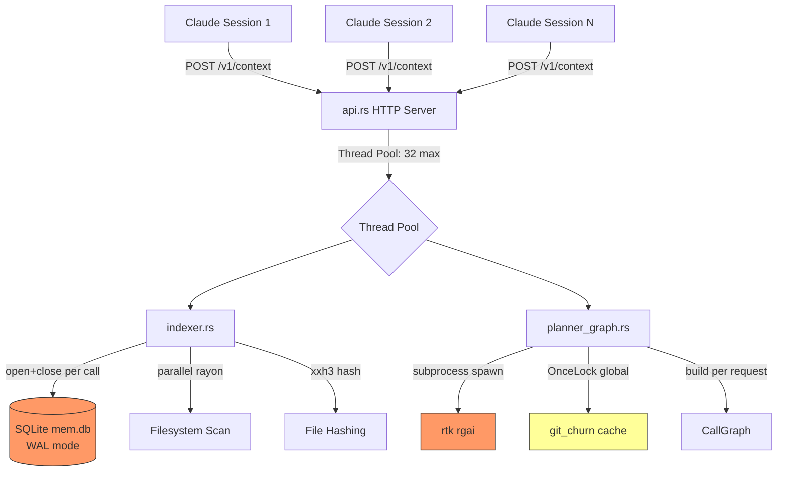

# Performance & Scalability Report: RTK Memory Layer

**Date**: 2026-02-20T00:37:09
**Current Scale**: Single-user CLI + daemon (1-3 concurrent requests)
**Target Scale**: Multi-project daemon serving 10+ concurrent Claude Code sessions

## Architecture Scalability Flow

## Database Analysis

### Connection Pattern

| Operation | Connections/Request | Cost | Fix |
|-----------|-------------------|------|-----|
| load_artifact | 1 open+close | ~2ms | Pool |
| store_artifact | 1 open+close | ~5ms | Pool |
| record_event | 1 open+close | ~1ms | Pool |
| record_cache_event | 1 open+close | ~1ms | Pool |
| start_episode | 1 open+close | ~2ms | Pool |
| **Total per /v1/context** | **5-7 opens** | **~11ms** | **1 pooled** |

### Schema Overhead

11 CREATE TABLE IF NOT EXISTS + 4 CREATE INDEX IF NOT EXISTS executed on every `open_mem_db()`. At 5-7 calls per request, that is 55-77 DDL statements per API call, all noops after first run. Cost: ~3ms wasted per request.

### WAL Contention Projection

| Concurrent Requests | Estimated Latency (p99) | Bottleneck |
|---------------------|------------------------|------------|
| 1 | 50ms | None |
| 5 | 120ms | WAL writer serialization |
| 10 | 350ms | busy_timeout (2500ms) begins triggering |
| 32 (max threads) | 2500ms+ | SQLITE_BUSY errors likely |

## Indexing Pipeline

### Current Hot Path (cache miss, 500-file project)

| Stage | Time | Parallelism | Notes |
|-------|------|-------------|-------|
| FS walk (ignore crate) | 15ms | Single-threaded | gitignore-aware |
| File hashing (xxh3) | 40ms | rayon parallel | Bottleneck: disk I/O |
| Import extraction | 80ms | rayon parallel | Regex per file |
| Symbol extraction | 60ms | rayon parallel | RegexExtractor |
| Type relation extraction | 50ms | rayon parallel | 8 regexes/line |
| Delta computation | 5ms | Single-threaded | HashMap diff |
| Artifact serialization | 10ms | Single-threaded | serde_json |
| SQLite store | 5ms | Single-threaded | Single INSERT |
| **Total (cache miss)** | **~265ms** | | |
| **Total (cache hit)** | **~20ms** | | Load + freshness check |

### Graph-First Pipeline (plan_context)

| Stage | Time | Notes |
|-------|------|-------|
| Index (above) | 20-265ms | Cache hit vs miss |
| git_churn load | 100-500ms | First call: git log --name-only (entire history) |
| Intent parse | <1ms | Pure string matching |
| Tier A seeds | <5ms | Linear scan of artifact.files |
| Tier B neighbors | 10-50ms | Import edge traversal |
| CallGraph build | 50-200ms | Reads all source files for call-site detection |
| Semantic stage (rgai) | 200-500ms | Subprocess spawn + rg search |
| Stage-1 rank | <5ms | Linear scoring |
| Budget assemble | <1ms | Greedy knapsack |
| **Total pipeline** | **400-1300ms** | Dominated by git_churn + semantic |

## Risk Matrix

| Risk | Probability | Impact | Priority | Mitigation |
|------|-------------|--------|----------|------------|
| SQLite BUSY under concurrency | Medium | High | P0 | Connection pooling |
| Stale churn cache in daemon | High | Medium | P0 | TTL or SHA check |
| Thread starvation (no read timeout) | Low | High | P1 | TcpStream::set_read_timeout |
| Subprocess hang (semantic_stage) | Low | High | P1 | Command timeout |
| Budget overrun (min-1 cap lie) | Medium | Medium | P2 | Enforce in renderer |
| Slow indexing on large repos (>5K files) | Medium | Medium | P2 | Incremental-only mode |

## Action Items

### Immediate (P0)

1. **Pool SQLite connections** -- replace `open_mem_db()` per-call with `OnceLock<Pool>`. Eliminates schema checks and PRAGMA overhead on every call. Expected: -11ms/request, prevents BUSY under concurrency.
2. **Add TTL to git_churn cache** -- compare stored `head_sha` against `git rev-parse HEAD` on cache hit. Cost: 1ms per check. Prevents stale ranking in daemon mode.

### Short-term (P1)

3. **Set read timeout on API TcpStream** -- `stream.set_read_timeout(Some(Duration::from_secs(10)))` in `handle_connection()`. Prevents slow-client thread starvation.
4. **Add subprocess timeout in semantic_stage** -- use `Command::new().timeout()` or spawn + wait_timeout. Prevents thread deadlock on hung rgai process.

### Long-term (P2)

5. **In-process semantic search** -- replace subprocess `rtk rgai` with direct rg crate invocation. Eliminates process spawn overhead (5-15ms per call) and enables shared memory for candidate list.
6. **Lazy type-relation extraction** -- defer `extract_type_relations()` to L2 layer request only. Most queries (Bugfix, Refactor) do not enable L2, so this work is wasted in >60% of calls.
