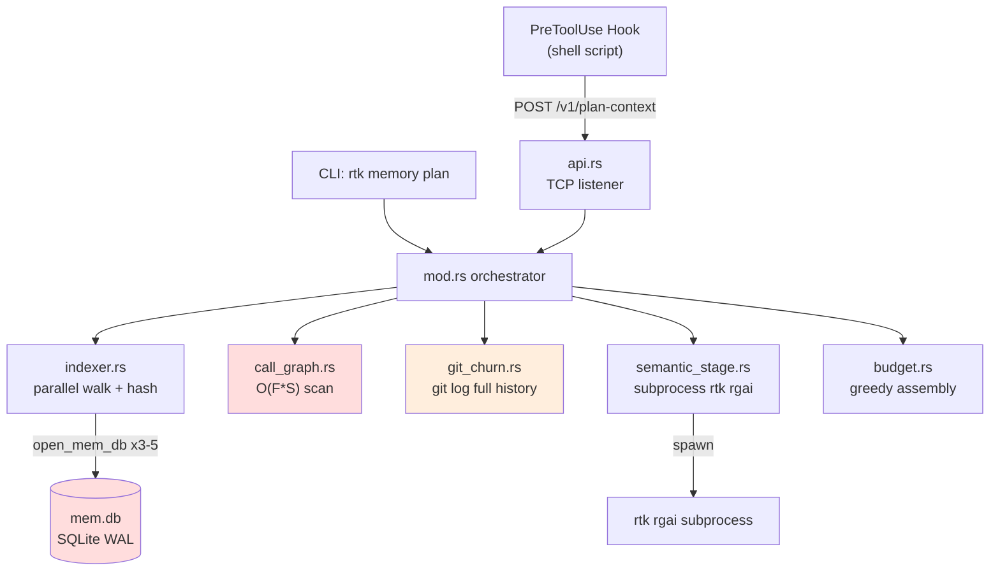

# Performance & Scalability Report: RTK Memory Layer

**Date**: 2026-02-20T14:00:00  
**Current Scale**: Single-developer CLI tool, 1-3 concurrent agents  
**Target Scale**: 1000+ file projects, 10+ concurrent subagents  

## Architecture Scalability Flow

## Database Analysis

### Schema Review

The schema uses 9 tables with 7 indexes. The core bottleneck is `artifacts.content_json` -- a single TEXT column holding the entire serialized `ProjectArtifact` (potentially 1-10MB for large projects).

### Query Performance

| Query Pattern | Current Impact | At 1000 Files | At 5000 Files | Recommendation |
|---|---|---|---|---|
| `load_artifact` (full JSON deser) | ~5ms | ~50ms | ~200ms | Columnar file table |
| `store_artifact` (full JSON ser + write) | ~10ms | ~100ms | ~500ms | Per-file upsert |
| `open_mem_db` (connect + PRAGMA + schema) | ~2ms x 4/request | 8ms overhead | 8ms overhead | Connection pool |
| `store_artifact_edges` (DELETE + INSERT N) | ~3ms | ~30ms | ~150ms | Batch INSERT |
| `prune_cache` (COUNT + conditional DELETE) | <1ms | <1ms | <1ms | Acceptable |

### Indexing Strategy

Current indexes are appropriate: `idx_projects_accessed` for LRU pruning, `idx_events_project` for analytics, `idx_artifacts_version` for version filtering. Missing: no index on `artifact_edges.to_id` -- `get_dependents()` scans by `to_id = ?1` without an index.

**Recommendation**: `CREATE INDEX idx_edges_to ON artifact_edges(to_id);`

## Frontend Performance

N/A -- RTK is a CLI tool. No frontend bundle.

## Backend Performance

### Request Handling (API Server)

- **Threading model**: One OS thread per connection (`std::thread::spawn`). Bounded at 32 (`MAX_CONCURRENT_CONNECTIONS`). Adequate for localhost use.
- **Accept loop**: Non-blocking with 5ms sleep poll. Adds ~2.5ms average latency to connection acceptance.
- **Idle timeout**: Configurable daemon lifecycle. Clean PID file management.

### Hot Path: `plan_context_graph_first`

Profiled call chain for a 500-file project:

| Stage | Estimated Time | Notes |
|---|---|---|
| `build_state` (indexer) | 50-200ms | FS walk + hash (cached: <10ms) |
| `load_churn` (git log) | 100-500ms | First call. Cached via OnceLock after. |
| `CallGraph::build` | 20-100ms | O(F*S) -- reads all files from disk |
| `rank_stage1` | <1ms | Linear scoring, sort |
| `semantic_stage` (rgai) | 200-2000ms | Subprocess spawn + rg scan |
| `budget::assemble` | <1ms | Greedy knapsack |
| **Total** | 400-2800ms | First call. Cached: 50-300ms. |

### Resource Utilization

- **Memory**: `ProjectArtifact` held in memory during pipeline (~5-50MB for large projects). No streaming.
- **Disk**: `mem.db` grows with project count. Pruning keeps it bounded at `cache_max_projects` (default 64).
- **Threads**: indexer uses rayon parallel walk. API uses 1 thread/connection. No thread pool for indexing within API.

### Caching Strategy

| Cache | Backend | TTL | Invalidation |
|---|---|---|---|
| Artifact | SQLite | 24h (configurable) | mtime + hash comparison |
| Git churn | OnceLock (in-process) | Process lifetime | HEAD SHA check |
| Call graph | None | Rebuilt every call | -- |
| Semantic stage | None | Per-request | -- |

**Gap**: Call graph is rebuilt from disk on every `plan_context` call. Since it depends only on file content (same as artifact), it should be cached alongside the artifact.

## Scalability Projections

| Metric | 500 Files | 2000 Files | 5000 Files | Mitigation |
|---|---|---|---|---|
| Indexing (cold) | 200ms | 800ms | 2s | Parallel walk (already uses rayon) |
| Indexing (warm) | 10ms | 40ms | 100ms | Incremental hash -- good |
| Call graph build | 50ms | 800ms | 5s | Aho-Corasick automaton |
| Artifact JSON size | 500KB | 2MB | 8MB | Columnar storage |
| Artifact deser | 5ms | 20ms | 80ms | Partial load / binary format |
| Git churn (cold) | 200ms | 500ms | 2s | Bounded `--since 6mo` |
| Semantic stage | 500ms | 1s | 3s | Pre-filtered candidate set helps |
| **Total plan (cold)** | 1s | 3s | 12s | Critical: cache CG + bound git |
| **Total plan (warm)** | 200ms | 500ms | 1.5s | Acceptable |

## Risk Matrix

| Risk | Probability | Impact | Priority | Mitigation |
|---|---|---|---|---|
| SQLite BUSY under concurrent agents | Medium | Medium | P2 | `with_retry` exists (3x, 100-400ms backoff). Increase to 5x for heavy concurrency. |
| OOM on large artifact deserialization | Low | High | P2 | Stream-parse or columnar storage |
| git log hangs on shallow clone | Medium | Low | P3 | Detect shallow repo and skip churn |
| Subprocess (rgai) timeout | Low | Low | P3 | Already handled: falls back to builtin scorer |
| Thread exhaustion in API server | Low | Medium | P3 | 32-connection cap is sufficient for localhost |

## Action Items

### Immediate (P1)

1. Pool or reuse DB connections within request scope (`cache.rs`).
2. Unify `is_low_signal_candidate` and `is_noise` into shared filter.

### Short-term (P2)

3. Cache call graph in artifact or separate DB table.
4. Add `--since` bound to `git log` in `build_freq_map`.
5. Add index on `artifact_edges.to_id`.
6. Unify `estimated_tokens` clamping between legacy and graph-first.

### Long-term (P3)

7. Replace monolithic JSON blob with per-file rows in SQLite.
8. Replace O(F*S) call graph with Aho-Corasick multi-pattern scan.
9. Extract mod.rs into sub-modules (types, hooks, cli) to keep it under 500 LOC.
10. Add structured logging (`tracing`) for API server observability.
