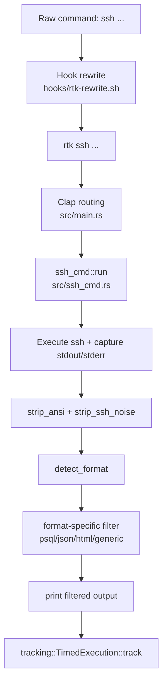

# Code Review: rtk ssh
Дата: 2026-02-16 23:02:59  
Область: `src/ssh_cmd.rs`, `src/main.rs`, `hooks/rtk-rewrite.sh`, `.claude/hooks/rtk-rewrite.sh`

## Контекст и метод проверки
- Прогнаны тесты: `cargo test ssh_cmd -- --nocapture` (35 passed, 0 failed, 1 ignored).
- Прогнан визуальный тест: `cargo test ssh_cmd::tests::visual_review_all_filters -- --ignored --nocapture`.
- Прогнан регрессионный набор: `cargo test --all-targets` (407 passed, 0 failed, 1 ignored).
- Проверена CLI-интеграция: `src/main.rs:556`, `src/main.rs:1432`, хук rewrite для `ssh` в `hooks/rtk-rewrite.sh:186`.

## Архитектура потока

## Findings (по приоритету)

### [P1] Сообщение про `-v` вводит в заблуждение: полного вывода не будет
- Локация: `src/ssh_cmd.rs:708`, `src/ssh_cmd.rs:60`, `src/ssh_cmd.rs:67`.
- Деталь: HTML-фильтр печатает `[use -v for full output]`, но в `run()` нет ветки, где `verbose > 0` отключает фильтрацию или возвращает raw output.
- Риск: оператор и LLM ожидают дебаг-режим с полным контекстом, но получают сжатый текст; это повышает шанс ложных выводов при диагностике.
- Рекомендация: либо реализовать true-verbose path (`if verbose > 0 { print raw }`), либо убрать/заменить это сообщение на корректное (`use rtk proxy ssh ...`).

### [P1] Потеря схемного контекста при `SELECT` с 0 строк
- Локация: `src/ssh_cmd.rs:229`, `src/ssh_cmd.rs:241`, `src/ssh_cmd.rs:247`, `src/ssh_cmd.rs:264`.
- Деталь: если `num_rows == 0`, `widths` пустой, `all_empty == true` для всех колонок, и фильтр скрывает все столбцы. В итоге шапка таблицы становится пустой, остается только `Hidden cols: ...`.
- Риск: при пустых выборках LLM теряет структуру ответа (какие поля реально вернул запрос), качество reasoning падает.
- Рекомендация: для `num_rows == 0` не применять авто-hide по `all_empty`; как минимум сохранять header (или первые N колонок).

### [P2] Слишком широкая автодетекция формата повышает шанс ложной классификации
- Локация: `src/ssh_cmd.rs:147`, `src/ssh_cmd.rs:157`.
- Деталь: `is_psql_schema()` и `is_psql_table()` используют простые эвристики (`Table "`, `Column|Type`, `-+-`). Любой похожий plain text может попасть не в тот фильтр.
- Риск: ошибочная маршрутизация приводит к агрессивному сжатию и потере смысла.
- Рекомендация: усилить сигнатуры (например, требовать комбинацию header+separator+row footer для psql, либо 2+ psql-specific marker).

## Сильные стороны реализации
- Корректная интеграция в CLI и hooks (`src/main.rs:556`, `src/main.rs:1432`, `hooks/rtk-rewrite.sh:186`).
- Сохранение exit-code дочернего `ssh` (`src/ssh_cmd.rs:85`).
- Хорошее покрытие unit tests + отдельный visual review (`src/ssh_cmd.rs:740+`).
- Реальная экономия токенов по visual samples: ~68-91% для schema/json/html сценариев.

## Масштабируемость (прогноз)
- 3 пользователя: решение работает стабильно, риск в основном функциональный (ложная классификация).
- 100 пользователей: вырастет число edge-cases форматов; нужны более строгие сигнатуры и safe-fallback.
- 1000 пользователей: потребуется policy-driven filtering (режимы strict/balanced/aggressive), иначе цена ложных сжатий станет заметной по support-load.

## Оценки (0-100)
- Code Quality: **79**
- Extensibility/Modularity: **74**
- Security: **84**
- Optimization/Performance: **71**
- Architecture & Visualization: **78**
- Deploy Cleanliness: **82**

## Приоритетный план исправлений
1. Исправить контракт `-v` (реальный full output или корректный текст подсказки).
2. Зафиксить поведение psql-filter для `0 rows` без скрытия всех колонок.
3. Ужесточить детектор форматов и добавить fallback-тесты на ложнопохожие входы.
