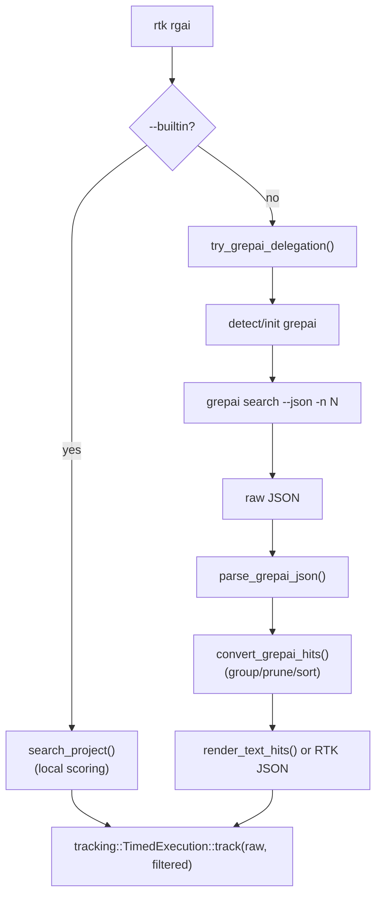

# Code Review: Grepai Hook via RTK `rgai`

**Date**: 2026-02-16 23:54:21
**Reviewer**: IT Architect Agent
**Scope**: `src/grepai.rs`, `src/rgai_cmd.rs`

## Executive Summary

Реализация в целом качественная: вы правильно вынесли парсинг grepai JSON, собрали фильтрующий pipeline и исправили трекинг savings (raw vs filtered).

Но есть 2 существенных риска для прод-использования: некорректная нумерация строк в выдаче и несовместимость JSON-контракта между `--builtin` и `grepai` режимами. Оба пункта могут сломать интеграции поверх `rtk rgai --json`.

## Architectural Diagram

## Requirements Compliance

| Original Requirement | Implementation Status | Notes |
| -------------------- | --------------------- | ----- |
| Делегировать `rtk rgai` в grepai | OK | Реализовано через `try_grepai_delegation()` |
| Сохранять RTK-формат вывода | WARN | Текстовый формат близок, JSON-схема расходится с builtin |
| Трекинг экономии на raw vs filtered | OK | Исправлено в `run()` |
| Компактный режим с меньшим шумом | OK | Лимиты по файлам/сниппетам работают |

## Architectural Assessment

### Strengths

- Чистое разделение ответственности: `grepai.rs` (интеграция) и `rgai_cmd.rs` (рендер/фильтрация).
- Хороший тестовый охват новых веток (`parse`, `group`, `compact`, fallback).
- Правильный шаг с always-JSON: единый вход для фильтрации и repeatable pipeline.

### Concerns

- Смещение line number на `+2` из-за учета служебных строк `File:` и пустой строки.
- JSON-контракт зависит от режима поиска (builtin vs grepai), что усложняет клиентский код.
- Fallback при parse error возвращает raw-строку, что может нарушать `--json` контракт.

### Recommendations

- Не учитывать служебный префикс grepai (`File:` + разделитель) в `line_offset`.
- Выровнять JSON-схему grepai-ветки с builtin-веткой.
- При `--json` и parse error возвращать валидный JSON-объект ошибки/fallback-маркер.

## Quality Scores

| Criterion          | Score      | Justification |
| ------------------ | ---------- | ------------- |
| Code Quality       | 82/100     | Хорошая структура и тесты, но есть функциональные edge-cases |
| Extensibility      | 84/100     | Pipeline удобно расширять, но контракт JSON нестабилен по режимам |
| Security           | 88/100     | Безопасная работа с `Command`; риски в основном не security-класса |
| Performance        | 80/100     | Существенная экономия в text/compact, но нестабильна в JSON-режиме |
| Architecture       | 83/100     | Логика понятна, но есть несогласованность выходных интерфейсов |
| Deploy Cleanliness | 85/100     | Изменения локализованы, тесты проходят |
| **TOTAL**          | **84/100** | Готово к использованию после фикса 2 must-fix дефектов |

## Critical Issues (Must Fix)

1. [CRITICAL] Смещены номера строк в grepai-выдаче.
   - Файл: `src/rgai_cmd.rs:307`, `src/rgai_cmd.rs:314`, `src/rgai_cmd.rs:322`
   - Причина: служебные строки grepai (`File:` и следующая пустая) увеличивают `line_offset`, хотя не относятся к исходному файлу.
   - Воспроизведение: raw `start_line=581`, RTK first line `583`.
   - Риск: переход по строкам в редакторе ведет не туда.

## Recommendations (Should Fix)

1. [SHOULD] Привести JSON-схему grepai-ветки к builtin-схеме.
   - builtin: `query/path/total_hits/shown_hits/scanned_files/skipped_large/skipped_binary/hits`
   - grepai: `query/total_hits/shown_hits/hits`
   - Файлы: `src/rgai_cmd.rs:192`, `src/rgai_cmd.rs:508`, `src/rgai_cmd.rs:464`

2. [SHOULD] Ужесточить fallback при parse error для `--json`.
   - Сейчас: `return raw.to_string()` в `src/rgai_cmd.rs:458`
   - Лучше: всегда отдавать валидный JSON с полем `fallback_raw`/`parse_error`.

## Minor Suggestions (Nice to Have)

1. [NICE] В `convert_grepai_hits()` добавить tie-break сортировку по `path`, как в builtin-ветке, чтобы убрать недетерминизм при равных `score`.
2. [NICE] Добавить интеграционный тест на parity JSON-ключей между `--builtin` и делегированным режимом.
3. [NICE] Добавить тест-кейс на line-number accuracy с реальным `File:` префиксом и `start_line`.
