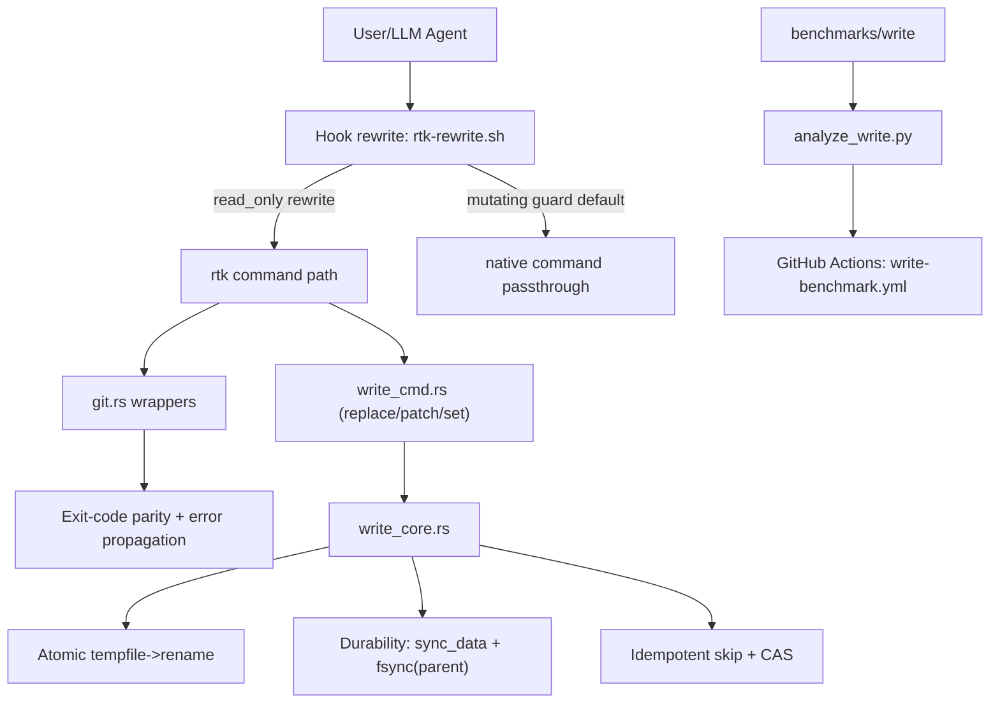

# Code Review: write-improvements

**Date**: 2026-02-17 13:47:31
**Reviewer**: IT Architect Agent
**Scope**: `src/git.rs`, `tests/git_cli_parity.rs`, `hooks/rtk-rewrite.sh`, `src/hook_audit_cmd.rs`, `src/write_core.rs`, `src/init.rs`, `src/write_cmd.rs`, `src/write_semantics.rs`, `tests/write_cli.rs`, `benchmarks/write/*`, `.github/workflows/write-benchmark.yml`

## Executive Summary

Реализация закрывает основной P0-риск semantic drift для mutating git-paths и вводит единый атомарный write-core с idempotent skip и durability режимами. Добавлен рабочий benchmark pipeline и CI-gate для threshold checks, что повышает воспроизводимость и управляемость качества.

Качество решения хорошее для текущего этапа rollout, но до полного соответствия `docs/write-improvements.md` остаются критичные пробелы: отсутствуют fault-injection crash-бенчмарки и расширенный parity-benchmark по side-effects/stderr для mutating-команд.

## Architectural Diagram

## Requirements Compliance

| Original Requirement | Implementation Status | Notes |
| -------------------- | --------------------- | ----- |
| P0 semantic drift в mutating wrappers устранить | OK | Non-zero propagation закрыт в `src/git.rs`; parity тесты есть в `tests/git_cli_parity.rs`. |
| Общий атомарный write-core как стандарт | OK | `src/write_core.rs` + интеграция в `src/init.rs`; durable/fast, CAS, stats. |
| Hook policy: mutating rewrite disabled by default | OK | `RTK_REWRITE_MUTATING=0` по умолчанию, аудит с `class=...` в логе. |
| Benchmark suite воспроизводим локально и в CI | OK | Локальный pipeline + новый workflow `.github/workflows/write-benchmark.yml`. |
| Durability/crash benchmarks (fault injection) | WARN | Раздел B из плана пока не реализован. |
| Semantic parity benchmark (exit+side-effect+stderr matrix) | WARN | Есть только exit-code parity тесты; матрица по side-effects/stderr не полная. |
| `rtk write` dry-run/apply/rollback semantics covered | OK | Dry-run/apply есть; rollback закреплён тестами неизменности при error в `tests/write_cli.rs` и `src/write_core.rs`. |

## Architectural Assessment

### Strengths

- Централизация write-пути в `write_core` снизила риск расхождения поведения между командами.
- Для mutating git-path сделана корректная failure-семантика с сохранением exit code native-инструмента.
- Hook-аудит стал диагностически полезнее за счёт классификации `read_only|mutating`.
- Benchmark pipeline практически применим: есть raw CSV, env fingerprint, Markdown-report, unit-тесты анализатора.

### Concerns

- `write set` для TOML/JSON делает full re-serialize (`src/write_cmd.rs:216`, `src/write_cmd.rs:226`), что может терять комментарии/формат/расположение ключей; риск нежелательных diff для user-facing конфигов.
- Раздел crash safety пока покрыт логикой и обычными тестами, но не fault-injection сценариями из плана.
- CI-gate проверяет latency thresholds, но не покрывает parity-side-effect/stderr gates для mutating-команд.

### Recommendations

- Перейти на `toml_edit`/AST-editing для TOML, чтобы сохранить комментарии и стиль файла.
- Добавить отдельный parity harness (matrix success/failure) с проверкой repo-state и ключевых stderr-сигналов.
- Реализовать fault-injection тесты (before-rename/after-rename) и добавить отчёт corruption/orphan-temp rate.

## Quality Scores

| Criterion          | Score      | Justification |
| ------------------ | ---------- | ------------- |
| Code Quality       | 86/100     | Хорошая модульность, тесты и понятная семантика ошибок; есть точечные риски в structured writes. |
| Extensibility      | 88/100     | `write_core` и `write_semantics` создают ясную основу для новых write-примитивов. |
| Security           | 82/100     | Критичных уязвимостей не выявлено; основной риск — не security, а integrity/UX при ре-сериализации конфигов. |
| Performance        | 90/100     | Bench показывает хорошие p50/p95 и ожидаемую разницу fast/durable; CI gate добавлен. |
| Architecture       | 89/100     | Правильный порядок rollout (parity/guardrail -> core -> bench); остаются незакрытые benchmark domains. |
| Deploy Cleanliness | 84/100     | Есть воспроизводимый pipeline и workflow; много нерелевантных warning в проекте ухудшают сигнал/шум. |
| **TOTAL**          | **87/100** | Качественный прогресс, но не финальный production-hardening по всем пунктам плана. |

## Critical Issues (Must Fix)

1. [CRITICAL] Для `rtk write set` перейти от полной ре-сериализации TOML/JSON к non-destructive editing для user-facing конфигов (`src/write_cmd.rs:216`, `src/write_cmd.rs:226`).
2. [CRITICAL] Дореализовать parity benchmark matrix по mutating git-командам (exit/side-effect/stderr), иначе включение `RTK_REWRITE_MUTATING=1` остаётся без полной доказательной базы.

## Recommendations (Should Fix)

1. [SHOULD] Добавить fault-injection crash benchmark из раздела B плана и формализовать pass/fail в CI.
2. [SHOULD] Снизить объём глобальных warning (`dead_code`, `unused`) для улучшения качества CI-сигнала.
3. [SHOULD] Расширить `tests/write_cli.rs` сценариями для TOML path conflicts и no-op structured updates.

## Minor Suggestions (Nice to Have)

1. [NICE] Добавить в `RESULTS.md` явный раздел "Methodology caveats" (FS cache, runner variance).
2. [NICE] Стабилизировать benchmark запусками `RUNS>=7` в nightly/cron job для меньшего шума.
