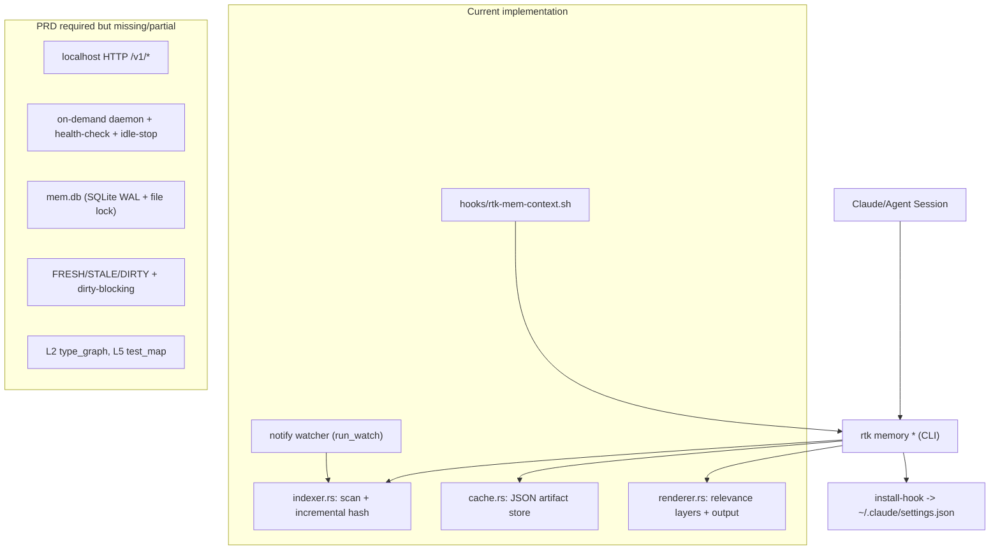

# Code Review: RTK Memory Layer (PRD `tasks/prd-rtk-memory-layer.md`)

> **Status update (2026-02-18, sprint-6+)**: this report is historical and partially obsolete. Core gaps called out here (HTTP API, SQLite WAL schema, strict consistency controls, `--since` git delta) were closed in later iterations.

**Date**: 2026-02-18 00:37:34
**Reviewer**: IT Architect Agent
**Scope**: `/Users/andrew/Programming/rtk/src/memory_layer/*`, `/Users/andrew/Programming/rtk/src/main.rs`, `/Users/andrew/Programming/rtk/hooks/rtk-mem-context.sh`, `/Users/andrew/Programming/rtk/Cargo.toml`, `/Users/andrew/Programming/rtk/tasks/prd-rtk-memory-layer.md`

## Executive Summary

Реализация `mod mem` функциональна для локального CLI-потока и даёт рабочий incremental cache + watcher + hook integration, но не закрывает критические требования PRD уровня release gate. Наиболее серьёзные разрывы: отсутствие HTTP API/daemon lifecycle, отсутствие гарантированного безопасного конкурентного доступа, и дефект zero-config hook path в `install-hook`.

Итог: решение пригодно как v0/v1-beta для одиночного CLI-пользователя, но **не готово** к заявленному в PRD production-уровню reliability для параллельных агентов.

## Architectural Diagram

## Requirements Compliance

| Original Requirement | Status | Notes |
| --- | --- | --- |
| MVP scope C: cache + daemon + API (`tasks/prd-rtk-memory-layer.md:7`) | FAIL | Cache/CLI есть, но daemon lifecycle и HTTP `/v1/*` отсутствуют. |
| Parallel agents + shared safe cache (`tasks/prd-rtk-memory-layer.md:8`, `:32`) | WARN | Общий disk cache есть, но без lock/WAL-гарантий race-loss. |
| Relevance mapping (`tasks/prd-rtk-memory-layer.md:10`, `:132`) | WARN | `query_type` реализован, но L2/L5 отсутствуют и L6-флаг частично игнорируется. |
| Consistency primary KPI / dirty-blocking (`tasks/prd-rtk-memory-layer.md:29`, `:151`) | FAIL | Нет tri-state `DIRTY`; валидация не всегда включает content hash; нет dependency cascade invalidation. |
| Data model `mem.db` SQLite WAL + schema (`tasks/prd-rtk-memory-layer.md:162`) | FAIL | Используются JSON-файлы в cache dir (`cache.rs`). |
| CLI contract incl. `delta --since REV` (`tasks/prd-rtk-memory-layer.md:193`) | FAIL | В `MemoryCommands::Delta` опция `--since` отсутствует. |
| Zero-config hook для Claude (`tasks/prd-rtk-memory-layer.md:31`, `:211`) | FAIL | `install-hook` пишет путь рядом с бинарём, но скрипт в package assets не поставляется. |
| Event-driven watcher (`tasks/prd-rtk-memory-layer.md:79`) | OK | Реализован `notify` + debounce/coalescing. |

## Architectural Assessment

### Strengths

- Нормальная модульная декомпозиция на `cache/indexer/extractor/manifest/renderer`.
- Incremental rehash по `size+mtime` и delta summary реализованы.
- Event-driven watcher через `notify` с фильтрацией шумных путей.
- Тестовый слой для `memory_layer` присутствует: `cargo test memory_layer` => 31/31 green.

### Concerns

- Главные PRD-решения (full-stack daemon+API, strict reliability model) не выполнены.
- Конкурентная модель записи cache остаётся lock-free на JSON-файлах, что не даёт формальных гарантий для multi-agent сценария.
- Zero-config путь hook script в `install-hook` нестабилен относительно реальной поставки.
- Relevance-layer логика неполная: отсутствуют L2/L5, а флаг L6 не участвует в фильтрации payload.

### Recommendations

- Закрыть P1-блокеры release gate: hook path, concurrency control, consistency model.
- Явно разделить maturity уровни: `beta` (CLI-only) vs `GA` (PRD-complete).
- Довести контракт PRD: `--since`, L2/L5, API endpoints и acceptance bench suite.

## Quality Scores

| Criterion | Score | Justification |
| --- | --- | --- |
| Code Quality | 74/100 | Код читаем, покрыт unit-тестами; есть дубли/незавершённость вокруг PRD-фич. |
| Extensibility/Modularity | 72/100 | Разбиение по модулям выполнено, но `mod.rs` всё ещё крупный и есть межмодульная связность. |
| Security | 58/100 | Нет явной модели защиты от prompt-injection в auto-injected hook context; lock/race риски. |
| Optimization/Performance | 69/100 | Warm cache быстрый на текущем repo (~20ms), но нет формального p95 bench на референсах. |
| Architecture & Visualization | 61/100 | Вектор архитектуры правильный, но ключевые PRD-элементы отсутствуют/частичны. |
| Deploy Cleanliness | 54/100 | Hook installer может устанавливать несуществующий путь; packaging не включает hook script рядом с бинарём. |
| **TOTAL** | **65/100** | Рабочий базовый MVP для локального сценария, но не соответствует release gate PRD. |

## Critical Issues (Must Fix)

1. **[CRITICAL] Broken zero-config hook install path**  
   `run_install_hook` вычисляет путь как `current_exe()/../rtk-mem-context.sh` (`/Users/andrew/Programming/rtk/src/memory_layer/mod.rs:543-553`), но package assets включают только бинарь `rtk` (`/Users/andrew/Programming/rtk/Cargo.toml:54-56`, `:60-62`). В реальной установке hook часто будет указывать на несуществующий файл.

2. **[CRITICAL] Relevance contract violation for L6 filtering**  
   `LayerFlags` содержит `l6_change_digest` (`/Users/andrew/Programming/rtk/src/memory_layer/mod.rs:141-147`), но `build_response` всегда добавляет `delta` (`/Users/andrew/Programming/rtk/src/memory_layer/renderer.rs:39-49`) и `render_text` всегда печатает delta (`/Users/andrew/Programming/rtk/src/memory_layer/renderer.rs:434-447`). Для `feature/refactor` это расходится с заданным relevance mapping.

3. **[CRITICAL] Missing concurrency safety for shared cache scenario**  
   Запись cache выполняется как tempfile+rename (`/Users/andrew/Programming/rtk/src/memory_layer/cache.rs:63-86`) без file lock/WAL координации. Это не закрывает требование устойчивости при параллельных агентах из PRD.

## Recommendations (Should Fix)

1. **[SHOULD] Добавить `--since REV` в `memory delta`**  
   Контракт PRD требует `rtk memory delta [--since REV]`, но в CLI отсутствует (`/Users/andrew/Programming/rtk/src/main.rs:1097-1110`).

2. **[SHOULD] Усилить consistency validation**  
   В `build_incremental_files` повторное использование идёт при совпадении только `size+mtime` (`/Users/andrew/Programming/rtk/src/memory_layer/indexer.rs:95-101`) без обязательной проверки content hash для stale/critical режимов.

3. **[SHOULD] Реализовать tri-state freshness model**  
   Сейчас статус фактически бинарный fresh/stale (`/Users/andrew/Programming/rtk/src/memory_layer/mod.rs:677-684`), без состояния `DIRTY` и policy-level blocking.

## Minor Suggestions (Nice to Have)

1. **[NICE] Вынести mem-константы в `config.rs`** (`CACHE_TTL_SECS`, `CACHE_MAX_PROJECTS`, `MAX_SYMBOLS_PER_FILE`) для управляемости rollout.
2. **[NICE] Добавить perf harness** для p95 cache-hit и scan cost на репозиториях разных размеров.
3. **[NICE] Добавить интеграционные тесты hook workflow** (install -> trigger -> prompt injection validation).
