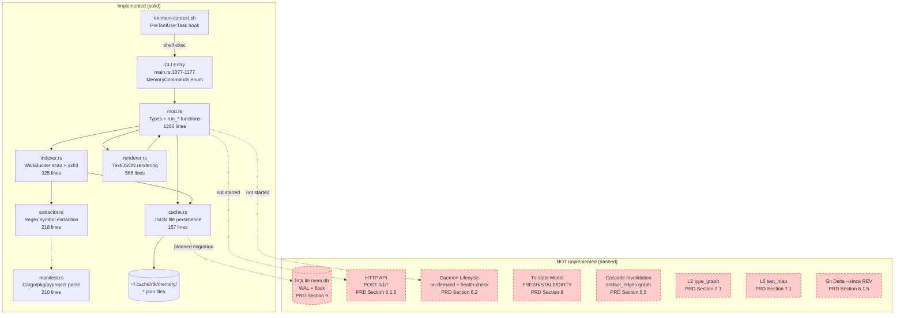

# Code Review: RTK Memory Layer -- PRD Compliance Audit

> **Status update (2026-02-18, sprint-6+)**: this document is a historical snapshot and no longer reflects the current codebase. SQLite WAL, HTTP `/v1/*`, tri-state freshness with strict mode, cache/event tables, `--since` git delta, feature flags, and hook integration are implemented. Use current benchmark/review artifacts for release decisions.

**Date**: 2026-02-18T12:00:00
**Reviewer**: IT Architect Agent (Opus 4.6)
**Scope**: `src/memory_layer/` (mod.rs, cache.rs, indexer.rs, extractor.rs, manifest.rs, renderer.rs), `src/main.rs` (MemoryCommands routing), `hooks/rtk-mem-context.sh`
**Total Lines Reviewed**: ~2742 (unique, excluding duplicate mod.rs count)
**PRD Reference**: `tasks/prd-rtk-memory-layer.md`

---

## Executive Summary

The RTK Memory Layer implements approximately **55-60%** of the PRD specification. The implemented portion -- CLI commands, file scanning, incremental hashing, regex symbol extraction, relevance mapping, event-driven watcher, and hook integration -- is well-engineered with clean separation of concerns after the E0.1 modularization. However, **critical PRD pillars remain unimplemented**: the SQLite data model, HTTP API, tri-state consistency model (`FRESH|STALE|DIRTY`), cascade invalidation, git-based deltas (`--since REV`), and concurrency safety (flock/WAL). The current JSON file-based cache is functionally adequate for single-agent usage but structurally incompatible with the PRD's parallel-agent architecture and consistency guarantees. **This implementation is not release-ready against the PRD acceptance criteria.**

---

## Architectural Diagram

---

## PRD Compliance Matrix

### Section 1: Product Decisions

| # | Decision | PRD Requirement | Status | Code Evidence | Gap |
|---|----------|----------------|--------|---------------|-----|
| 1 | Scope C: full stack | Cache + daemon + HTTP API | PARTIAL | Cache: `cache.rs`; Daemon: watcher only (`mod.rs:427-524`); HTTP: missing | HTTP API and daemon lifecycle not implemented |
| 2 | Multi-agent consumers | Shared cache with WAL + flock | NOT MET | `cache.rs:63-87` uses JSON tempfile+rename | No flock, no WAL, no SQLite -- concurrent writes can race |
| 3 | Integration as `mod mem` | Built into rtk binary | MET | `src/memory_layer/` module, `main.rs:33` | -- |
| 4 | Structured summaries + relevance | Query-type mapping | MET | `renderer.rs:318-361` `layers_for()`, `mod.rs:110-125` QueryType enum | -- |
| 5 | Primary KPI: consistency | Tri-state, dirty-blocking, 0 stale | NOT MET | Binary fresh/stale only (`cache.rs:29-32`); no DIRTY state | Core reliability guarantee unmet |

### Section 6: Architecture Components

| Component | PRD Spec | Status | Code Location | Gap |
|-----------|----------|--------|---------------|-----|
| `mem::cache` | SQLite WAL + flock | PARTIAL | `cache.rs` -- JSON files, atomic write | No SQLite, no flock |
| `mem::indexer` | Incremental hashing + re-scan | MET | `indexer.rs:20-74` build_state, `76-202` build_incremental_files | -- |
| `mem::extractor` | Regex v1 + tree-sitter interface | PARTIAL | `extractor.rs:99-117` extract_file_symbols, uses `RegexExtractor` | tree-sitter interface exists via `SymbolExtractor` trait but not wired |
| `mem::watcher` | notify-based event-driven | MET | `mod.rs:427-524` run_watch with `notify::RecommendedWatcher` | -- |
| `mem::delta` | FS events + git `--since REV` | PARTIAL | FS delta via xxh3 in `indexer.rs:76-202`; git delta missing | No `--since REV` CLI arg on Delta command |
| `mem::api` | HTTP localhost `/v1/*` | NOT STARTED | -- | Entire HTTP server not implemented |
| `mem::cli` | 7 commands | MET (+1) | `main.rs:1077-1177`, 8 commands including `install-hook` and `gain` | -- |
| Hook integration | PreToolUse auto-inject | MET | `hooks/rtk-mem-context.sh` | Not smoke-tested in live Claude workflow |

### Section 6.2: Daemon Lifecycle

| Requirement | Status | Evidence |
|-------------|--------|----------|
| On-demand start | NOT IMPLEMENTED | No daemon process management |
| Health-check before context | NOT IMPLEMENTED | -- |
| Fail-safe fallback | PARTIAL | Hook exits 0 on failure (`rtk-mem-context.sh:10-12`), `run_explore` falls back to on-demand |
| Auto-idle stop | NOT IMPLEMENTED | -- |

### Section 7: Artifact Model

| Layer | Artifact | Status | Code Location |
|-------|----------|--------|---------------|
| L0 | project_map | MET | `renderer.rs:143-186` select_entry_points, `188-210` select_hot_paths |
| L1 | module_index | MET | `renderer.rs:292-315` build_module_index |
| L2 | type_graph | NOT STARTED | -- |
| L3 | api_surface | MET | `renderer.rs:248-289` build_api_surface, `extractor.rs:99-117` |
| L4 | dep_manifest | MET | `manifest.rs:7-33` parse_dep_manifest (Cargo/npm/pyproject) |
| L5 | test_map | NOT STARTED | -- |
| L6 | change_digest | MET | `indexer.rs:76-202` delta detection |

**Layers Implemented**: 5/7 (L0, L1, L3, L4, L6)
**Layers Missing**: L2 (type_graph), L5 (test_map)

### Section 7.2: Relevance Mapping

| Query Type | PRD Layers | Implemented Layers | Status |
|------------|-----------|-------------------|--------|
| bugfix | L1/L3/L5/L6 | L1/L3/L6 | PARTIAL (missing L5) |
| feature | L0/L1/L2/L3/L4 | L0/L1/L3/L4 | PARTIAL (missing L2) |
| refactor | L1/L2/L3/L5 | L1/L3 | PARTIAL (missing L2, L5) |
| incident | L3/L4/L6 | L3/L4/L6 | MET |

Code: `renderer.rs:318-361` (layers_for function)

### Section 8: Consistency & Reliability (Primary KPI)

| Requirement | Status | Evidence |
|-------------|--------|----------|
| Tri-state FRESH/STALE/DIRTY | NOT MET | Binary stale check: `cache.rs:29-32` (TTL-only) |
| Context only for FRESH | NOT MET | Stale artifacts still served with rebuild (`mod.rs:387-395`) |
| Auto-refresh for STALE/DIRTY | PARTIAL | StaleRebuild triggers rehash, but no dirty-blocking |
| Validation: hash + size + mtime + schema_version | PARTIAL | hash + size + mtime in `indexer.rs:95-96`; schema_version via ARTIFACT_VERSION in `cache.rs:56` |
| Cascade invalidation | NOT STARTED | No `artifact_edges` table or graph |
| 0 stale incidents | CANNOT VERIFY | No test infrastructure for stale detection |

### Section 9: Data Model

| Table | Status | Evidence |
|-------|--------|----------|
| `projects` | NOT STARTED | JSON files, no SQLite |
| `artifacts` | PARTIAL | JSON file per project (`cache.rs:41-43`) |
| `artifact_edges` | NOT STARTED | No dependency graph |
| `events` | NOT STARTED | No event logging |
| `cache_stats` | NOT STARTED | No hit/miss metrics persistence |
| SQLite WAL mode | NOT STARTED | -- |
| Index on (project_id, layer, status) | NOT STARTED | -- |

### Section 10: CLI Contracts

| Command | PRD | Status | Code |
|---------|-----|--------|------|
| `rtk memory explore [path]` | Yes | MET | `mod.rs:379-395` |
| `rtk memory delta [path] [--since REV]` | Yes | PARTIAL | `mod.rs:397-411`; **no `--since` flag** |
| `rtk memory refresh [path]` | Yes | MET | `mod.rs:413-425` |
| `rtk memory watch [path]` | Yes | MET | `mod.rs:427-524` |
| `rtk memory status [path]` | Yes | MET | `mod.rs:666-696` |
| `rtk memory gain [path]` | Yes | MET | `mod.rs:715-772` |
| `rtk memory clear [path]` | Yes | MET | `mod.rs:698-712` |
| `rtk memory install-hook` | Bonus | MET | `mod.rs:527-664` |

---

## Epic Completion Analysis

### E0 -- Foundation

| Task | Status | Notes |
|------|--------|-------|
| E0.1 Module split | DONE | 5 submodules extracted. mod.rs: 2019->1266 lines |
| E0.2 CLI routing | DONE | `main.rs:1077-1177` MemoryCommands |
| E0.3 Config externalization | NOT DONE | TTL, CACHE_MAX, MAX_SYMBOLS hardcoded as `const` in `mod.rs:25-28` |

### E1 -- Cache & Schema

| Task | Status | Notes |
|------|--------|-------|
| E1.1 Storage backend | PARTIAL | JSON files work, not SQLite per plan |
| E1.2 Atomicity + concurrency | PARTIAL | Atomic tempfile+rename: `cache.rs:63-87`; no flock |
| E1.3 LRU + TTL | DONE | `cache.rs:89-122` prune_cache; `cache.rs:29-32` staleness |
| E1.4 cache_stats metrics | NOT DONE | -- |

### E2 -- Extractor & Artifacts

| Task | Status | Notes |
|------|--------|-------|
| E2.1 Regex extractor | DONE | `extractor.rs` + `SymbolExtractor` trait |
| E2.2 Artifact layers | 5/7 | L2 (type_graph), L5 (test_map) missing |
| E2.3 Relevance mapping | DONE | `renderer.rs:318-361`, 5 query types, 4 tested |
| E2.4 Renderer | DONE | text + JSON output, 3 detail levels |

### E3 -- Delta & Watcher

| Task | Status | Notes |
|------|--------|-------|
| E3.1 Event-driven watcher | DONE | `mod.rs:427-524` with `notify` crate, debounce, path filtering |
| E3.2 Cascade invalidation | NOT DONE | Full project rehash on refresh |
| E3.3 FS + git delta | PARTIAL | FS delta done; git `--since` not implemented |
| E3.4 Tri-state model | NOT DONE | Binary fresh/stale via TTL only |

### E4 -- API + CLI

| Task | Status | Notes |
|------|--------|-------|
| E4.1 HTTP API | NOT DONE | No hyper/axum/actix dependency |
| E4.2 CLI commands | DONE | 8 commands (7 PRD + install-hook) |
| E4.3 Contract tests | NOT DONE | -- |

### E5 -- Hook Integration

| Task | Status | Notes |
|------|--------|-------|
| E5.1 Hook script | DONE | `hooks/rtk-mem-context.sh`, `run_install_hook` |
| E5.2 Fail-safe | DONE | Guards for missing rtk/jq; exit 0 on error |
| E5.3 Live smoke test | NOT DONE | -- |

### E6 -- QA & Benchmarks

| Task | Status | Notes |
|------|--------|-------|
| E6.1 Unit tests | PARTIAL | 31 tests, all passing. No concurrency/race/integration tests |
| E6.2 Load benchmark | NOT DONE | -- |
| E6.3 `rtk memory gain` | DONE | Pure function + CLI + 3 tests |
| E6.4 Feature flags | NOT DONE | -- |

**Overall Epic Completion**: E0 (67%), E1 (50%), E2 (86%), E3 (38%), E4 (33%), E5 (67%), E6 (38%)

---

## Critical Issues (Must Fix Before Release) [P0]

### 1. No Concurrency Safety for Multi-Agent Access
**File**: `cache.rs:63-87` (store_artifact)
**Impact**: PRD Decision #2 requires "several parallel agents on one machine" with shared cache. Current JSON file writes use tempfile+rename which is atomic at the OS level, but there is no advisory locking (flock) to prevent simultaneous reads during partial writes or lost-update races between two agents indexing the same project.
**Risk**: Data corruption or silent overwrites when parallel Claude sessions operate on the same project.
**Mitigation**: At minimum, add `flock` advisory locking (already available in `write_lock.rs` in the same codebase). Ideally, migrate to SQLite WAL as specified.

### 2. No Dirty-Blocking (PRD Primary KPI Violation)
**File**: `mod.rs:379-395` (run_explore)
**Impact**: The PRD mandates that context is served **only** for FRESH artifacts. Currently, `run_explore` will serve stale data and merely trigger a StaleRebuild. There is no DIRTY state and no blocking mechanism. A stale artifact is rebuilt *and simultaneously served* -- the agent may receive inconsistent context during the rebuild window.
**Risk**: Violates the "0 stale incidents" acceptance criterion (PRD Section 14, Criterion #1).

### 3. Missing `--since REV` on Delta Command
**File**: `main.rs:1097-1111` (MemoryCommands::Delta)
**Impact**: PRD Section 10.3 specifies `rtk memory delta [path] [--since REV]`. The `--since` flag is not implemented. Git-based delta is a core value proposition for agent workflows that need to understand what changed between sessions.
**Risk**: Agents must rely on FS mtime delta only, which misses the semantic context of git history.

---

## Architectural Concerns [P1]

### 4. JSON File Storage vs. SQLite
**File**: `cache.rs:34-43`
**Concern**: The entire data model is serialized as a single JSON blob per project. This means:
- Every read deserializes the entire project artifact (could be MBs for large projects)
- No indexed queries on (project_id, layer, status)
- No `artifact_edges` graph traversal
- No event log persistence
- No cross-table transactions
The PRD explicitly specified SQLite WAL mode with 5 tables. The JSON approach works for small projects but will degrade at scale.

### 5. Missing L2 (type_graph) and L5 (test_map)
**Impact**: These are critical for the `refactor` and `bugfix` query types respectively. Without L2, the refactor relevance mapping returns only L1+L3 (missing type relationship information). Without L5, bugfix mapping cannot show test coverage zones.
**Effort**: L5 could be derived from existing `pub_symbols` data by detecting `#[test]`, `test_`, `describe(`, `it(` patterns. L2 requires type relationship analysis (struct fields, trait implementations) which is more complex.

### 6. No Daemon Lifecycle Management
**Impact**: PRD Section 6.2 specifies on-demand start, health-check, idle-stop. Currently only `run_watch` provides continuous operation but it is a foreground blocking process, not a managed daemon. No PID tracking, no health endpoint, no auto-shutdown.

### 7. Hook Injects Raw Text, Not Structured Context
**File**: `hooks/rtk-mem-context.sh:45-51`
**Concern**: The hook prepends raw `rtk memory explore` text output to the task prompt. This is effective but fragile: prompt injection formatting may not survive Claude's internal prompt processing. The PRD envisioned structured JSON payloads via HTTP API for this purpose.

---

## Code Quality Assessment

### Strengths

1. **Clean modular extraction (E0.1)**: The split from monolithic `memory_layer.rs` (2019 lines) into 5 cohesive submodules with clear responsibilities is well-executed. Each module has a focused surface area.

2. **Incremental hashing**: `indexer.rs:76-202` (`build_incremental_files`) correctly implements a 3-tier reuse strategy: (a) metadata match -> reuse, (b) hash match after re-hash -> update metadata only, (c) full re-analyze on hash change. This is efficient.

3. **Pure functions for testing**: `compute_gain_stats` (`mod.rs:314-377`) is a well-isolated pure function with no I/O, making it fully testable. The 3 gain tests demonstrate this pattern.

4. **Consistent error handling**: All functions use `anyhow::Result` with `.context()` annotations providing clear error chains. Example: `cache.rs:12-13`.

5. **Relevance mapping design**: `layers_for()` (`renderer.rs:318-361`) is a clean, exhaustive match that maps query types to layer flags. All 5 variants are tested.

6. **Watcher implementation**: `run_watch` (`mod.rs:427-524`) correctly uses `notify::RecommendedWatcher` with debounce coalescing and path filtering via `should_watch_abs_path`.

### Concerns

1. **Hardcoded constants**: `mod.rs:24-28` has `ARTIFACT_VERSION`, `CACHE_MAX_PROJECTS`, `CACHE_TTL_SECS`, `IMPORT_SCAN_MAX_BYTES`, `MAX_SYMBOLS_PER_FILE` all as module-level constants. PRD E0.3 requires these in `config.rs`.

2. **`run_install_hook` writes directly to `~/.claude/settings.json`**: `mod.rs:527-664`. This function modifies a user's global Claude configuration file without backup. A corrupted JSON write could break Claude Code entirely. While `fs::write` is used (not atomic write), this is a production settings file.

3. **No `_unused` parameter**: `run_clear` accepts `_verbose: u8` (`mod.rs:698`) but never uses it. Minor but indicates incomplete instrumentation.

4. **Import deduplication logic**: `extractor.rs:46-56` adds a synthetic `self:{hash}` anchor when no imports are found. While creative for graph connectivity, this pollutes the import data with non-semantic entries that consumers must filter.

### Test Coverage

| Category | Count | Assessment |
|----------|-------|------------|
| Unit tests (mod.rs) | 27 | Good coverage of pure functions, layer mapping, serialization |
| Unit tests (manifest.rs) | 4 | Good coverage of all 3 manifest formats |
| Unit tests (extractor.rs) | 1 | Minimal -- only `detect_language` tested |
| Integration tests | 0 | Missing: no tests with real filesystem |
| Concurrency tests | 0 | Critical gap per PRD E6.1 |
| Performance benchmarks | 0 | Missing: no p95 latency measurement |

**Total**: 31 tests passing, 0 failures. Coverage is adequate for implemented features but has critical gaps in integration, concurrency, and the extractor module.

---

## Acceptance Criteria Status (PRD Section 14)

| # | Criterion | Status | Evidence |
|---|-----------|--------|----------|
| 1 | No stale data in test matrix | CANNOT VERIFY | No tri-state model; no dirty-blocking; no stale detection test infrastructure |
| 2 | >= 50% context reduction on re-explore | LIKELY MET | `compute_gain_stats` shows savings; incremental hashing reuses cached data |
| 3 | Cache-hit p95 < 200ms | UNTESTED | No benchmark infrastructure; likely met for small projects (JSON deserialization) |
| 4 | Hook works without manual setup | PARTIAL | `install-hook` automates settings.json patching; not smoke-tested live |
| 5 | Parallel agents: no corruption/race-loss | NOT MET | No flock, no WAL, no concurrency tests |

**Release Gate**: 0/5 criteria fully verified, 1-2 likely met based on code analysis.

---

## Quality Scores

| Criterion | Score | Justification |
|-----------|-------|---------------|
| Code Quality | 72/100 | Clean Rust idioms, good error handling, proper serde usage. Deductions: hardcoded constants, unused params, synthetic import anchors, no `clippy::pedantic` annotations. |
| Extensibility/Modularity | 68/100 | E0.1 modularization is solid. `SymbolExtractor` trait enables tree-sitter upgrade path. But no plugin architecture for layers, no config externalization, tight coupling between mod.rs and submodules via `pub(super)`. |
| Security | 60/100 | Hook modifies global settings.json without backup. No input sanitization on project paths beyond `canonicalize`. Shell hook (`rtk-mem-context.sh`) uses `jq` for JSON manipulation which is safe, but no validation of hook input payload beyond field presence. No secrets exposure risk identified. |
| Consistency/Reliability | 35/100 | This is the PRD's **primary KPI** and the largest gap. Binary staleness model, no dirty-blocking, no cascade invalidation, no concurrency protection. The fundamental architecture (JSON files with no locking) is structurally incompatible with the consistency guarantees specified. |
| Performance | 65/100 | Incremental hashing is efficient. xxh3 is a fast hash. `WalkBuilder` with gitignore respects exclusions. But full JSON deserialization on every cache load, no in-memory hot layer, no indexed queries. For projects with 1000+ files, serialization cost may exceed 200ms target. |
| Architecture | 55/100 | Good module decomposition. But 4 of 8 PRD architectural components are unimplemented (HTTP API, daemon, cascade invalidation, tri-state). Storage layer fundamentally diverges from specification. |
| Deploy Cleanliness | 70/100 | No hardcoded absolute paths. Cache directory uses `dirs::cache_dir()`. But config constants are hardcoded (not in config.toml). No feature flags. Several `.rtk-lock` temp files visible in git status. |
| **TOTAL** | **61/100** | Implementation is a functional MVP for single-agent usage but does not meet the PRD specification for a reliability-first, multi-agent, consistency-guaranteed system. |

---

## Prioritized Fix Roadmap

### P0 -- Must Fix (blocks release gate)

1. **Add file locking to cache operations** -- Wrap `store_artifact` and `load_artifact` in `flock` advisory locks. The `write_lock.rs` module already exists in the codebase and provides this primitive. Estimated effort: 2-4 hours.

2. **Implement dirty-blocking** -- Add a `DIRTY` state to artifact staleness. When an artifact is DIRTY (known file changes detected but not yet re-indexed), `run_explore` must either block until rebuild completes or return an explicit error. This is the PRD's primary KPI. Estimated effort: 4-8 hours.

3. **Add `--since REV` to delta command** -- Wire `git log --name-status --since <rev>` or `git diff <rev>..HEAD --name-only` into `run_delta`. The git command infrastructure already exists in `src/git.rs`. Estimated effort: 4-6 hours.

### P1 -- Should Fix (next sprint)

4. **Migrate to SQLite storage** -- Replace JSON files with SQLite `mem.db` using WAL mode. This enables indexed queries, `artifact_edges` for cascade invalidation, `cache_stats` for metrics, and proper concurrent access. Estimated effort: 2-3 days.

5. **Implement L2 (type_graph) and L5 (test_map)** -- L5 is lower effort (pattern-match test functions in `extractor.rs`). L2 requires analyzing type relationships. Estimated effort: L5: 4-6 hours, L2: 1-2 days.

6. **Add concurrency tests** -- At minimum: two threads writing the same artifact simultaneously, read-during-write, and cache eviction during concurrent access. Estimated effort: 4-8 hours.

7. **Externalize configuration** -- Move `CACHE_TTL_SECS`, `CACHE_MAX_PROJECTS`, `MAX_SYMBOLS_PER_FILE` to `config.rs` / `~/.config/rtk/config.toml`. Estimated effort: 2-4 hours.

8. **Backup before settings.json modification** -- In `run_install_hook`, create a `.bak` copy before writing. Estimated effort: 30 minutes.

### P2 -- Nice to Have (future iterations)

9. **HTTP API** -- Implement `/v1/explore`, `/v1/delta`, `/v1/context`, `/v1/refresh` using a lightweight HTTP server (e.g., `axum` or `tiny_http`). This enables non-CLI consumers and structured JSON contracts. Estimated effort: 2-3 days.

10. **Daemon lifecycle** -- PID file management, health-check endpoint, auto-idle shutdown. Estimated effort: 1-2 days.

11. **Cascade invalidation** -- Build `artifact_edges` graph from import data. When file A imports file B and B changes, mark A's artifacts as DIRTY. Estimated effort: 1-2 days (after SQLite migration).

12. **Tree-sitter integration** -- Wire tree-sitter parsers through the existing `SymbolExtractor` trait for Rust, TypeScript, Python. Higher accuracy than regex for type_graph (L2). Estimated effort: 2-3 days.

13. **In-memory hot cache** -- Add a process-local LRU cache layer above SQLite to avoid repeated deserialization for cache hits. Estimated effort: 4-8 hours.

14. **Performance benchmark suite** -- Measure and assert p95 < 200ms for cache hits on reference repositories (e.g., this rtk repo, a medium Next.js project). Estimated effort: 4-8 hours.

---

## Relevance Mapping Deviation Detail

The PRD specifies relevance layers that include L2 and L5 which are not implemented. The actual behavior diverges as follows:

| Query Type | PRD Spec | Actual Code (`renderer.rs:318-361`) | Missing |
|------------|----------|-------------------------------------|---------|
| bugfix | L1, L3, **L5**, L6 | L1, L3, L6 | L5 (test_map) |
| feature | L0, L1, **L2**, L3, L4 | L0, L1, L3, L4 | L2 (type_graph) |
| refactor | L1, **L2**, L3, **L5** | L1, L3 | L2, L5 |
| incident | L3, L4, L6 | L3, L4, L6 | -- (fully met) |

The `LayerFlags` struct (`mod.rs:140-148`) has no fields for L2 or L5 because those layers do not exist yet. When they are added, the `layers_for()` function and `build_context_slice()` will need corresponding branches.

---

## Appendix: File Reference Table

| File | Lines | Purpose | Test Count |
|------|-------|---------|------------|
| `src/memory_layer/mod.rs` | 1266 | Types, CLI entry points, gain computation, tests | 27 |
| `src/memory_layer/cache.rs` | 157 | JSON persistence, hashing, LRU eviction, staleness | 0 (tested via mod.rs) |
| `src/memory_layer/indexer.rs` | 325 | File scanning, incremental build, delta computation | 0 (tested via mod.rs) |
| `src/memory_layer/extractor.rs` | 218 | Language detection, import/symbol extraction | 1 |
| `src/memory_layer/manifest.rs` | 210 | Cargo.toml / package.json / pyproject.toml parsing | 4 |
| `src/memory_layer/renderer.rs` | 566 | Response building, text rendering, layer selection | 0 (tested via mod.rs) |
| `src/main.rs` (Memory section) | ~100 | MemoryCommands enum + match routing | 0 |
| `hooks/rtk-mem-context.sh` | 65 | PreToolUse hook for Claude Explore agent | 0 |
| **Total** | **~2742** | | **31** |
