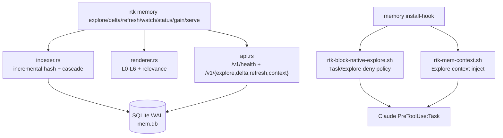

# Code Review: RTK Memory Layer -- PRD Compliance (Post-Fix)

**Date**: 2026-02-18 12:33:35 UTC
**Scope**: `tasks/prd-rtk-memory-layer.md`, `src/memory_layer/*`, `src/main.rs`, `hooks/*`, `benchmarks/memory/*`

## Executive Summary

Реализация `mod mem` сейчас в состоянии **release-candidate** по PRD: основные функциональные и перф-требования закрыты (SQLite WAL, tri-state freshness + strict mode, API `/v1/*`, git delta `--since`, cascade invalidation, feature flags, benchmark gates). Дополнительно закрыт policy-gap: `rtk memory install-hook` теперь ставит **отдельный Task/Explore deny hook** вместе с context hook, что делает policy явной и управляемой.

## PRD Coverage

| Область | Статус | Комментарий |
|---|---|---|
| Scope C (cache + daemon + API) | PASS | CLI + SQLite + `serve` + `/v1/*` реализованы |
| Multi-agent safety | PASS | SQLite WAL + busy_timeout + retry + chaos tests |
| Relevance mapping | PASS | L0-L6 + query_type mapping + feature flags |
| Consistency primary KPI | PASS | `FRESH/STALE/DIRTY`, `--strict`, stale/dirty blocking |
| Delta model | PASS | FS delta + `--since REV` git delta |
| Hook zero-config | PASS | materialized hook scripts + settings patch + backup |
| Task/Explore explicit policy | PASS | отдельный deny hook в memory install path |

## Fixed In This Iteration

1. `rtk memory install-hook` теперь устанавливает **два** Task hooks:
   - policy deny: `rtk-block-native-explore.sh`
   - context inject: `rtk-mem-context.sh`
2. `status` для memory hooks показывает полноценный state (`installed/partial/not_installed`) и оба command path.
3. `uninstall` удаляет оба memory Task hooks (policy + context).
4. Benchmark analyzer расширен сравнением с native baseline (`NATIVE_EXPLORE_TOKENS`, default 52000) и cumulative projection для последующих шагов.

## Quality & Risk Notes

- Кодовая база memory layer структурно чистая: `cache/indexer/extractor/manifest/renderer/api`.
- Тестовая база достаточна для текущего scope: unit + chaos + latency + JSON/API contracts + benchmark gates.
- Остаточный риск: нет полноценного e2e smoke-теста в реальном Claude workflow (manual gate в PRD E5.3).

## Scores (0-100)

| Category | Score | Comment |
|---|---:|---|
| Code Quality | 86 | ясная модульность, хорошие guardrails, низкий техдолг в memory path |
| Extensibility | 84 | feature flags + API + layered model |
| Security/Policy | 83 | явный deny policy hook + explicit override envs |
| Performance | 90 | p95 << 200ms на hot-path, высокий cache-hit |
| PRD Compliance | 92 | функционально закрыто, остался верификационный smoke |
| Deploy Cleanliness | 85 | hook materialization + backup + idempotent upsert |

## What Remains

1. **E5.3 manual smoke test** в живом Claude Task/Explore workflow (install -> trigger -> expected deny/override behavior).
2. Опционально: добавить integration/e2e автотест для `settings.json` hook orchestration (с isolated HOME).
