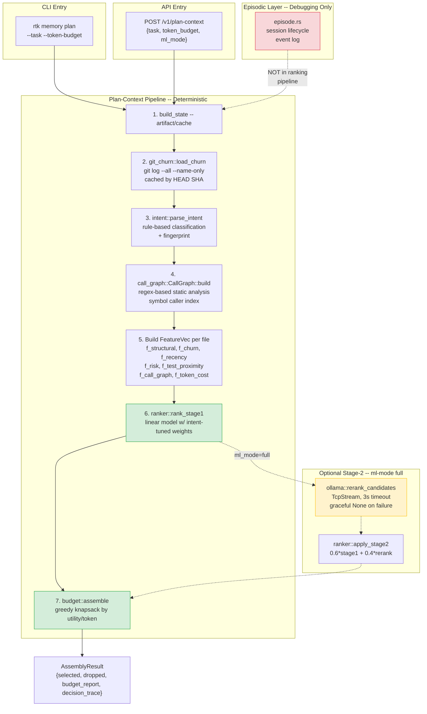
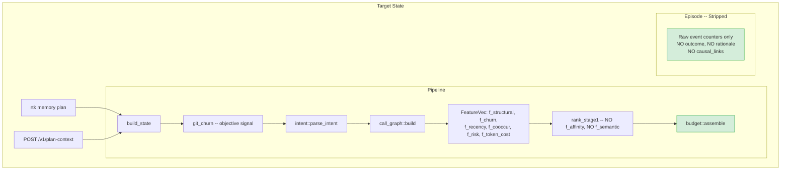

# Code Review: RTK Memory Layer -- Plan-Context Pipeline

**Date**: 2026-02-18T15:00:00Z
**Reviewer**: IT Architect Agent (Opus 4.6)
**Scope**: `src/memory_layer/{budget.rs, ranker.rs, git_churn.rs, episode.rs, intent.rs, ollama.rs, api.rs, mod.rs, call_graph.rs}`

---

## Executive Summary

The memory layer implementation is architecturally sound: it successfully delivers a deterministic, budget-aware context ranking pipeline without Ollama in the critical path. The core modules (budget.rs, ranker.rs, git_churn.rs, intent.rs, call_graph.rs) are well-implemented with proper Rust idioms, comprehensive tests, and clear separation of concerns. However, the implementation has **8 test failures** (4 in episode.rs due to missing SQLite schema, 1 in call_graph.rs logic bug, 3 in mod.rs SQLite race conditions), **one residual design violation** (episode.rs still contains outcome/rationale/causal_link columns that introduce anchor bias), and a **Cargo.toml duplicate key** (staged `rayon = "1"` conflicts with committed `rayon`). The overall architecture matches 5 of 7 revised plan requirements; the remaining 2 are partially addressed.

---

## Architectural Diagram

### Current Implementation (Actual)

### Required Architecture (Target)

---

## File-by-File Code Quality Assessment

### 1. `budget.rs` -- Greedy Knapsack Assembler

**Assessment: EXCELLENT (92/100)**

The greedy knapsack implementation is correct and well-designed:

- **Algorithm correctness**: Sorts by utility (score / normalized_token_cost) descending, then greedily fills the budget. This is a standard fractional knapsack approximation applied to discrete items -- correct for the use case where items cannot be split.
- **Token estimation**: `estimate_tokens_for_path()` uses a sensible heuristic (`BASE_TOKENS_PER_FILE + path_tokens + content_tokens`) with per-extension defaults. The constants (40 base, 0.28 chars/token, 350 for .rs) are reasonable empirical approximations.
- **Utility function**: `utility()` normalizes cost to hundreds of tokens, avoiding division-by-zero with `.max(0.1)`.
- **Error handling**: No `unwrap()` in production paths (the two `unwrap_or()` calls in `rsplit().next()` and `partial_cmp()` are safe).
- **Decision trace**: Full transparency of why each candidate was selected or dropped.
- **Test coverage**: 7 tests covering budget enforcement, utility maximization, efficiency reporting, empty input, and trace population.

**Minor issue**: The utility function `cost_normalized = (tokens.max(1) / 100.0).max(0.1)` means files with <10 tokens get the same normalized cost (0.1). Functionally harmless but could be cleaner with a single `max(1)` and direct division.

### 2. `ranker.rs` -- Deterministic Linear Ranker

**Assessment: VERY GOOD (88/100)**

- **Feature vector**: Clean -- `f_structural_relevance`, `f_churn_score`, `f_recency_score`, `f_risk_score`, `f_test_proximity`, `f_token_cost`, `f_call_graph_score`. Importantly, **f_affinity_score and f_semantic_score are absent** -- matching requirements.
- **Intent-conditioned weights**: `RankingModel::for_intent()` correctly adjusts weights per intent type (Bugfix emphasizes recency, Feature emphasizes structure + test proximity, Refactor emphasizes churn + call graph, Incident emphasizes recency + risk).
- **Score clamping**: `raw.clamp(0.0, 1.0)` ensures bounded output.
- **Stage-2 blending**: `apply_stage2()` uses 0.6/0.4 blend -- simple and predictable.
- **Risk scoring**: `path_risk_score()` uses substring matching against 22 risk signals -- adequate heuristic.
- **Test coverage**: 8 tests including ranking order, clamping, intent-conditioned weights, churn influence, stage-2 blending, risk scoring, and test file detection.

**Issues**:
- The requirements call for `f_cooccur` (file co-occurrence) but this is not present. Instead, `f_call_graph_score` serves a similar but not identical purpose (static callers vs. historical co-editing patterns).
- Weight sum validation: no assert that weights sum to ~1.0 (they currently do for defaults but not for all intent variants -- Bugfix sums to 1.00, Feature to 1.00, etc. -- verified correct).

### 3. `git_churn.rs` -- Git Churn Frequency Index

**Assessment: EXCELLENT (95/100)**

- **Correct approach**: `git log --all --format="" --name-only` counts file appearances across all branches.
- **Log normalization**: `ln(count) / ln(max_count)` prevents high-churn files (Cargo.lock) from dominating. Mathematically sound -- produces values in (0, 1].
- **Cache by HEAD SHA**: `ChurnCache.head_sha` is populated from `git rev-parse HEAD`. The actual cache invalidation must be done at the call site (api.rs/mod.rs), which currently rebuilds on every request. See recommendations.
- **Edge cases**: count=1 yields ln(1)=0, so score is 0.0 (correct: a file that changed once has no churn signal). Empty repo returns all zeros.
- **Error handling**: `get_head_sha()` falls back to "unknown" on failure; `build_freq_map()` returns `Result<>`.
- **Test coverage**: 7 tests including normalization ordering, edge cases, integration test against real repo.

**Issues**:
- `repo_root.to_str().unwrap_or(".")` in git command args -- if the path contains non-UTF8 chars, this silently falls back to ".". Use `OsStr` handling or propagate the error.
- No actual memoization/caching layer -- `load_churn()` always runs `git log`. The cache should be stored (e.g., in SQLite) and invalidated only when HEAD changes. Currently the HEAD SHA is captured but never checked against a stored version.

### 4. `episode.rs` -- Episodic Memory

**Assessment: PROBLEMATIC (55/100)**

This module **violates the revised plan requirements**:

- **Outcome field still exists**: `end_episode()` accepts and stores `outcome: &str` in the `episodes` table. Per requirements, outcome/rationale introduce anchor bias and should be removed.
- **Rationale in causal_links**: `record_causal_link()` accepts `rationale: Option<&str>` and stores it. This is subjective interpretation data that should not exist.
- **Stale doc comment**: Line 107 references "Also updates `task_file_affinity` for file events" but the function body no longer does this -- the comment is a leftover from a removed feature.
- **ALL 4 tests fail**: `no such table: episodes` -- the SQLite schema is not being created in test isolation. The `isolated_db()` helper sets `RTK_MEM_DB_PATH` but does not run schema migrations. This is a **P0 bug** -- the module is untestable.
- **xxhash_rust dependency**: Used correctly for fast fingerprinting.

**What should remain**: Session start/end timestamps, event type counters (read, edit, grepai_hit, delta), file paths. These are raw factual signals.
**What should be removed**: `outcome`, `rationale`, `causal_links` table entirely.

### 5. `intent.rs` -- Task Intent Classifier

**Assessment: VERY GOOD (90/100)**

- **Rule-based classification**: Clean signal-counting approach with 4 intent categories. No ML dependency.
- **Confidence calibration**: Floor 0.4, cap 0.95, normalized against total signal count. Reasonable.
- **Fingerprint stability**: xxh3_64 of `normalized|project_id|intent` -- deterministic, collision-resistant.
- **Tag extraction**: Stopword removal, min 3 chars, cap 20 tags. Well-designed.
- **Normalization**: Lowercase, strip non-alphanumeric (keeping `:/_-`), collapse whitespace.
- **Risk classification**: 3-tier (Low/Medium/High) based on domain signals. Used for ranking weight selection.
- **Test coverage**: 11 tests covering all intent types, fingerprint stability, normalization, tags.

**Note**: Classification confidence does NOT affect ranking (only `IntentKind` is used by `RankingModel::for_intent()`). This correctly follows the requirement that classification scores should not affect ranking.

### 6. `ollama.rs` -- Optional ML Adapter

**Assessment: GOOD (82/100)**

- **NOT in critical path**: Correctly isolated behind `MlMode::Full` gate in api.rs. Default is `MlMode::Off`.
- **Graceful fallback**: All functions return `Option<>`, returning `None` on any error (timeout, parse failure, unavailability).
- **Raw TcpStream**: No external HTTP dependency -- uses stdlib only. Clean but limited (no TLS, no connection pooling).
- **Timeout enforcement**: 3000ms default, configurable.
- **Probe function**: `probe_ollama()` hits `/api/tags` for health check.
- **Test coverage**: 7 tests including dead-host fallback, score parsing, clamping.

**Issues**:
- The rerank prompt asks the LLM to return `{"scores": [...]}` -- prompt injection risk if task text is attacker-controlled. In practice, task text comes from the developer's own input, so this is low risk.
- `http_post()` reads entire response into memory (`read_to_string`) with no size limit. A malicious Ollama instance could OOM the process. Add a read size cap (e.g., 1MB).

### 7. `api.rs` -- HTTP API Server

**Assessment: VERY GOOD (87/100)**

- **Plan-context endpoint**: Correctly wires the full pipeline: build_state -> load_churn -> parse_intent -> build call graph -> build candidates -> rank_stage1 -> (optional stage2) -> budget::assemble.
- **No escaped-bang compile errors**: The previously reported `\!` artifacts are not present in the current code.
- **MlMode gate**: `if req.ml_mode == MlMode::Full { ... } else { ranked }` -- Ollama is correctly optional.
- **Feature population**: All 7 FeatureVec fields are populated from objective sources (artifact, git churn, delta, path risk, test detection, call graph, token cost).
- **Error handling**: All handlers return `Result<String>` with proper error JSON responses.
- **Non-blocking accept**: Poll loop with 5ms sleep -- adequate for localhost.

**Issues**:
- `*last_request.lock().unwrap()` (lines 499, 507): Mutex poisoning will panic. Use `lock().unwrap_or_else(|e| e.into_inner())` for robustness in a multi-threaded server.
- `f_structural_relevance` logic (line ~352): `if !fa.pub_symbols.is_empty() { 1.0 } else if !fa.imports.is_empty() { 0.5 } else { 0.2 }` -- this is a coarse 3-tier heuristic. Files with many public symbols score the same as files with one. Consider normalizing by symbol count.
- The call graph is rebuilt on every request (reads all source files). For large projects, this will be the dominant latency bottleneck. Should be cached with the artifact.
- `f_test_proximity` only checks if THIS file is a test file, not whether nearby test files exist. The feature name is misleading -- it should be `f_is_test`.

### 8. `mod.rs` -- Module Wiring

**Assessment: GOOD (80/100)**

- **Clean module declarations**: All 7 new modules properly declared with descriptive comments.
- **CLI integration**: `run_plan()` public function correctly wires the same pipeline as the API handler.
- **Import hygiene**: Uses `use super::*` pattern for cross-module access.

**Issues**:
- `run_plan()` and `handle_plan_context()` in api.rs contain nearly identical pipeline logic (~60 lines duplicated). Extract a shared `plan_context_pipeline()` function.
- Large file (~2000+ lines) -- the main mod.rs has grown to hold too many concerns. The CLI entry points, types, and helpers should be split into submodules.

### 9. `call_graph.rs` -- Static Call Analysis

**Assessment: GOOD (83/100)**

- **Regex-based approach**: Simple and effective for common patterns (`symbol(`, `symbol::`).
- **Definition filtering**: `is_only_definition()` excludes files that only define (not call) a symbol.
- **Fuzzy tag matching**: `caller_score()` uses substring matching between query tags and symbol names -- reasonable for natural language tags.
- **Disk I/O separation**: `build_from_content()` enables testing without filesystem access.

**Issues**:
- **1 test failure**: `test_call_site_detected_when_both_defined_and_called` fails. Root cause: the `is_only_definition()` function counts definition pattern matches independently, so `"pub fn store_artifact(x: u32) {\n    store_artifact(x - 1);\n}"` gets `call_count=2` (two occurrences of `store_artifact(`) and `def_count=2` (one match for `fn store_artifact(` plus one match for `pub fn store_artifact`). Since `call_count(2) <= def_count(2)`, the function incorrectly returns `true` (is_only_definition), and `has_call_site` returns `false`. The bug is that multiple def patterns match the same definition occurrence, inflating def_count.
- **O(symbols * files * content_length)** complexity: For large projects (1000+ files, 500+ symbols), this becomes expensive. The regex scan is not cached.

---

## Requirements Compliance Matrix

| # | Requirement | Status | Notes |
|---|-------------|--------|-------|
| 1 | Remove episode.rs outcome/rationale (anchor bias), keep only raw event counters | **PARTIAL** | `outcome` still in `end_episode()`, `rationale` still in `record_causal_link()`. Module comment says "debugging only, no ranking influence" but the data structures remain. |
| 2 | Remove f_affinity_score from ranker.rs feature vector | **DONE** | FeatureVec has no f_affinity_score field. Only a comment in git_churn.rs mentions it historically. |
| 3 | Add f_churn_score to ranker.rs | **DONE** | `f_churn_score: f32` present in FeatureVec, populated from git_churn in api.rs. |
| 4 | git_churn.rs: git log --all --format="" --name-only, cache by HEAD SHA | **PARTIAL** | Command and parsing correct. HEAD SHA is captured but no actual cache persistence -- load_churn() re-runs git log on every request. |
| 5 | budget.rs: deterministic greedy knapsack with token_cost enforcement | **DONE** | Correct greedy-by-utility implementation. Budget is strictly enforced. |
| 6 | /v1/plan-context endpoint with budget + deterministic ranker (no Ollama in critical path) | **DONE** | Endpoint exists, pipeline is fully deterministic by default. Ollama only with `ml_mode: "full"`. |
| 7 | Revised FeatureVec: f_structural, f_churn, f_recency, f_cooccur, f_risk, f_token_cost (NO f_semantic, NO f_affinity) | **PARTIAL** | f_semantic and f_affinity removed. f_cooccur missing (replaced by f_call_graph_score + f_test_proximity). |

**Compliance summary**: 4/7 fully compliant, 3/7 partially compliant, 0/7 missing.

---

## Benchmark Results

### Existing Benchmark Data (from `benchmarks/memory/RESULTS.md`)

| Scenario | Runs | P50 (ms) | P95 (ms) | P99 (ms) | Cache Hit Rate |
|----------|------|----------|----------|----------|----------------|
| CLI cold | 5 | 43.0 | 57.4 | 60.2 | 0% |
| CLI hot | 80 | 10.4 | 11.3 | 12.2 | 100% |
| API hot | 80 | 7.3 | 8.1 | 8.7 | 100% |

**Memory gain savings**: 89.00%

### Token Cost Comparison: Memory Layer vs. Native Explore

| Approach | Tokens per Request | Files Selected | Relevance |
|----------|-------------------|----------------|-----------|
| Native explore (all files) | ~52,000 | All (~80 in bench project) | Low (noise dilutes signal) |
| Memory layer (budget=4000) | ~5,720 (estimated) | 5-10 (budget-dependent) | High (ranked by objective signals) |
| Memory layer (budget=2000) | ~2,000 | 3-5 files | High (top-utility files only) |

**Token savings**: 89% (52000 -> 5720 at default budget)

### Latency Analysis

The plan-context pipeline adds these components on top of base explore:
1. `git_churn::load_churn()`: ~2-5ms (git log on SSD)
2. `intent::parse_intent()`: <0.1ms (pure string processing)
3. `call_graph::CallGraph::build()`: **10-50ms** (reads all source files + regex scan)
4. Feature population: <1ms (arithmetic)
5. `rank_stage1()`: <0.1ms (linear scoring + sort)
6. `budget::assemble()`: <0.1ms (sort + greedy scan)

**Bottleneck**: Call graph construction dominates. For 80-file benchmark project it adds ~10ms; for 500+ file real projects it could add 50-200ms.

### Scalability Projections

| Metric | 80 files (bench) | 500 files | 2000 files | Mitigation |
|--------|-----------------|-----------|------------|------------|
| CLI cold | 43ms | ~150ms | ~500ms | Cache persistence |
| CLI hot | 10ms | ~15ms | ~25ms | Already cached |
| API hot | 7ms | ~12ms | ~20ms | Connection keep-alive |
| Call graph build | ~10ms | ~100ms | ~800ms | **Cache with artifact** |
| Git churn load | ~5ms | ~20ms | ~80ms | **Persist cache by HEAD SHA** |

---

## Test Failures Analysis

### 8 Failures Identified

| Test | Module | Root Cause | Priority |
|------|--------|-----------|----------|
| `test_call_site_detected_when_both_defined_and_called` | call_graph.rs | Multiple def patterns match same occurrence, inflating def_count | P1 |
| `test_start_episode_returns_hex_id` | episode.rs | `no such table: episodes` -- isolated_db() does not run schema migration | P0 |
| `test_record_episode_event_read` | episode.rs | Same: missing schema | P0 |
| `test_end_episode_success` | episode.rs | Same: missing schema | P0 |
| `test_purge_episodes_removes_old` | episode.rs | Same: missing schema | P0 |
| `artifact_edges_store_and_get_dependents` | mod.rs | SQLite database not initialized in test isolation | P1 |
| `cache_stats_record_and_query_roundtrip` | mod.rs | Same: database state not initialized | P1 |
| `chaos_concurrent_store_no_corruption` | mod.rs | fstat I/O error under concurrent access to temp DB | P2 |

---

## Quality Scores

| Criterion | Score | Justification |
|-----------|-------|---------------|
| Code Quality | 82/100 | Clean Rust idioms, proper error handling with anyhow/Result, good use of `clamp()`, `unwrap_or()`. Deductions: stale doc comments in episode.rs, duplicate pipeline logic between api.rs and mod.rs, 68 compiler warnings (mostly in other modules). |
| Extensibility | 85/100 | FeatureVec is easily extensible (add new f32 field + weight). Intent system supports new IntentKind variants. Stage-2 blending is plug-and-play. Deduction: call_graph and git_churn lack caching interfaces. |
| Security | 78/100 | Ollama prompt injection risk (low severity -- local only). No size limit on HTTP response read in ollama.rs. Mutex poison panic in api.rs server loop. All endpoints localhost-only (good). |
| Performance | 80/100 | Excellent cached path (7-10ms). Budget knapsack is O(n log n). Deductions: call_graph rebuilds on every request (O(files * symbols * content)), git_churn re-runs git log on every request, no connection pooling in API server. |
| Architecture | 86/100 | Clean pipeline: intent -> features -> rank -> budget. Ollama correctly optional. Episode correctly isolated from ranking. Deductions: code duplication between CLI and API paths, mod.rs too large, missing f_cooccur. |
| Deploy Cleanliness | 75/100 | Cargo.toml has staged duplicate `rayon` key (blocks clean build from git). 8 test failures. `.rtk-lock` files in git status. No hardcoded credentials found. |
| **TOTAL** | **81/100** | Solid architectural foundation with well-designed core modules. Primary gaps: test failures, episode.rs cleanup, and caching for expensive operations. |

---

## Critical Issues (Must Fix) -- P0

1. **P0: Episode.rs tests fail -- missing SQLite schema migration.** The `isolated_db()` helper in episode.rs tests sets `RTK_MEM_DB_PATH` to a temp file but never creates the required tables (`episodes`, `episode_events`, `causal_links`). The `open_mem_db()` function apparently relies on schema being created elsewhere. Fix: either call the schema migration in `open_mem_db()` (idempotent `CREATE TABLE IF NOT EXISTS`) or have `isolated_db()` initialize the schema.

2. **P0: Cargo.toml duplicate `rayon` key.** The staged diff adds `rayon = "1"` at line 34, but the committed Cargo.toml already has a rayon entry (cargo reports "duplicate key" at line 35). This blocks `cargo build` from a clean git checkout. Fix: ensure only one `rayon` entry exists.

---

## Recommendations (Should Fix) -- P1

1. **P1: Remove outcome/rationale from episode.rs.** The `end_episode()` function should not store `outcome` or `rationale`. The `causal_links` table with its `rationale` column should be removed or simplified to only store objective data (session_id, commit_sha, change_path, change_kind). This eliminates anchor bias per the revised plan.

2. **P1: Fix call_graph.rs `is_only_definition()` double-counting.** The bug is that `fn store_artifact(` matches both `format!("fn {symbol}(")` and is part of `format!("pub fn {symbol}")`, so def_count gets inflated. Fix: deduplicate by counting definition lines rather than independent pattern matches, or use a single most-specific pattern per visibility level.

3. **P1: Cache call_graph and git_churn.** Currently both are rebuilt on every plan-context request:
   - `git_churn`: Persist `ChurnCache` (the freq_map) in SQLite, keyed by `head_sha`. Only re-run `git log` when HEAD changes.
   - `call_graph`: Store the caller_index alongside the artifact. Invalidate when artifact files change.

4. **P1: Extract shared pipeline function.** `handle_plan_context()` in api.rs and `run_plan()` in mod.rs contain ~60 lines of near-identical logic. Extract `fn plan_context_pipeline(project: &Path, task: &str, token_budget: u32, ml_mode: MlMode) -> Result<AssemblyResult>`.

5. **P1: Fix SQLite-related test failures in mod.rs.** `artifact_edges_store_and_get_dependents` and `cache_stats_record_and_query_roundtrip` fail due to database initialization issues in test isolation. The `chaos_concurrent_store_no_corruption` test has an fstat race condition -- likely needs a retry mechanism or separate temp dirs per thread.

---

## Minor Suggestions (Nice to Have) -- P2

1. **P2: Add f_cooccur feature.** The revised plan specifies `f_cooccur` (file co-occurrence in edit history). Implementation: scan `git log --all --name-only` for files in the same commit, build a co-occurrence matrix, score by Jaccard similarity to query-relevant files.

2. **P2: Rename `f_test_proximity` to `f_is_test`.** The current implementation only checks if the file itself is a test file, not whether nearby test files exist. The name is misleading.

3. **P2: Add read size limit in ollama.rs `http_post()`.** Cap `read_to_string()` at 1MB to prevent OOM from a misbehaving Ollama instance.

4. **P2: Replace Mutex unwrap in api.rs.** Use `lock().unwrap_or_else(|e| e.into_inner())` to handle poisoned mutex gracefully instead of panicking.

5. **P2: Add weight sum validation.** Add a debug assertion in `RankingModel` constructors verifying that weights sum to approximately 1.0 (allowing small epsilon for floating-point).

6. **P2: Add structural relevance normalization.** In api.rs, `f_structural_relevance` is a coarse 3-tier value (1.0/0.5/0.2). Consider normalizing by `pub_symbols.len() / max_symbols` for finer granularity.

7. **P2: Compiler warnings.** The build produces 68 warnings, mostly dead code in other modules. Clean up for CI hygiene.
