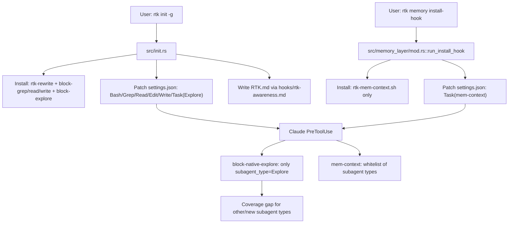

# Code Review: Memory Layer + Subagents + Init/Docs Consistency

**Date**: 2026-02-19 11:52:00
**Reviewer**: IT Architect Agent
**Scope**: `src/memory_layer/mod.rs`, `hooks/rtk-mem-context.sh`, `hooks/rtk-block-native-explore.sh`, `src/init.rs`, `src/main.rs`, `MEMORY_LAYER.md`, `INSTALL.md`, `README.md`, `hooks/rtk-awareness.md`

## Executive Summary

Текущая реализация memory layer технически рабочая (SQLite WAL, incremental index, hook-инъекция), но требование «обязательно для ВСЕХ субагентов» не выполнено end-to-end.
Главные проблемы: split-установка hooks между `rtk init -g` и `rtk memory install-hook`, неполный policy-enforcement по `Task` subagent types и рассинхрон документации/поведения.

## Architectural Diagram

## Requirements Compliance

| Original Requirement | Implementation Status | Notes |
| -------------------- | --------------------- | ----- |
| Memory layer обязателен для всех субагентов | **FAIL** | `hooks/rtk-block-native-explore.sh` фильтрует только `Explore`; `hooks/rtk-mem-context.sh` имеет whitelist типов, не universal. |
| `rtk init -g` должен давать рабочий memory-пайплайн «из коробки» | **WARN** | Устанавливает только block-explore policy, но не `rtk-mem-context.sh`. |
| `rtk memory install-hook` должен ставить оба Task-hook (context + policy) | **FAIL** | Код ставит только `rtk-mem-context.sh`, хотя `MEMORY_LAYER.md` обещает оба. |
| uninstall/cleanup должны удалять все RTK memory hooks | **FAIL** | `rtk-mem-context.sh` не включён в списки удаления/cleanup в `init.rs`. |
| Документация init/CLAUDE/RTK должна быть согласована с кодом | **FAIL** | Есть расхождения по поведению hook-инсталляции и области действия memory.

## Architectural Assessment

### Strengths

- Хорошая базовая архитектура memory layer: модульная декомпозиция (`cache/indexer/renderer/...`) и SQLite WAL.
- В `init.rs` качественная идемпотентность патча `settings.json` и backup перед изменением.
- Hook-стратегия для Grep/Read/Write последовательная и покрыта тестами.

### Concerns

1. **Неполная гарантия “memory for all subagents”**:
   - `hooks/rtk-block-native-explore.sh:26-29` ограничивает политику только `subagent_type=Explore`.
   - `hooks/rtk-mem-context.sh:24-27` использует фиксированный whitelist, а не all-Task policy.
2. **Разорванный lifecycle установки**:
   - `rtk init -g` не ставит mem-context hook (`src/init.rs:297-313`, `src/init.rs:981-997`).
   - `rtk memory install-hook` не ставит block policy hook (`src/memory_layer/mod.rs:719-823`).
3. **Uninstall/cleanup leak**:
   - `rtk-mem-context.sh` не удаляется `remove_hook_from_json`/`uninstall`/`cleanup_project_local_hooks` (`src/init.rs:444-455`, `src/init.rs:521-527`, `src/init.rs:1477-1483`).
4. **Документация расходится с фактом**:
   - `MEMORY_LAYER.md:417-421` заявляет установку обоих hooks через `rtk memory install-hook`, но код это не делает.
   - `MEMORY_LAYER.md:425` говорит только про Explore, тогда как скрипт пытается покрыть и другие типы.
   - `INSTALL.md:86-99` и `README.md:246-254` позиционируют `rtk init -g` как complete setup, без шага memory hook.
5. **Инструкции RTK.md не отражают memory policy**:
   - Источник `RTK.md` (`hooks/rtk-awareness.md`) не содержит правил по memory layer и обязательности для subagents.

### Recommendations

1. Унифицировать установку hooks: один источник истины (либо `init`, либо `memory install-hook`) с установкой **обоих** Task-hook.
2. Переписать Task-policy на coverage всех subagent_type (или deny-by-default для `Task` + явные allow-исключения).
3. Убрать жесткий whitelist в `rtk-mem-context.sh`, перейти на default-on для `Task` (с исключениями только для реально несовместимых типов).
4. Добавить `rtk-mem-context.sh` в uninstall/cleanup/show checks.
5. Синхронизировать docs (`MEMORY_LAYER.md`, `INSTALL.md`, `README.md`, `hooks/rtk-awareness.md`) с фактическим поведением и обязательным memory режимом.
6. Добавить тесты на комбинации hooks (init-only, memory-only, combined) и на coverage новых subagent_type.

## Quality Scores

| Criterion          | Score      | Justification |
| ------------------ | ---------- | ------------- |
| Code Quality       | 78/100     | Модули и idempotency хорошие, но есть lifecycle gaps между init/memory hook путями. |
| Extensibility      | 70/100     | Whitelist-подход для subagent_type плохо масштабируется при добавлении новых агентов. |
| Security           | 72/100     | Guard hooks есть, но policy неполная и docs drift создают риск обхода intended режима. |
| Performance        | 84/100     | Memory-core эффективен; bottleneck в orchestration, а не в data-plane. |
| Architecture       | 74/100     | Хороший core, слабая связность control-plane (install/policy/docs). |
| Deploy Cleanliness | 66/100     | Init/Install/Uninstall поведение несогласовано, есть остаточные артефакты hooks. |
| **TOTAL**          | **74/100** | Технически сильный фундамент, но integration policy недозавершена. |

## Critical Issues (Must Fix)

1. [CRITICAL] `rtk memory install-hook` не устанавливает `rtk-block-native-explore.sh`, несмотря на заявленный контракт (`src/memory_layer/mod.rs:719-823`, `MEMORY_LAYER.md:417-421`).
2. [CRITICAL] Политика «обязательно для всех субагентов» не обеспечена: блокируется только `Explore`, остальные `Task` типы не принуждаются к memory (`hooks/rtk-block-native-explore.sh:26-29`).
3. [CRITICAL] Uninstall/cleanup не удаляют `rtk-mem-context.sh` и его запись в `settings.json` (`src/init.rs:444-455`, `src/init.rs:521-527`, `src/init.rs:1477-1483`).

## Recommendations (Should Fix)

1. [SHOULD] Встроить установку mem-context hook в `rtk init -g` (или автоматически вызывать `memory install-hook` после init).
2. [SHOULD] Обновить `rtk init --show`, чтобы диагностировать mem-context hook вместе с policy hook.
3. [SHOULD] Уточнить и синхронизировать user-facing messages (`src/memory_layer/mod.rs:857`, `MEMORY_LAYER.md:425`).

## Minor Suggestions (Nice to Have)

1. [NICE] Добавить в `hooks/rtk-awareness.md` короткий раздел про memory layer и обязательность для Task-субагентов.
2. [NICE] Добавить smoke-test сценарий «fresh machine setup»: `init -g` + один Task subagent запуск + verify injected memory prompt.
