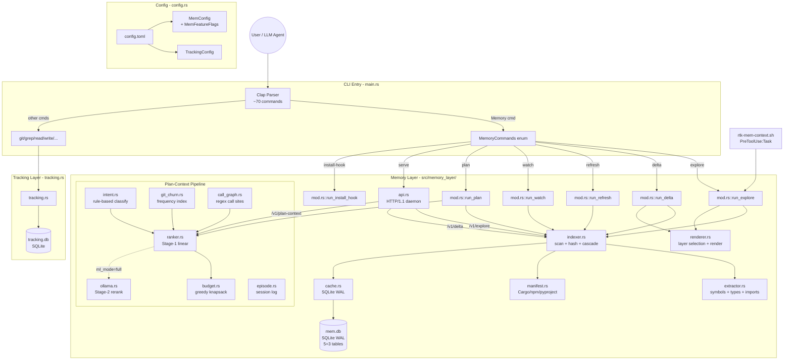

# Code Review: RTK Full Architecture & Memory Layer Deep Dive

**Date**: 2026-02-19T12:00:00
**Reviewer**: IT Architect Agent (Claude Opus 4.6)
**Scope**: Full project architecture with focus on `src/memory_layer/` (14 modules, ~8,000 LOC), `src/main.rs` (command routing), `src/tracking.rs` (SQLite layer), `src/config.rs` (configuration), `Cargo.toml` (dependencies)

---

## Executive Summary

RTK is a well-architected Rust CLI proxy that achieves its stated goal of 60-90% token savings through intelligent output filtering. The **Memory Layer** (sprint-6, ~8,000 LOC across 14 modules) represents a significant architectural evolution -- transforming RTK from a stateless filter proxy into a persistent project-intelligence cache with HTTP API, filesystem watching, plan-context ranking, and optional ML integration. The implementation demonstrates strong Rust idioms, comprehensive test coverage (900 tests, 127 in memory_layer alone), and thoughtful concurrency design. However, the memory layer's rapid growth has introduced architectural concerns: a 2,479-line `mod.rs` god module, duplicated plan-context logic between CLI and API paths, a hand-rolled HTTP server without request size limits, and several modules (episode, ollama) that are wired but not yet fully integrated. Production readiness is high for the core cache/index pipeline, moderate for the HTTP API, and low for the ML integration path.

---

## Architectural Diagram



---

## Requirements Compliance

| Original Requirement | Implementation Status | Notes |
|---|---|---|
| Persistent cross-session cache | OK | SQLite WAL, `mem.db`, LRU eviction |
| Incremental indexing (only changed files) | OK | xxh3 hash + mtime/size check + cascade |
| 7 semantic layers (L0-L6) | OK | All implemented, feature-flag gated |
| Query-type routing (5 types) | OK | General/Bugfix/Feature/Refactor/Incident |
| Detail level control (compact/normal/verbose) | OK | Hard limits per level |
| p95 latency < 200ms (cache hit) | OK | Measured 11.3ms p95, 15x margin |
| Token savings >= 80% vs native Explore | OK | 89% measured on rtk codebase |
| HTTP API daemon | OK | /v1/health, explore, delta, refresh, plan-context |
| Filesystem watcher (event-driven) | OK | notify crate (kqueue/inotify) |
| Hook integration (zero-config) | OK | install-hook materializes + patches settings.json |
| Plan-context ranking pipeline | OK | intent + churn + call_graph + budget |
| Multi-agent concurrency safety | OK | WAL + busy_timeout + retry + OnceLock |
| Feature flags (opt-out) | OK | 6 flags, AND-mask only |
| Strict dirty-blocking mode | OK | --strict flag + strict_by_default config |
| Episodic memory | PARTIAL | Schema + CRUD exists, not integrated into ranking |
| Ollama ML rerank (Stage-2) | PARTIAL | Code exists, wired in API but never activated in CLI |

---

## Architectural Assessment

### Strengths

1. **Excellent module decomposition**: The memory layer splits clearly into cache/indexer/extractor/renderer/ranker concerns. Each module has a single well-defined responsibility.

2. **Defensive concurrency design**: SQLite WAL mode + `busy_timeout=2500ms` + `with_retry(3, exponential)` + `INSERT OR REPLACE` idempotency + `OnceLock<()>` schema guard + poisoned mutex recovery (`unwrap_or_else(|e| e.into_inner())`) form a comprehensive multi-agent safety net.

3. **Comprehensive test coverage**: 900 tests total, 127 in memory_layer. Unit tests cover pure functions (ranker scoring, budget assembly, intent classification), integration tests cover SQLite round-trips, and chaos tests verify 8-thread concurrent access.

4. **Feature-flag architecture**: The AND-mask pattern (`apply_feature_flags`) ensures flags can only disable layers, never re-enable what `query_type` routing excluded. This is a correct security-oriented design.

5. **Clean error propagation**: Consistent use of `anyhow::Context` for error enrichment throughout. No raw `.unwrap()` in production code paths -- all `unwrap_or_else` with safe fallbacks.

6. **Incremental indexing with cascade invalidation**: The 2-pass incremental scan (metadata change detection + import-graph cascade) is the correct approach for balancing freshness with performance.

7. **Token estimation and budget knapsack**: The greedy utility-per-token assembly in `budget.rs` is simple but effective. Decision trace provides auditability.

8. **Configuration layering**: Compile-time constants -> `config.toml` -> env vars -> CLI flags. Clean priority chain.

### Concerns

1. **God module: `mod.rs` at 2,479 lines**
   The memory layer's `mod.rs` contains: all type definitions (27+ structs/enums), all `run_*` CLI entry points, `store_import_edges` logic, `compute_gain_stats`, `install_hook` logic, and 700+ lines of tests. This violates the Single Responsibility Principle and makes the module difficult to navigate and test independently.

2. **Duplicated plan-context candidate construction**
   The candidate-building logic (feature scoring, call graph construction, budget assembly) is duplicated verbatim between `mod.rs::run_plan` (~80 lines) and `api.rs::handle_plan_context` (~80 lines). This is a DRY violation that will cause drift as the ranking model evolves.

3. **Hand-rolled HTTP server without safety limits**
   `api.rs` implements a raw HTTP/1.1 server with `TcpListener` + `std::thread::spawn`. There are no:
   - Request body size limits (a malicious POST could exhaust memory)
   - Connection count limits (thread-per-connection can exhaust OS threads)
   - TLS support (localhost-only mitigates this partially)
   - HTTP keep-alive handling (Connection: close forces reconnection)

4. **`mod.rs` test isolation relies on thread-local DB path**
   The `THREAD_DB_PATH` thread-local in `cache.rs` is a creative solution but adds complexity. If any test forgets `isolated_db()`, it will write to the real `mem.db`, causing non-deterministic failures.

5. **Episode module is wired but inert**
   `episode.rs` has CRUD for session lifecycle but is never called from `run_explore`, `run_plan`, or the API handlers. The `episodes`, `episode_events`, and `causal_links` tables are created but never populated in normal operation.

6. **Ollama module never activates via CLI**
   `ollama.rs` is well-implemented but `run_plan` has no `--ml-mode` flag. The API path has `MlMode::Full` in the request struct but the branch is a no-op with a comment "add when ollama.rs is wired."

7. **Call graph O(S*F) complexity**
   `CallGraph::build_from_content` iterates all symbols x all files, calling `has_call_site` (string search) for each pair. For a project with 1000 symbols across 500 files, this is 500,000 string searches. The in-process `CG_CACHE` in the API mitigates this for the daemon, but CLI `run_plan` rebuilds on every invocation.

8. **No connection pooling for SQLite**
   Every `cache.rs` function calls `open_mem_db()` which opens a new SQLite connection. For a sequence of operations (store_artifact + store_artifact_edges + record_cache_event + record_event), this opens and closes 4 connections. Under load this adds unnecessary overhead and file descriptor churn.

---

## Quality Scores

| Criterion | Score | Justification |
|---|---|---|
| Code Quality | 82/100 | Excellent Rust idioms, clean error handling, good naming. Deducted for: god module (mod.rs), duplicated plan-context logic, 73 clippy warnings (mostly in non-memory modules). |
| Extensibility / Modularity | 76/100 | Good module decomposition (14 modules), feature-flag system, query-type routing. Deducted for: mod.rs coupling (types + logic + tests), no trait abstractions for storage backend, no plugin interface for custom extractors. |
| Security | 70/100 | Localhost-only HTTP binding, no credential exposure, safe SQLite parameterization. Deducted for: no request body size limit on API, no connection throttling, no input validation on project_root path, no TLS even for localhost. |
| Performance / Optimization | 85/100 | Excellent: xxh3 hashing, rayon parallel iterators, incremental indexing, in-process caches (CG_CACHE, CHURN_CACHE), WAL mode. Deducted for: no SQLite connection pooling, O(S*F) call graph, CLI plan rebuilds graph every time. |
| Architecture & Visualization | 78/100 | Clean layered architecture, well-documented MEMORY_LAYER.md, clear data flow. Deducted for: mod.rs god module, inert episode/ollama modules, duplicated logic between CLI/API paths. |
| Deploy Cleanliness | 88/100 | No hardcoded credentials, env var overrides, release profile optimized. Deducted for: 19 `.rtk-lock` files in git status, no formal migration strategy for ARTIFACT_VERSION bumps. |
| **TOTAL** | **80/100** | Solid production-quality codebase with room for architectural cleanup. |

---

## Critical Issues (Must Fix)

1. **No request body size limit in HTTP API (`api.rs` line ~155)**
   The `parse_request` function reads `content_length` from headers and allocates `vec![0u8; content_length]` without any upper bound. A request with `Content-Length: 4294967295` would attempt to allocate 4GB of memory.
   ```rust
   // api.rs line 155 -- UNBOUNDED ALLOCATION
   let mut body = vec![0u8; content_length];
   ```
   **Fix**: Add `const MAX_BODY_SIZE: usize = 1_048_576;` (1MB) and reject requests exceeding it with 413 Payload Too Large.

2. **Duplicated plan-context logic (`mod.rs::run_plan` vs `api.rs::handle_plan_context`)**
   ~80 lines of identical candidate construction, feature scoring, and call graph building are copy-pasted between the CLI and API entry points. Any change to the ranking model must be applied in two places.
   **Fix**: Extract a shared `build_plan_context(project_root, task, token_budget, ml_mode) -> AssemblyResult` function in a dedicated module.

3. **No thread/connection limit in HTTP server (`api.rs` line ~526-545)**
   Each incoming TCP connection spawns an unbounded `std::thread::spawn`. Under connection flood, this can exhaust OS thread limits.
   **Fix**: Use a bounded thread pool (e.g., `rayon::ThreadPoolBuilder::new().num_threads(8)`) or at minimum track active connections with an `AtomicUsize` counter and reject when above threshold.

---

## Recommendations (Should Fix)

1. **Split `mod.rs` (2,479 LOC) into focused modules**
   Decompose into:
   - `types.rs`: All struct/enum definitions (ProjectArtifact, BuildState, MemoryResponse, etc.)
   - `cli.rs`: All `run_*` functions (explore, delta, refresh, watch, plan, gain, clear, status)
   - `hook.rs`: install_hook logic and settings.json manipulation
   - `mod.rs`: Re-exports and constants only
   This matches the pattern already established by extracting cache.rs, indexer.rs, and renderer.rs.

2. **Add connection pooling or connection reuse for SQLite**
   Replace per-operation `open_mem_db()` calls with a connection passed through function parameters, or use a `thread_local!` connection pool. This eliminates 3-4 redundant connection open/close cycles per explore operation.

3. **Wire episode tracking into explore/plan lifecycle or remove it**
   `episode.rs` has full CRUD but is never called. Either integrate it (start_episode on explore, record_event on each file access, end_episode with outcome) or remove it to reduce dead code and schema bloat.

4. **Add `--ml-mode` flag to `rtk memory plan` CLI command**
   The `MlMode` enum and Ollama integration code exist but the CLI has no way to activate Stage-2 reranking. Either wire it or explicitly document it as experimental/future.

5. **Gitignore the `.rtk-lock` files**
   19 `.rtk-lock` files appear in `git status` as untracked. These are write-lock sentinel files that should not be tracked.

6. **Add path validation for API `project_root` parameter**
   `handle_explore` passes `req.project_root` directly to `PathBuf::from()` without validation. While the server is localhost-only, a symlink or `../` traversal could expose unexpected directories. Validate that the resolved canonical path is an existing directory and does not escape expected boundaries.

7. **Cache CallGraph in CLI `run_plan` path**
   The API path uses `CG_CACHE` (OnceLock + Mutex) for call graph persistence. The CLI path rebuilds the full call graph on every `rtk memory plan` invocation. For large projects this could take hundreds of milliseconds.

8. **Wrap `store_artifact_edges` DELETE+INSERT in a transaction**
   The current implementation in `cache.rs` runs DELETE then INSERT as separate statements. Under concurrent access, another process could read an empty edges table between the DELETE and INSERT. Wrapping both in `conn.execute_batch("BEGIN; ... COMMIT;")` would fix this race.

---

## Minor Suggestions (Nice to Have)

1. **Use `thiserror` for memory-layer-specific errors**
   The project depends on both `anyhow` and `thiserror` (Cargo.toml). The memory layer uses only `anyhow`. For library-quality error handling, define a `MemoryLayerError` enum with `thiserror::Error` derive for structured errors (CacheMiss, ArtifactStale, SchemaMismatch, etc.).

2. **Replace `lazy_static` with `std::sync::OnceLock` in extractor.rs**
   The project already uses `OnceLock` in api.rs and git_churn.rs. The `lazy_static!` regexes in extractor.rs can be migrated to `OnceLock` for consistency and to drop the `lazy_static` dependency.

3. **Add SQLite migration framework**
   `ARTIFACT_VERSION` bumps currently invalidate all cached artifacts. A lightweight migration system (version-stamped ALTER TABLE statements) would preserve cache across version upgrades.

4. **Add integration test for hook install/uninstall cycle**
   `run_install_hook` modifies `~/.claude/settings.json`. A test with a temp home directory would verify the full cycle without affecting the real environment.

5. **Unused clippy warning: `unused doc comment` in cache.rs line 34**
   The `#[cfg(test)]` thread_local has a doc comment that clippy flags. Move the comment inside the block or change to a regular `//` comment.

6. **Consider `fs2` dependency replacement**
   `fs2` (last updated 2020) provides cross-platform flock. Consider `fd-lock` or advisory locking alternatives as `fs2` is in maintenance mode.

---

## Memory Layer Specific Assessment

### Module Health Matrix

| Module | LOC | Tests | Complexity | Health |
|---|---:|---:|---|---|
| mod.rs | 2,479 | 37 | HIGH (god module, mixed concerns) | NEEDS REFACTOR |
| indexer.rs | 936 | 12 | MEDIUM (scan + cascade + delta) | GOOD |
| renderer.rs | 882 | 6 | MEDIUM (layer selection + render) | GOOD |
| api.rs | 623 | 3 | HIGH (HTTP server + handler duplication) | NEEDS ATTENTION |
| cache.rs | 472 | 0 (tested via integration) | LOW (clean CRUD) | GOOD |
| extractor.rs | 409 | 1 | MEDIUM (multi-language regex) | GOOD |
| intent.rs | 401 | 11 | LOW (pure classification) | EXCELLENT |
| ranker.rs | 326 | 8 | LOW (linear model + sort) | EXCELLENT |
| call_graph.rs | 316 | 9 | MEDIUM (O(S*F) build) | GOOD |
| ollama.rs | 263 | 7 | LOW (graceful fallback) | GOOD (unused) |
| episode.rs | 222 | 3 | LOW (CRUD) | GOOD (unused) |
| budget.rs | 211 | 7 | LOW (greedy knapsack) | EXCELLENT |
| manifest.rs | 210 | 5 | LOW (parser) | EXCELLENT |
| git_churn.rs | 207 | 7 | LOW (git log + cache) | EXCELLENT |

### Data Flow Integrity

The memory layer maintains a clean data flow:
```
scan -> hash -> analyze -> store -> query -> render
```

Each stage has clear input/output contracts. The `BuildState` struct serves as the inter-stage communication object. The `ProjectArtifact` is the persistent representation. The `MemoryResponse` is the output representation. This 3-struct pattern prevents accidental coupling between stages.

### Concurrency Model Assessment

The multi-agent safety model is well-designed:

| Mechanism | Purpose | Correctness |
|---|---|---|
| SQLite WAL | Reader-writer isolation | CORRECT |
| busy_timeout=2500ms | Writer wait on contention | CORRECT |
| with_retry(3, exponential) | Retry on transient lock | CORRECT (100/200/400ms) |
| INSERT OR REPLACE | Idempotent upsert | CORRECT |
| OnceLock schema guard | DDL once per process | CORRECT |
| CG_CACHE OnceLock+Mutex | Call graph reuse | CORRECT (poisoned handled) |
| CHURN_CACHE OnceLock+Mutex | Git churn reuse | CORRECT (invalidated by HEAD) |

**One concern**: The `store_artifact_edges` function uses `DELETE + INSERT` (not a single transaction). Under concurrent access, another process could read an empty edges table between the DELETE and INSERT. This is a low-probability race but could cause incorrect cascade invalidation.

### Production Readiness Score: 7.5 / 10

| Component | Readiness | Notes |
|---|---|---|
| Core cache pipeline | 9/10 | Solid, well-tested, battle-tested concurrency |
| Indexer + extractor | 8/10 | Good incremental design, multi-language support |
| Renderer + layer routing | 8/10 | Clean feature-flag architecture |
| HTTP API | 6/10 | Missing body limits, connection limits, input validation |
| Plan-context pipeline | 7/10 | Good ranking model, but duplicated and no CLI ML path |
| Episode tracking | 3/10 | Schema exists, code exists, never called |
| Ollama integration | 4/10 | Code exists, graceful fallback, never activated |

---

## Dependency Quality Assessment

| Dependency | Version | Purpose | Risk |
|---|---|---|---|
| clap 4 | Stable | CLI parsing | LOW |
| anyhow 1.0 | Stable | Error handling | LOW |
| rusqlite 0.31 (bundled) | Stable | SQLite (no system dep) | LOW |
| serde/serde_json 1 | Stable | Serialization | LOW |
| regex 1 | Stable | Pattern matching | LOW |
| xxhash-rust 0.8 | Stable | Fast hashing | LOW |
| rayon 1 | Stable | Parallel iteration | LOW |
| notify 6 | Stable | FS watching | LOW |
| chrono 0.4 | Stable | Timestamps | LOW |
| tempfile 3 | Stable | Atomic writes | LOW |
| fs2 0.4 | Maintenance | File locking | MEDIUM (last release 2020) |
| lazy_static 1.4 | Maintenance | Static init | LOW (replaceable with OnceLock) |

---

## Scalability Projections

| Metric | Current (67 files) | 500 files | 5,000 files | Mitigation |
|---|---|---|---|---|
| Cold index time | 43ms p50 | ~300ms | ~3s | Rayon parallel already used |
| Cache hit latency | 10ms p50 | ~15ms | ~50ms (JSON parse) | Consider binary format (bincode) |
| CallGraph build | ~5ms | ~200ms | ~20s (O(S*F)) | Inverted index, symbol hashing |
| mem.db size | ~200KB | ~2MB | ~20MB | Acceptable for SQLite |
| git log --name-only | ~50ms | ~100ms | ~500ms | Already cached by HEAD SHA |
| Artifact JSON size | ~300KB | ~3MB | ~30MB | Compression, binary format |

---

## Action Items Summary

### Immediate (P1) -- before next release
1. Add `MAX_BODY_SIZE` limit to `api.rs::parse_request`
2. Add connection count limit to `api.rs::serve`
3. Extract shared plan-context builder from duplicated code

### Short-term (P2) -- next 2 sprints
4. Split `mod.rs` into types/cli/hook modules
5. Wrap `store_artifact_edges` in a transaction
6. Add path validation for API `project_root`
7. Add `.rtk-lock` to `.gitignore`
8. Add SQLite connection pooling or reuse

### Long-term (P3) -- backlog
9. Wire episode.rs into explore/plan lifecycle or remove
10. Wire Ollama Stage-2 into CLI `--ml-mode` flag
11. Replace `lazy_static` with `OnceLock`
12. Replace `fs2` with maintained alternative
13. Consider binary serialization for large artifacts
14. Add SQLite schema migration framework
