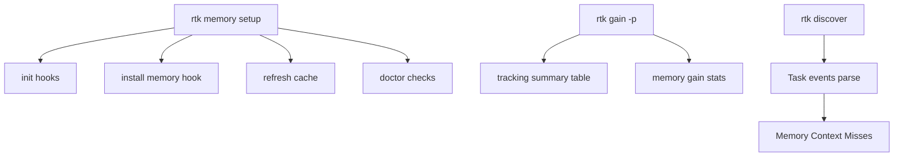

# Code Review: Memory Observability Implementation

- Дата: 2026-02-19
- Scope: D1–D6, F1–F5, tasks/memory-observability.md
- Проверенные файлы: `src/main.rs`, `src/memory_layer/mod.rs`, `src/memory_layer/cache.rs`, `src/gain.rs`, `src/discover/mod.rs`, `src/discover/provider.rs`

## Ключевые Findings (по приоритету)

### P1 — `rtk memory setup` всегда завершаетcя `Ok(())` и не отражает финальный результат doctor
- Файл: `src/memory_layer/mod.rs:1342`, `src/memory_layer/mod.rs:1380`
- Проблема: `run_setup` запускает `doctor_inner`, но игнорирует `(has_fail, has_warn)` и всегда печатает "Setup complete".
- Риск: пользователь и CI получают ложный success при `[FAIL]/[WARN]`, что противоречит роли `doctor` как gate.
- Рекомендация: использовать результат `doctor_inner` для итогового статуса и возврата кода (`Err`/`exit`) согласно F1.

### P1 — `rtk discover --format json` потенциально возвращает невалидный JSON
- Файл: `src/discover/mod.rs:217`, `src/discover/mod.rs:222`
- Проблема: JSON печатается, после чего безусловно может печататься текстовая секция `Memory Context Misses`.
- Риск: ломается машинная интеграция и парсинг JSON-вывода.
- Рекомендация: включить misses в JSON-структуру или отключать текстовый блок в `format=json`.

### P1 — F3/D4 не реализованы по спецификации (источник и формат строки в `gain -p`)
- Файл: `src/gain.rs:185`, `src/gain.rs:194`, `src/memory_layer/cache.rs:371`
- Проблема: вместо строки в таблице `By Command` добавлен отдельный блок; используются `cache_stats` + эвристика от artifact, а не `cache_events`/агрегация как в PRD/ADR.
- Риск: метрика не сопоставима с ТЗ, данные могут быть неточными, UX не соответствует требуемому формату.
- Рекомендация: добавлять именно командную строку `rtk memory (hook)` в общий список с теми же колонками и сортировкой, источник данных привести к согласованной схеме.

### P2 — `run_setup` игнорирует флаг `--auto-patch` (и частично семантику setup-шагов)
- Файл: `src/memory_layer/mod.rs:1342`, `src/memory_layer/mod.rs:1349`
- Проблема: параметр `_auto_patch` не используется; всегда вызывается `PatchMode::Auto`.
- Риск: CLI-поведение не соответствует контракту и ожиданиям пользователя.
- Рекомендация: выбирать `PatchMode::Auto/Ask` на основе флага.

### P2 — `devenv` не соответствует части требований F5
- Файл: `src/main.rs:1277`, `src/memory_layer/mod.rs:1393`, `src/memory_layer/mod.rs:1460`
- Проблема:
  - default session name = `rtk-mem`, в PRD указан `rtk`.
  - root resolution — просто canonical path, без walk-up к `.git`.
  - health loop использует `rtk gain -p`, а не `--ultra-compact`; нет `memory status` в loop.
- Риск: отклонение от UX/операционного сценария из PRD.
- Рекомендация: привести defaults и команды панели 2 к спецификации.

### P2 — покрытие тестами по T1–T5 существенно неполное относительно tasks
- Файл: `tasks/memory-observability.md:44`, `tasks/memory-observability.md:88`, `tasks/memory-observability.md:130`, `tasks/memory-observability.md:166`, `tasks/memory-observability.md:216`
- Наблюдение: именованные тесты (`test_doctor_*`, `test_setup_*`, `test_memory_miss_*`, `test_devenv_*`, `test_gain_output_*`) в кодовой базе не найдены.
- Риск: поведенческие регрессии в новых CLI-фичах не защищены целевыми тестами.

## Что реализовано корректно

- D1: есть параллельный запуск `grepai watch` + `rtk memory watch` в `devenv` без bridge.
  - Файл: `src/memory_layer/mod.rs:1426`, `src/memory_layer/mod.rs:1438`
- D2/F1 (базово): `doctor` реализован, есть `[ok]/[FAIL]/[WARN]` логика и exit-коды 0/1/2.
  - Файл: `src/memory_layer/mod.rs:1215`, `src/memory_layer/mod.rs:1329`
- D3/F2 (базово): `setup` как единая команда из 4 шагов присутствует.
  - Файл: `src/memory_layer/mod.rs:1342`
- D5/F4 (частично): детект Task без memory marker реализован.
  - Файл: `src/discover/provider.rs:248`, `src/discover/mod.rs:222`
- D6/F5 (базово): `devenv` встроен в бинарь (не внешний скрипт).
  - Файл: `src/main.rs:1268`, `src/main.rs:2125`

## Mermaid (архитектурный поток)

## Оценки качества (0-100)

- Code Quality: 72
- Extensibility/Modularity: 70
- Security: 82
- Optimization/Performance: 74
- Architecture & Visualization: 68
- Deploy Cleanliness: 66

## Масштабирование (прогноз)

- 3 пользователя: проблем не ожидается, текущая реализация достаточна.
- 100 пользователей: нужна стабилизация машинных контрактов (`discover --json`) и точности gain-метрик.
- 1000 пользователей: без унификации схемы telemetry/metrics и строгих контрактных тестов высок риск drift и ложных сигналов observability.
