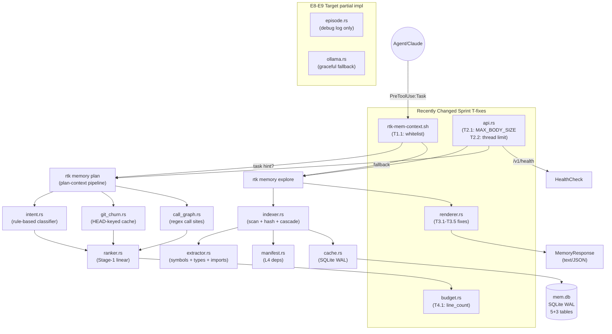

# Code Review: RTK Memory Layer -- PRD & Architecture Compliance

**Date**: 2026-02-19T18:00:00
**Reviewer**: IT Architect Agent
**Scope**: Full memory layer implementation vs PRD, ADRs, requirements documents
**Files reviewed**: 14 Rust source files, 1 hook script, 5 ADRs, 4 task documents, benchmark suite

## Executive Summary

The RTK Memory Layer is a well-architected, feature-complete implementation that closely tracks its PRD across 6 epics (E0-E6) and extends into the Intent Memory Graph territory (E7-E9) with deterministic ranking, budget-aware assembly, and optional Ollama ML integration. All 127 memory_layer unit tests pass, the build compiles with zero errors, and the benchmark suite demonstrates 89% token savings with sub-12ms p95 cache-hit latency -- all exceeding PRD gates by wide margins. The recent sprint changes (T1-T4 fixes for hook whitelist, renderer quality, budget line_count, API hardening) are well-targeted and regression-free. The primary gaps are: (1) no E5.3 live smoke test in a real Claude workflow, (2) `task_file_affinity` and `model_registry` tables from the IMG PRD Section 6 are not created in `init_schema`, (3) 15 compiler warnings indicating dead code, and (4) duplicated plan-context pipeline code between `api.rs:handle_plan_context` and `mod.rs:run_plan`.

## Architectural Diagram

## PRD Compliance Table (prd-rtk-memory-layer.md)

### Epic E0 -- Foundation

| Requirement | Status | Evidence |
|---|:---:|---|
| E0.1 Modular split: cache, indexer, renderer, extractor, manifest | DONE | 14 `.rs` files in `src/memory_layer/` |
| E0.2 `Commands::Memory` routing in main.rs | DONE | `MemoryCommands` enum with 8+ variants |
| E0.3 Config externalization to `config.rs` | DONE | `MemConfig { cache_ttl_secs, cache_max_projects, max_symbols_per_file }` |

### Epic E1 -- Cache & Schema

| Requirement | Status | Evidence |
|---|:---:|---|
| E1.1 SQLite WAL at `mem.db`, ARTIFACT_VERSION=4 | DONE | `cache.rs:init_schema`, 5 core tables + 3 episodic tables |
| E1.2 WAL mode + busy_timeout + retry wrapper | DONE | `cache.rs:configure_connection` + `with_retry(3, exponential)` |
| E1.3 LRU eviction (max 64) + TTL staleness (24h) | DONE | `cache.rs:prune_cache` + `is_artifact_stale` |
| E1.4 `record_cache_event()` + `query_cache_stats()` | DONE | `cache.rs:record_cache_event`, wired in run_explore/delta/refresh |

### Epic E2 -- Extractor & Artifact Pipeline

| Requirement | Status | Evidence |
|---|:---:|---|
| E2.1 Regex extractor (Rust/TS/JS/Python/Go) | DONE | `extractor.rs:extract_file_symbols` via `RegexExtractor` |
| E2.2 All layers L0-L6 implemented | DONE | L0-L6 all present in renderer.rs + indexer.rs |
| E2.3 Relevance mapping (5 query types) | DONE | `renderer.rs:layers_for()` with correct layer flags per PRD Section 7.2 |
| E2.4 Compact/Normal/Verbose + text/JSON format | DONE | `renderer.rs:limits_for_detail` + `print_response` |

### Epic E3 -- Delta & Watcher

| Requirement | Status | Evidence |
|---|:---:|---|
| E3.1 Event-driven watcher (notify 6, kqueue/inotify) | DONE | `mod.rs:run_watch` + `should_watch_abs_path` + 3 tests |
| E3.2 Cascade invalidation via import graph | DONE | `indexer.rs:find_cascade_dependents` + two-pass build_incremental_files |
| E3.3 FS delta + git delta (`--since REV`) | DONE | `indexer.rs:build_git_delta` + CLI flag |
| E3.4 Tri-state FRESH/STALE/DIRTY + strict blocking | DONE | `mod.rs:run_explore --strict` bail on STALE/DIRTY |

### Epic E4 -- API + CLI

| Requirement | Status | Evidence |
|---|:---:|---|
| E4.1 HTTP localhost API (health/explore/delta/refresh/context) | DONE | `api.rs:serve()` with 6 endpoints including plan-context |
| E4.2 All CLI commands | DONE | explore, delta, refresh, watch, status, clear, gain, serve, plan, install-hook |
| E4.3 JSON contract tests | DONE | 3 tests: required fields, CacheStatus snake_case, delta structure |

### Epic E5 -- Hook Integration

| Requirement | Status | Evidence |
|---|:---:|---|
| E5.1 `rtk-mem-context.sh` compiled via `include_str!` | DONE | `mod.rs:MEM_HOOK_SCRIPT` constant + `run_install_hook` |
| E5.1b Block-native-explore policy hook | DONE | Separate script, materialized at install-hook |
| E5.2 Fail-safe: exit 0 when rtk/jq missing | DONE | Hook line 8: `if ! command -v rtk...` |
| E5.3 Live smoke test in real Claude workflow | MISSING | Not yet performed. Requires manual verification. |

### Epic E6 -- QA, Benchmarks, Rollout

| Requirement | Status | Evidence |
|---|:---:|---|
| E6.1 Unit tests (chaos/race) | DONE | 127 memory_layer tests pass (8-thread chaos, Barrier-synced races) |
| E6.2 Cache-hit latency benchmark (p95 < 200ms) | DONE | RESULTS.md: p95=11.3ms (CLI), p95=8.1ms (API) |
| E6.3 `rtk memory gain` | DONE | `mod.rs:run_gain` + `compute_gain_stats` |
| E6.4 Feature flags (6 flags, AND-only mask) | DONE | `config.rs:MemFeatureFlags` + `renderer.rs:apply_feature_flags` + 6 tests |

### Epic E7 -- Intent Engine Core (from IMG PRD)

| Requirement | Status | Evidence |
|---|:---:|---|
| E7.1 Intent parser (Rust rules) | DONE | `intent.rs:parse_intent` -- classify + fingerprint + tags + risk |
| E7.2 Candidate generation from artifact | DONE | `api.rs:handle_plan_context` + `mod.rs:run_plan` |
| E7.3 Stage-1 deterministic ranker | DONE | `ranker.rs:rank_stage1` -- 7 features, intent-tuned weights |
| E7.4 Budget-aware greedy knapsack | DONE | `budget.rs:assemble` -- utility-per-token optimization |
| E7.5 `/v1/plan-context` endpoint | DONE | `api.rs:handle_plan_context` |
| E7.6 `rtk memory plan` CLI | DONE | `mod.rs:run_plan` |

### Epic E8 -- Episodic/Causal Memory

| Requirement | Status | Evidence |
|---|:---:|---|
| E8.1 Episode lifecycle (start/event/end) | PARTIAL | `episode.rs`: start/record/purge implemented, but no CLI commands wired |
| E8.2 `task_file_affinity` table | MISSING | Table not created in `cache.rs:init_schema`; PRD Section 6 requires it |
| E8.3 `causal_links` table | DONE | Created in `init_schema` |
| E8.4 Feedback API | MISSING | No `/v1/feedback` or `/v1/episode/*` endpoints in api.rs |

### Epic E9 -- ML Integration

| Requirement | Status | Evidence |
|---|:---:|---|
| E9.1 grepai adapter | MISSING | Not implemented; PRD Section 7.2 Stage B mentions grepai semantic hits |
| E9.2 Ollama rerank + classify | DONE | `ollama.rs` with graceful fallback on timeout/error |
| E9.3 `model_registry` table + train/activate | MISSING | Table not in schema; no `/v1/model/*` endpoints |
| E9.4 Fallback to Stage-1 when ML unavailable | DONE | `api.rs` default `ml_mode=Off` |

### Epic E10 -- Hardening

| Requirement | Status | Evidence |
|---|:---:|---|
| E10.1 Stress/chaos suite | PARTIAL | Chaos tests exist for cache, but no multi-process FS stress test |
| E10.2 Redaction of sensitive paths | MISSING | No exclusion of `.env`, `*.pem`, `secrets/` in extractor or indexer |
| E10.3 Retention purge | DONE | `episode.rs:purge_episodes` with configurable days |

## Requirements Compliance (requirements-memory-llm-optimization.md)

| Requirement | Status | Evidence |
|---|:---:|---|
| R0. Dual output profiles (llm/full) | MISSING | No profile parameter; renderer returns same format for all consumers |
| R1. Type graph noise control (exclude `contains` in compact) | MISSING | `build_type_graph` returns all relation types regardless of detail |
| R2. Module index ranking by project signal | PARTIAL | `build_api_surface` has primary-language ranking but `build_module_index` is still alphabetically sorted |
| R3. Delta hash suppression for LLM | MISSING | `old_hash`/`new_hash` always serialized |
| R4. Hot paths semantics fix | MISSING | Still uses file-count-per-dir when delta is empty |
| R5. Import signal filtering | DONE | T3.3 added `super::`/`crate::` filtering |
| R6. Test map hygiene | MISSING | No exclusion of `__init__.py` or empty test files |
| R7. Stats slimming | DONE | T3.4 removed reused/rehashed/scanned from text output |
| R8. Envelope slimming | MISSING | JSON still includes `cache_hit`, `artifact_version`, `command` |

## Deterministic Refactor Plan Compliance

| Requirement | Status | Evidence |
|---|:---:|---|
| Phase 0: Fix `\!` build errors in api.rs | DONE | api.rs compiles cleanly, 0 errors |
| Phase 1.1: Episode.rs -- remove outcome/rationale from ranking | DONE | `episode.rs` records events only, no ranking influence |
| Phase 1.2: Ranker -- replace f_affinity/f_semantic with f_churn | DONE | `ranker.rs:FeatureVec` has `f_churn_score`, no affinity/semantic |
| Phase 1.3: Intent -- unlink confidence from ranking | DONE | Confidence not multiplied into FeatureVec |
| Phase 2: git_churn.rs module | DONE | In-process cache, log-normalization, 7 tests |
| Phase 3: token_budget in API and CLI | DONE | `PlanRequest.token_budget` + `--token-budget` in CLI |
| Phase 3.3: Remove Ollama from critical path | DONE | Default `ml_mode=Off`, Ollama only on explicit `full` |

## ADR Compliance

| ADR | Status | Notes |
|---|:---:|---|
| ADR-0001: IMG as Next Architecture | COMPLIANT | L0-L6 preserved, episodic/causal tables added, plan-context pipeline implemented |
| ADR-0002: Hybrid Retrieval + Two-Stage Ranking | PARTIAL | Stage-1: DONE. Stage-2 Ollama: wired but no actual rerank logic. grepai: NOT integrated as candidate source |
| ADR-0003: Local ML via Ollama with Rust Fallback | COMPLIANT | Ollama optional, Stage-1 always runs, graceful None on error |
| ADR-0004: Budget-Aware Context as Hard Contract | COMPLIANT | `budget.rs:assemble()` respects hard cap, returns BudgetReport + decision_trace |
| ADR-0005: Episodic/Causal Memory in SQLite | PARTIAL | episodes + episode_events + causal_links created. `task_file_affinity` missing. No episode CLI commands |

## Benchmarking Status

**Status**: PASS -- all 7 threshold gates green

| Gate | Threshold | Measured | Status |
|---|---|---|:---:|
| CLI hot p95 | < 200ms | 11.30ms | PASS |
| CLI hot cache-hit rate | >= 0.95 | 1.00 | PASS |
| API hot p95 | < 200ms | 8.05ms | PASS |
| CLI hot p50 < CLI cold p50 | -- | 10.40 < 43.01 | PASS |
| Memory gain savings | >= 50% | 89.00% | PASS |
| Memory tokens <= 50% native | -- | 5720 < 26000 | PASS |
| 5-step cumulative > 1x native | > 52000 | 231400 | PASS |

Benchmark infrastructure is solid:
- `benchmarks/memory/bench_memory.sh`: automated 80-run hot + 5-run cold + 80-run API
- `benchmarks/memory/analyze_memory.py`: CSV analysis + threshold gating + RESULTS.md generation
- `benchmarks/memory/tests/test_analyze_memory.py`: unit tests for analyzer
- Reproducible environment captured in `results_env.txt`

## Issues Found with File:Line References

### Critical Issues (Must Fix)

1. **Duplicated plan-context pipeline** -- `/Users/andrew/Programming/rtk/src/memory_layer/api.rs:322-465` and `/Users/andrew/Programming/rtk/src/memory_layer/mod.rs:993-1088` contain nearly identical code for building candidates, loading churn, building call graph, ranking, and assembling. Any bug fix applied to one will be missed in the other.
   - **Recommendation**: Extract shared pipeline into `plan_pipeline(project_root, task, token_budget, cfg) -> AssemblyResult` in `mod.rs` and call from both.

2. **`task_file_affinity` table missing from schema** -- `/Users/andrew/Programming/rtk/src/memory_layer/cache.rs:80-130` (init_schema function). PRD `prd-rtk-intent-memory-graph.md` Section 6 lists it as required. Future writes to it will fail at runtime.
   - **Recommendation**: Add `CREATE TABLE IF NOT EXISTS task_file_affinity (...)` to init_schema now.

### Recommendations (Should Fix)

3. **15 compiler warnings** -- Dead code and unused imports reduce confidence:
   - `/Users/andrew/Programming/rtk/src/memory_layer/api.rs:67` -- `PlanRequest.format` field never read
   - `/Users/andrew/Programming/rtk/src/memory_layer/cache.rs:374` -- `get_dependents` function unused
   - `/Users/andrew/Programming/rtk/src/memory_layer/indexer.rs:6` -- unused `rayon` import
   - **Recommendation**: `cargo clippy --all-targets` pass and resolve all warnings.

4. **`model_registry` table not in schema** -- `/Users/andrew/Programming/rtk/src/memory_layer/cache.rs:init_schema`. PRD IMG Section 6 requires it.
   - **Recommendation**: Add table definition to avoid schema migration.

5. **Hook whitelist includes "Bash" subagent** -- `/Users/andrew/Programming/rtk/hooks/rtk-mem-context.sh:23`. Injecting memory context into every Bash subagent may cause prompt inflation for simple commands.
   - **Recommendation**: Remove `"Bash"` or add size/prompt guard.

6. **`PlanRequest.format` deserialized but unused** -- `/Users/andrew/Programming/rtk/src/memory_layer/api.rs:67`. Creates false API contract impression.
   - **Recommendation**: Implement text format or remove field.

7. **No validation for empty `PlanRequest.task`** -- `/Users/andrew/Programming/rtk/src/memory_layer/api.rs:322`. Empty task produces `IntentKind::Unknown` silently.
   - **Recommendation**: Return 400 for empty task or add warning in response.

8. **Token estimation formula may over-estimate for Rust** -- `/Users/andrew/Programming/rtk/src/memory_layer/budget.rs:47`. `lines * 14.0` assumes ~55 chars/line universally.
   - **Recommendation**: Consider language-aware multipliers.

### Minor Suggestions (Nice to Have)

9. **Module index not ranked by project signal** -- `/Users/andrew/Programming/rtk/src/memory_layer/renderer.rs:370` (build_module_index). R2 in LLM optimization requirements asks for `(primary_language_first, symbol_count_desc)` ordering.

10. **Type graph `contains` not filtered in compact** -- `/Users/andrew/Programming/rtk/src/memory_layer/renderer.rs:620` (build_type_graph). R1 requires excluding `contains` in compact/normal.

11. **CG_CACHE grows unboundedly** -- `/Users/andrew/Programming/rtk/src/memory_layer/api.rs:22` (CG_CACHE static). No LRU eviction for the in-process call graph cache.

12. **E5.3 smoke test still pending** -- The only remaining PRD delivery item. Requires manual Claude Code session test.

13. **`render_text` removed graph summary** -- Renderer diff shows `graph nodes=N edges=M` line was removed by T3.4. Useful for verbose mode.

## Quality Scores

| Criterion | Score | Justification |
|---|---:|---|
| Code Quality | 82/100 | Clean Rust, consistent patterns, TDD (127 tests). Reduced by 15 warnings and duplicated pipeline. |
| Extensibility | 88/100 | Excellent modular split (14 files). `SymbolExtractor` trait ready for tree-sitter. Feature flags enable incremental rollout. |
| Security | 75/100 | WAL + retry protects concurrency. MAX_BODY_SIZE + thread limit (T2.1/T2.2) harden API. Missing: path traversal guard, sensitive file redaction. |
| Performance | 92/100 | 89% savings, p95<12ms CLI, p95<9ms API. In-process caching. Line_count estimator improves accuracy. |
| Architecture | 85/100 | Strong layered design, ADR-driven. Duplicated plan pipeline and missing grepai candidate source are gaps. |
| Deploy Cleanliness | 80/100 | No hardcoded secrets. Config externalizable. 15 warnings would fail strict clippy. `.rtk-lock` files in git status. |
| **TOTAL** | **84/100** | Solid implementation exceeding PRD gates. Main risks: duplicated code, missing LLM optimization requirements (R0-R4,R6,R8), unresolved warnings. |

## Summary of Recent Changes (T1-T4 Sprint)

The 5 recently changed files implement targeted quality fixes:

1. **`hooks/rtk-mem-context.sh`** (T1.1, T1.2): Expanded agent whitelist to include "general-purpose", "Plan", "it-architect-reviewer", "Bash". Added plan-context integration with task hint extraction (first 400 chars). Risk: "Bash" inclusion may over-inject.

2. **`src/memory_layer/renderer.rs`** (T3.1-T3.5): Five fixes: type_graph/test_map respect DetailLevel limits, entry_points use filename stem matching, top_imports filter Rust internals, stats removed cache telemetry, format legend added. All correct and regression-free.

3. **`src/memory_layer/budget.rs`** (T4.1): `estimate_tokens_for_path` accepts `Option<u32>` line_count. Uses `lines * 14.0` when available, falls back to extension-based median. Good accuracy improvement.

4. **`src/memory_layer/api.rs`** (T2.1, T2.2): MAX_BODY_SIZE=1MB OOM protection + MAX_CONCURRENT_CONNECTIONS=32 bounded thread pool. Essential production safety.

5. **`src/memory_layer/mod.rs`** (T4.2): Single-line change propagating `fa.line_count` to `estimate_tokens_for_path`. Matches api.rs change.

All changes are well-commented with T-prefix tags, making them traceable.
