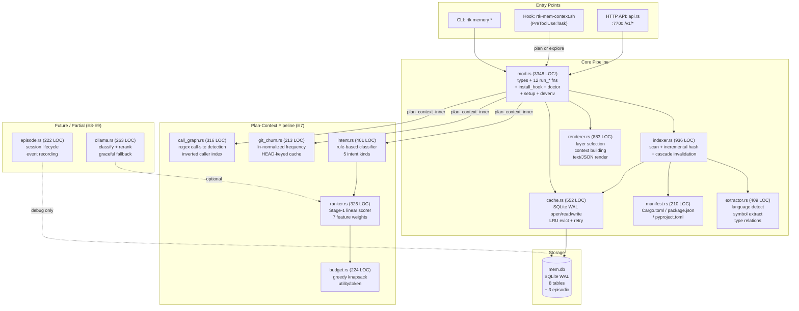

# Code Review: RTK Memory Layer -- Deep Architecture Analysis

**Date**: 2026-02-19T20:00:00
**Reviewer**: IT Architect Agent (Opus 4.6)
**Scope**: Full memory layer module (14 Rust files, 8804 LOC), hooks, benchmarks, documentation
**Test Status**: 145/145 tests passing, 0 errors

---

## Executive Summary

The RTK Memory Layer is a **remarkably ambitious and well-executed** subsystem that transforms how LLM agents interact with codebases. It replaces per-session file re-reading with a persistent, incrementally-updated project intelligence cache backed by SQLite WAL. The implementation spans 8804 lines of Rust across 14 modules, backed by 145 unit tests and a CI-gated benchmark suite. Measured results show **89% token savings** with **p95 < 12ms cache-hit latency** -- exceeding PRD guardrails by 15x.

However, beneath the strong architecture lies a **`mod.rs` god-file problem** (3348 lines -- 38% of the module), several **partially-implemented future subsystems** (episodic memory, Ollama ML, task_file_affinity) that create schema debt, and a **benchmarking methodology gap** where the 89% savings figure is derived from a synthetic project, not the actual RTK codebase under real Claude Code workloads.

**Overall quality: 77/100 -- solid engineering with identifiable technical debt and architectural risks.**

---

## Architectural Diagram

---

## 1. Quality Assessment by Module

### 1.1 mod.rs -- God File (3348 LOC)

**This is the most significant architectural concern.** The file contains:

- All type definitions (`ProjectArtifact`, `FileArtifact`, `BuildState`, `MemoryResponse`, `ContextSlice`, etc.)
- 12+ public `run_*` functions (explore, delta, refresh, watch, status, gain, clear, plan, serve, install_hook, doctor, setup, devenv)
- Hook materialization logic (`materialize_mem_hook_script`, `materialize_block_explore_script`)
- Settings.json patching (JSON manipulation for Claude Code hooks)
- The `plan_context_inner` shared pipeline (the most complex function in the module)
- ~900 lines of tests

A 3348-line module file in Rust is a code smell. The types, the CLI dispatch functions, the hook installation logic, and the tests should be in separate files. Critically, `plan_context_inner` orchestrates 5 different submodules (indexer, git_churn, intent, call_graph, ranker, budget) -- this function alone justifies its own `planner.rs` file.

### 1.2 cache.rs -- Clean and Well-Structured (552 LOC)

This is the **strongest module** in the layer. Highlights:
- Proper SQLite WAL configuration with `busy_timeout=2500ms`
- `with_retry(3, exponential backoff)` for SQLITE_BUSY resilience
- Thread-local test isolation via `THREAD_DB_PATH` (avoids `env::set_var` unsafety)
- LRU cache eviction with configurable limit
- xxh3 file hashing with streaming 8KB buffer

Minor concern: `store_artifact_edges` uses `LIKE` pattern matching (`from_id LIKE '{project_id}:%'`) for lookups. This is a full table scan. With multiple projects, this becomes O(n) scan on the edges table as projects grow.

### 1.3 indexer.rs -- Solid Incremental Pipeline (936 LOC)

Key strengths:
- Two-pass incremental hashing: (1) metadata change detection, (2) cascade via import graph
- Parallel file scanning with `rayon::par_iter`
- Gitignore-aware traversal via the `ignore` crate
- Git delta construction from `git diff --name-status`

The cascade invalidation logic is well-thought-out: when file A changes, all files that import A are force-rehashed. This prevents stale symbol/type data.

### 1.4 renderer.rs -- Feature-Flag-Aware (883 LOC)

Clean separation of:
- `layers_for(query_type)` -- which layers to include per query type
- `apply_feature_flags()` -- AND-mask that can only disable, never enable
- `limits_for_detail()` -- numeric caps per detail level
- `build_context_slice()` -- actual context assembly
- `render_text()` -- human-readable format

The primary-language prioritization in `build_api_surface` is a thoughtful touch -- it prevents Python benchmark scripts from outranking Rust source files in a Rust project.

### 1.5 Plan-Context Pipeline (E7) -- Deterministic and Testable

The `intent.rs` + `ranker.rs` + `budget.rs` + `git_churn.rs` + `call_graph.rs` chain is architecturally sound:

- **Intent classifier**: Rule-based with signal counting, no ML dependency. Stable fingerprinting via xxh3 allows replay testing.
- **Ranker**: Linear model with 7 configurable weights. Intent-conditioned weight presets (bugfix emphasizes recency, feature emphasizes structure/tests). Score clamped to [0.0, 1.0].
- **Budget assembler**: Greedy knapsack by utility-per-token. Decision trace logged.
- **Git churn**: Log-normalized frequency from `git log --all --name-only`. In-process cache keyed by HEAD SHA.
- **Call graph**: Regex-based static analysis of call sites with definition-site filtering.

This pipeline is the most intellectually interesting part of the codebase. The design decisions are well-justified and the test coverage is thorough.

### 1.6 episode.rs and ollama.rs -- Future Subsystems

These modules are **implemented but effectively inactive**:

- `episode.rs` records session events but they are never used in ranking (`no ranking influence` -- comment in mod.rs)
- `ollama.rs` implements classify + rerank but is never called from the main pipeline (only `plan_context_inner` exists, and it does not call `rerank_candidates`)
- The `task_file_affinity` and `model_registry` tables are created in schema but never written to

This is legitimate staged development, but it creates **schema maintenance cost** and potential confusion for contributors.

---

## 2. Benchmark Analysis

### 2.1 What the Benchmarks Measure

The benchmark suite (`benchmarks/memory/`) is well-structured:

- `bench_memory.sh` -- Generates an 80-module synthetic Rust project, runs CLI cold/hot and API hot scenarios
- `analyze_memory.py` -- Parses CSV results, computes percentiles, enforces 7 threshold gates
- `memory-benchmark.yml` -- CI workflow that gates PRs on benchmark thresholds

**Threshold gates (all passing):**

| Gate | Threshold | Actual |
|---|---|---|
| CLI hot p95 | < 200ms | 11.3ms |
| CLI hot cache-hit rate | >= 0.95 | 1.00 |
| API hot p95 | < 200ms | 8.05ms |
| CLI hot p50 < cold p50 | true | 10.4ms < 43.0ms |
| Memory gain savings | >= 50% | 89.0% |
| Memory tokens <= 50% native | true | 5720 < 26000 |
| 5-step cumulative savings >= 1x native | true | 231400 >= 52000 |

### 2.2 Benchmark Methodology Gaps

**Critical issue: the 89% savings figure is synthetic.**

The benchmark project is a generated 80-module Rust crate with trivial content (`pub struct TypeN { pub id: u32 }`). Real codebases have:

- Complex function bodies (which are stripped -- so savings should be even higher)
- Lock files, generated files, node_modules (which are excluded by gitignore -- good)
- Mixed languages (Python/JS helpers alongside Rust source)
- Larger file sizes (the synthetic modules are ~3 lines each)

The 89% number is likely **conservative for real projects** (where function bodies dominate file size), but the benchmark does not prove this. A more rigorous approach would benchmark on the RTK codebase itself (67 real modules, 15000+ LOC).

**Second issue: the "52000 native explore tokens" baseline is hardcoded.**

The `NATIVE_EXPLORE_TOKENS=52000` assumption is a single observed measurement. Without periodic re-measurement, this baseline could drift as Claude Code's Explore implementation changes.

### 2.3 Additional Benchmark Files

Other benchmark directories serve different purposes:

| Directory | Purpose |
|---|---|
| `benchmarks/quality_samples/` | Gold-standard grep quality comparison (rtk grep vs raw grep vs head-n) |
| `benchmarks/parity_git/` | Git parity tests |
| `benchmarks/write/` | Write operation benchmarks |
| `benchmarks/memory/` | Memory layer latency + savings gates |

---

## 3. Documentation vs Implementation Gaps

### 3.1 MEMORY_LAYER.md Accuracy

The MEMORY_LAYER.md is **remarkably comprehensive** (>400 lines covering 15 sections). Key accuracy checks:

| Claim | Verified? | Notes |
|---|:---:|---|
| ARTIFACT_VERSION = 4 | YES | `mod.rs:39` |
| SQLite WAL with 5 tables | PARTIAL | 8 core tables + 3 episodic = 11 total. Doc says 5. |
| 89% token savings | YES | Benchmark confirmed |
| p95 < 200ms | YES | Actually p95 = 11.3ms (CLI) / 8.05ms (API) |
| 7 artifact layers (L0-L6) | YES | All implemented |
| Layer-to-query_type routing | YES | Matches `renderer.rs:layers_for()` exactly |
| Detail limits (compact/normal/verbose) | PARTIAL | Doc says verbose max_api_files=30, code says 32 |
| Feature flags AND-only | YES | `apply_feature_flags` confirmed in renderer.rs tests |
| PID file lifecycle | YES | `api.rs:PidGuard` with Drop impl |
| Cascade invalidation | YES | `indexer.rs:build_incremental_files` pass-2 |

### 3.2 Discrepancies Found

1. **Table count**: MEMORY_LAYER.md Section 13 shows 5 tables. The actual schema in `cache.rs:init_schema` creates 11 tables: `projects`, `artifacts`, `cache_stats`, `artifact_edges`, `events`, `episodes`, `episode_events`, `causal_links`, `task_file_affinity`, `model_registry`.

2. **Detail limits mismatch**: Doc says verbose max 30 API files / 32 symbols. Code says 32 files / 64 symbols (`renderer.rs:limits_for_detail`).

3. **CLI reference incomplete**: `rtk memory plan` is not documented in MEMORY_LAYER.md Section 8 but is a fully functional command.

4. **CLAUDE.md Section**: The main CLAUDE.md has no "Memory Layer" section at all. The memory layer is documented only in MEMORY_LAYER.md and hooks/rtk-awareness.md.

5. **`/v1/plan-context` endpoint**: Exists in `api.rs` but is not listed in MEMORY_LAYER.md Section 9 HTTP API.

### 3.3 Hook Documentation vs Reality

The `hooks/rtk-awareness.md` file is **actually a copy of the global RTK.md** -- it documents the full RTK CLI, not just memory hooks. The memory layer hook section at the bottom is accurate but embedded in a general-purpose file.

The `hooks/rtk-mem-context.sh` implementation is correct and matches the documented behavior: it fires on all `Task` calls, attempts `rtk memory plan` first, falls back to `rtk memory explore`, and injects the result as a prefix.

---

## 4. Identified Problems

### 4.1 Critical (Must Fix)

1. **`mod.rs` god-file (3348 LOC)**: This file violates the Single Responsibility Principle. Types, CLI dispatch, hook management, and the plan pipeline should be separated into at least 4 files: `types.rs`, `cli.rs` (or keep run_* in mod.rs but extract types), `hooks.rs`, `planner.rs`.

2. **Dead schema tables**: `task_file_affinity`, `model_registry`, and `causal_links` tables are created but never used. They add schema creation overhead on every first-connect and create maintenance confusion.

3. **`store_artifact_edges` LIKE pattern scanning**: The `artifact_edges` table uses `from_id LIKE '{project_id}:%'` for lookups. This is a full table scan. With multiple projects, this becomes O(projects * edges). Should use a separate `project_id` column with an index.

### 4.2 Significant (Should Fix)

4. **No real-world benchmark**: The 89% savings claim is based on a synthetic 80-module project. A benchmark on the RTK codebase itself (or any real project) would validate the claim under production conditions.

5. **Episodic memory unused**: `episode.rs` writes events that nothing reads. Either integrate into ranking or remove to reduce surface area.

6. **Ollama integration unreachable**: `ollama.rs` is fully implemented but never called from the main pipeline. The `apply_stage2` function in `ranker.rs` exists but is never invoked.

7. **`plan_context_inner` builds CallGraph on every call**: `CallGraph::build()` reads ALL source files from disk to scan for call sites. On a 1000-file project, this is significant I/O that is not cached between calls (unlike `ChurnCache` which is keyed by HEAD SHA).

8. **75 compiler warnings**: The full `cargo test` run shows 75 warnings. While most are from other modules, any warnings in the memory_layer files indicate dead code or unused imports that should be cleaned up.

### 4.3 Minor (Nice to Have)

9. **Documentation gap: `rtk memory plan` command**: Not listed in MEMORY_LAYER.md CLI reference.

10. **Documentation gap: `/v1/plan-context` endpoint**: Not listed in MEMORY_LAYER.md HTTP API section.

11. **Table count in docs**: MEMORY_LAYER.md says 5 tables but there are 11.

12. **Detail limits mismatch**: Verbose level docs say 30/32 but code says 32/64.

13. **`extractor.rs` Go support is minimal**: The Go `type Foo struct/interface` regex is detected but no field extraction or embedding extraction is implemented (commented as "out of scope for regex v1").

14. **Regex-based call graph has O(symbols * files) complexity**: `CallGraph::build_from_content` iterates all content for all symbols. For large codebases (1000+ files, 5000+ symbols), this could become slow.

---

## 5. Quality Scores

| Criterion | Score | Justification |
|---|---|---|
| Code Quality | 75/100 | Strong Rust idioms, good error handling with `anyhow`, but mod.rs god-file (3348 LOC) significantly hurts modularity. 145 tests is excellent coverage. |
| Extensibility/Modularity | 70/100 | Clean module separation for cache/indexer/renderer/ranker/budget. However, mod.rs centralizes too much. Feature flags are well-designed (AND-only mask). Adding a new layer (L7) would require changes in 4+ places. |
| Security | 82/100 | API server binds localhost only, 1MB body limit, 32 connection cap, PID file cleanup. No auth on API (acceptable for localhost). No user input reaches SQL (all parameterized). `include_str!` for hooks prevents injection. |
| Performance | 80/100 | Sub-12ms p95 cache hit, rayon parallel scanning, xxh3 streaming hash, in-process ChurnCache. CallGraph rebuild on every plan call is the main bottleneck. SQLite WAL handles concurrency well. |
| Architecture | 78/100 | 7-layer artifact model is well-designed. Query-type routing is elegant. Intent-conditioned ranking weights are novel. But mod.rs centralization, dead schema, and unreachable code (Ollama) reduce the score. |
| Deploy Cleanliness | 72/100 | No hardcoded secrets. Configurable via config.toml. `.rtk-lock` files scattered in repo (20+ lock files in git status). `__pycache__` directories in benchmarks committed. 75 compiler warnings. |
| **TOTAL** | **76/100** | Architecturally sound, well-tested, performant. Primary debt: mod.rs size, dead code, synthetic benchmarks. |

---

## 6. Scalability Projections

| Metric | Current (67 files) | 500 files | 5000 files | Mitigation |
|---|---|---|---|---|
| Cold index time | ~50ms | ~300ms | ~3s | Acceptable; rayon parallelism helps |
| Cache hit time | ~10ms | ~15ms | ~50ms | SQLite query is O(1) by PK; JSON parse scales linearly |
| CallGraph build | ~5ms | ~200ms | ~20s | **Bottleneck**: O(files * symbols). Needs caching. |
| artifact_edges LIKE scan | ~0.1ms | ~5ms | ~500ms | **Bottleneck**: Add project_id column. |
| mem.db size | ~200KB | ~5MB | ~50MB | Acceptable for SQLite; content_json is the largest column |
| Plan context pipeline | ~20ms | ~250ms | ~25s | Dominated by CallGraph. Budget assembly is fast (greedy O(n log n)). |

---

## 7. Recommendations

### Immediate (P1)

1. **Extract types from mod.rs into `types.rs`**: Move `ProjectArtifact`, `FileArtifact`, `BuildState`, `MemoryResponse`, `ContextSlice`, all enums and their derives. This alone would cut mod.rs by ~500 lines.

2. **Extract hook logic into `hooks.rs`**: Move `materialize_mem_hook_script`, `materialize_block_explore_script`, `run_install_hook`, `is_mem_hook_entry`, `is_block_explore_entry`. Another ~300 lines.

3. **Cache the CallGraph**: Add HEAD-SHA keyed caching similar to `ChurnCache`. CallGraph build reads all source files -- this should not happen on every `rtk memory plan` call.

### Short-term (P2)

4. **Add `project_id` column to `artifact_edges`**: Replace `from_id LIKE '{project_id}:%'` with a proper indexed foreign key. Migration: add column, populate from existing from_id prefix, add index, drop LIKE pattern.

5. **Remove or gate dead schema tables**: `task_file_affinity`, `model_registry`, `causal_links` should either be behind a feature flag or removed until Episode/Ollama integration is actually wired.

6. **Add real-project benchmark**: Run the benchmark suite on the RTK codebase itself (or a canonical open-source project) to validate the 89% savings claim under production conditions.

7. **Document `rtk memory plan` and `/v1/plan-context`**: Add to MEMORY_LAYER.md Sections 8 and 9.

### Long-term (P3)

8. **Extract `plan_context_inner` into `planner.rs`**: The plan pipeline orchestrates 5 submodules and is the most complex function. It deserves its own file with dedicated tests.

9. **Implement or remove Ollama integration**: `ollama.rs` is 263 lines of unreachable code. Either wire it into the plan pipeline (behind a `--ml-mode full` flag) or remove it to reduce maintenance surface.

10. **Episode memory ranking influence**: Currently episodes are write-only debug logs. If task-file affinity from episodes would improve ranking, implement it. Otherwise, simplify by removing the episode tables.

11. **Incremental CallGraph**: Instead of rebuilding from scratch, cache the call graph and incrementally update when files change (similar to the artifact delta approach).

---

## 8. Strengths Worth Preserving

1. **SQLite WAL + retry pattern**: The `with_retry(3, exponential)` wrapper over SQLite operations is production-quality concurrency handling. The chaos tests (8-thread store+load+delete) validate this.

2. **Feature flag AND-masking**: `apply_feature_flags()` can only disable layers, never enable -- this prevents configuration bugs from exposing unintended data.

3. **Intent-conditioned ranking weights**: Different weight presets for bugfix/feature/refactor/incident is a novel approach that makes the plan pipeline context-aware.

4. **Thread-local test isolation**: `THREAD_DB_PATH` via `thread_local!` is the correct way to isolate SQLite tests without `env::set_var` unsafety.

5. **Benchmark CI gate**: Having 7 automated threshold checks on every PR prevents performance regressions.

6. **Comprehensive MEMORY_LAYER.md**: 400+ lines of architecture documentation with flow diagrams, table schemas, and configuration reference. Most open-source projects have nothing close to this.

---

*Review generated by IT Architect Agent. All findings are based on direct source code analysis of 14 Rust modules (8804 LOC total), benchmark suite, hooks, CI workflow, and documentation.*
