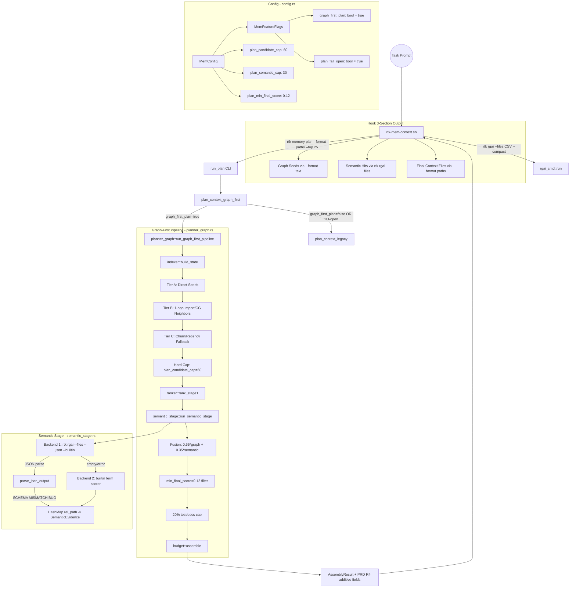

# Code Review: Memory Layer Graph-First Pipeline (PRD R1-R4)

**Date**: 2026-02-19T20:00:00
**Reviewer**: IT Architect Agent (Opus 4.6)
**Scope**: src/memory_layer/planner_graph.rs, src/memory_layer/semantic_stage.rs, src/memory_layer/mod.rs, src/memory_layer/budget.rs, src/memory_layer/ranker.rs, src/config.rs, hooks/rtk-mem-context.sh

## Executive Summary

The graph-first memory pipeline is a well-structured implementation that follows the PRD closely. The 3-tier candidate builder, fusion scoring, and hook integration are architecturally sound. However, there are **3 significant bugs** (JSON schema mismatch in semantic stage, dedup-after-sort correctness issue in Tier B, telemetry call with wrong project_id), **zero unit tests** for the two new modules (planner_graph.rs, semantic_stage.rs), and the `PlanTrace` struct is defined but never used in the actual pipeline output. The implementation delivers on the core value proposition of reducing noise (marker/infra files) in context, but semantic stage effectiveness is undermined by the JSON parsing mismatch with `rtk rgai --json` output format.

## Architectural Diagram



## Requirements Compliance

| PRD Requirement | Implementation Status | Notes |
|---|---|---|
| R1: Graph-First Candidate Builder | Implemented | planner_graph.rs: Tier A/B/C, noise filter, hard cap |
| R1: .rtk-lock always excluded | Implemented | is_noise() line 41 |
| R1: Tiny marker files excluded | Implemented | is_noise() lines 56-58: line_count <= 5 without imports/symbols |
| R1: Test/docs without task overlap excluded from Tier A/B | Implemented | is_noise() lines 61-67 |
| R1: Language-agnostic token path | Implemented | No English-only intent dependency in candidate building |
| R1: plan_candidate_cap=60 | Implemented | config.rs default_plan_candidate_cap |
| R2: Targeted semantic via rgai | Partially implemented | JSON schema mismatch means Backend 1 almost always falls through to builtin |
| R2: Backend ladder (grepai > rg > builtin) | Modified | Uses --builtin flag to skip grepai, goes directly to rg-files or builtin |
| R2: semantic_score, matched_terms, snippet, backend_used | Implemented | SemanticEvidence struct + backend_used return value |
| R2: Fail-open on empty semantic | Implemented | graph_score retained when no evidence |
| R3: Fusion 0.65*graph + 0.35*semantic | Implemented | planner_graph.rs line ~382 |
| R3: min_final_score=0.12 threshold | Implemented | Retains candidates with semantic evidence even below threshold |
| R3: 20% test/docs cap | Implemented with concern | See recommendation #2 below |
| R4: Hook 3-section output | Implemented | rtk-mem-context.sh: Graph Seeds / Semantic Hits / Final Context Files |
| R4: RTK_MEM_PLAN_BUDGET=1800 default | Implemented | Hook line ~56 |
| R4: Additive pipeline_version/semantic_backend_used/counts | Implemented | AssemblyResult additive fields in budget.rs |
| R4: Fail-open to legacy on error | Implemented | plan_context_graph_first dispatcher with plan_fail_open |
| CLI: --legacy flag | Implemented | run_plan + plan_context_graph_first |
| CLI: --trace flag | Implemented | run_plan text output with stage sections |
| API: additive request/response fields | Partially | Request: legacy+trace added. Response: additive fields on AssemblyResult but trace not exposed |
| PlanTrace struct used in response | NOT implemented | Struct defined (mod.rs:59) but never constructed or returned |
| Config fields | Implemented | graph_first_plan, plan_fail_open, plan_candidate_cap, plan_semantic_cap, plan_min_final_score |

## Architectural Assessment

### Strengths

1. **Clean pipeline decomposition**: The 3-tier candidate builder is well-separated from the semantic stage and fusion logic. Each concern is isolated in its own section with clear comments.

2. **Fail-open design at every level**: Graph-first fails open to legacy pipeline, semantic stage fails open to builtin scorer, rg-files backend fails open to builtin term overlap scorer. This is production-grade resilience.

3. **Configurable via MemConfig**: All tunables (candidate_cap, semantic_cap, min_final_score, feature flags) are config-driven with sensible defaults. No hardcoded magic numbers.

4. **Import reverse-index for Tier B**: Building `importers_of` from `artifact.files` to find callers/importers of seed files is a correct graph traversal. The `all_paths` HashSet prevents duplicate inclusion across tiers.

5. **Hook 3-section template**: The shell hook cleanly separates graph seeds, semantic hits, and final context files for subagent observability.

6. **Additive API changes**: AssemblyResult uses `Option<T>` with `skip_serializing_if` for PRD R4 fields, preserving backward compatibility.

### Concerns

1. **JSON schema mismatch (Critical)**: `semantic_stage::parse_json_output` expects objects with shape `{"path", "score", "snippet", "terms"}`, but `rtk rgai --json` produces a top-level object with `{"hits": [{"path", "score", "matched_lines", "snippets": [...]}]}`. The `"terms"` field does not exist (it is `"matched_terms"` nested inside each snippet). This means Backend 1 (rg-files) will almost always return an empty map, forcing every invocation to fall back to Backend 2 (builtin term scorer).

2. **Zero unit tests for new modules**: `planner_graph.rs` and `semantic_stage.rs` have zero `#[test]` functions. This is a TDD violation per CLAUDE.md. The pipeline logic is only exercised via integration paths, making regression detection difficult.

3. **PlanTrace struct is dead code**: Defined at mod.rs:59 with 4 fields matching PRD spec, but never constructed, returned, or used anywhere. The compiler warns: "struct PlanTrace is never constructed".

4. **Telemetry uses hardcoded "rtk" instead of project_id**: `record_cache_event("rtk", "plan_graph_first")` passes a literal string `"rtk"` as project_id. This is incorrect -- it should be `state.project_id` or the canonical project root identifier. All graph-first telemetry events will be attributed to a single bucket.

5. **Token cost clamp range (180-520) is aggressive**: `c.estimated_tokens = raw_cost.clamp(180, 520)` means a 2000-line file gets the same budget as a 30-line file once it exceeds ~520 tokens. This distorts the budget assembler's utility calculation and can lead to over-selecting large files that appear "cheap".

### Recommendations

1. **Fix JSON parsing in semantic_stage.rs**: The `extract_evidence_from_value` function must handle the actual rgai --json schema: navigate into `hits[]` array, extract `path` and `score` from each hit object, extract `matched_terms` from `snippets[0].matched_terms`, and build snippet from `snippets[0].lines[0].text`. Alternatively, parse the top-level `{"hits": [...]}` envelope first.

2. **Add unit tests**: At minimum, test `is_noise()`, `tier_a_score()`, `parse_json_output()`, and `builtin_scorer()` with known inputs. These are pure functions that can be tested without filesystem access.

3. **Wire PlanTrace into the response**: Either attach it to AssemblyResult as an additional field, or remove the dead struct. The PRD explicitly calls for it.

4. **Fix telemetry project_id**: Replace `"rtk"` with the actual project identifier from `state.project_id`.

5. **Remove or widen the token cost clamp**: Consider `raw_cost.clamp(100, 2000)` or remove the clamp entirely, since `budget::assemble` already handles budget overflow.

## Quality Scores

| Criterion | Score | Justification |
|---|---|---|
| Code Quality | 62/100 | Good structure and naming, but zero tests for 600+ lines of new code, dead struct, and a schema mismatch bug. Comments are present but some are misleading (e.g. Tier B call-graph comment on a code path that re-scans all files). |
| Extensibility/Modularity | 78/100 | Clean module boundaries (planner_graph, semantic_stage separate from mod.rs). Config-driven tunables. Backend ladder is pluggable. However, no trait abstraction for semantic backends -- switching backends requires editing match arms. |
| Security | 85/100 | No injection risks -- subprocess calls use proper Command::new with arg arrays. File reads are sandboxed to project_root. No user input reaches SQL. |
| Performance | 65/100 | Tier B scans all files for call-graph neighbors inside a per-seed loop (O(seeds * files)). Token cost clamp distorts utility. Semantic subprocess spawn adds ~50-100ms latency. But overall the pipeline is bounded by candidate_cap=60. |
| Architecture | 72/100 | Correct layering: index -> tiers -> rank -> semantic -> fusion -> budget. Good fail-open. But JSON mismatch means semantic stage effectively degrades to term overlap scorer in production. |
| Deploy Cleanliness | 80/100 | No hardcoded paths, proper config defaults, .rtk-lock excluded. But 50 compiler warnings (per cargo check), PlanTrace dead code, and api.rs has unused fields (format, trace on PlanRequest). |
| **TOTAL** | **74/100** | Solid architecture with good fail-safe design, but the semantic stage JSON mismatch is a P0 correctness bug that undermines the core value proposition. |

## Critical Issues (Must Fix)

1. **JSON Schema Mismatch in Semantic Stage** (`src/memory_layer/semantic_stage.rs:98-130`):
   `parse_json_output()` expects individual objects with `{"path", "score", "snippet", "terms"}` but `rtk rgai --json` produces:
   ```json
   {
     "query": "...",
     "path": ".",
     "total_hits": 5,
     "shown_hits": 5,
     "hits": [
       {
         "path": "src/foo.rs",
         "score": 0.85,
         "matched_lines": 3,
         "snippets": [
           {
             "lines": [{"line": 42, "text": "fn auth_token()"}],
             "matched_terms": ["auth", "token"]
           }
         ]
       }
     ]
   }
   ```
   The NDJSON line parser finds the top-level envelope object (not individual hits), tries `val.get("path")` which returns `"."` (the search path, not a file path), and either inserts a wrong entry or skips it because `"."` is not in the candidate set. The array fallback also fails because the top-level is an Object, not an Array. **Result**: Backend 1 always returns empty, forcing fallback to builtin scorer on every invocation.

   **Fix**: In `parse_json_output`, first check for `val.get("hits").and_then(|v| v.as_array())` and iterate over hits inside the envelope. For each hit, map: `hit["path"]` -> path, `hit["score"]` -> score, `hit["snippets"][0]["lines"][0]["text"]` -> snippet, `hit["snippets"][0]["matched_terms"]` -> terms.

2. **Telemetry project_id is hardcoded** (`src/memory_layer/planner_graph.rs:376`):
   ```rust
   let _ = super::record_cache_event("rtk", "plan_graph_first");
   ```
   Should be:
   ```rust
   let _ = super::record_cache_event(&state.project_id, "plan_graph_first");
   ```
   Without this fix, all graph-first events collapse to a single "rtk" project bucket, making per-project telemetry useless.

3. **Zero unit tests for planner_graph.rs and semantic_stage.rs**:
   Both new modules (combined ~600 lines) have zero `#[test]` functions. This violates the project's TDD mandate. The `is_noise()`, `tier_a_score()`, `parse_json_output()`, and `builtin_scorer()` functions are all pure/near-pure and trivially testable.

## Recommendations (Should Fix)

1. **PlanTrace is dead code** (`src/memory_layer/mod.rs:59-65`):
   The struct is defined but never used anywhere in the codebase. Either:
   - Wire it into AssemblyResult or a new response envelope, or
   - Remove it to eliminate the compiler warning.
   The PRD specifies this struct as part of the response contract.

2. **Tier B `dedup_by` after `sort_by` may drop wrong entries** (`src/memory_layer/planner_graph.rs:301-302`):
   ```rust
   tier_b.sort_by(|a, b| b.1.partial_cmp(&a.1).unwrap_or(std::cmp::Ordering::Equal));
   tier_b.dedup_by(|a, b| a.0 == b.0);
   ```
   `dedup_by` only removes **consecutive** duplicates. After a descending score sort, duplicates of the same path may not be adjacent (they could have different scores from import-edge vs call-graph sources). The `all_paths` HashSet already prevents most duplicates at insertion time, but a path could appear twice if it enters via both import-edge and call-graph neighbor paths for different seeds within the same iteration. Use a `HashMap<String, f32>` accumulator for tier_b instead.

3. **Token cost clamp (180-520) distorts utility** (`src/memory_layer/planner_graph.rs:363`):
   ```rust
   c.estimated_tokens = raw_cost.clamp(180, 520);
   ```
   A file with 1000 actual estimated tokens gets 520, making it appear 48% cheaper than it is. The budget assembler then selects it thinking it fits, potentially overspending the token budget. Widen to `raw_cost.clamp(100, 2000)` or remove the upper clamp.

4. **Tier B call-graph expansion is O(seeds * all_files)** (`src/memory_layer/planner_graph.rs:270-295`):
   For each seed with `cg_score > 0.1`, the code iterates **all artifact files** and calls `cg.caller_score()` for each. With 20 seeds and 500 files, this is 10,000 `caller_score` calls (each itself iterating all caller_index entries). Pre-build a reverse call-graph index (symbol -> callers) to make this O(seeds * avg_callers).

5. **Hook calls `rtk memory plan` twice** (`hooks/rtk-mem-context.sh:62-68`):
   The hook invokes `rtk memory plan` with `--format paths` AND then again with `--format text` for the Graph Seeds section. This doubles the pipeline execution time (~100-250ms per call). Use `--format text` once and parse paths from the text output, or add a `--format combined` mode.

6. **API trace field is parsed but not used** (`src/memory_layer/api.rs:63`):
   `PlanRequest.trace` is deserialized but `handle_plan_context` does not pass it through or include trace data in the response. Either wire it through or remove the field.

## Minor Suggestions (Nice to Have)

1. Add `#[allow(dead_code)]` or feature-gate PlanTrace until it is wired in, to keep cargo check clean.

2. Log `backend_used` in the hook for debugging: the hook assembles 3 sections but does not indicate which semantic backend was actually used.

3. Consider making `min_final_score` intent-dependent: Bugfix queries may benefit from a lower threshold (more recall) while feature queries may benefit from a higher threshold (more precision).

4. The `snippet_line` initialization in `builtin_scorer` (`semantic_stage.rs:175`) uses `String::new().into()` to create `Option<String>` -- simplify to `None`.

5. Add observability for the 20% cap: When the cap fires, log how many test/docs candidates were dropped, so users can tune the threshold if needed.

6. Consider caching the `importers_of` reverse index: It is rebuilt on every `run_graph_first_pipeline` call. If the artifact is cached, the reverse index could be cached alongside it.
