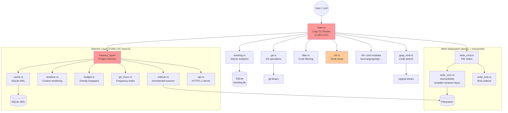

# Code Review: RTK Rust Code Quality Audit

**Date**: 2026-02-19T20:00:00
**Reviewer**: IT Architect Agent (Opus 4.6)
**Scope**: Full codebase quality audit — 46,577 LOC across 65+ modules

## Executive Summary

RTK is a well-structured Rust CLI project with strong architectural foundations: atomic writes, CAS concurrency, incremental indexing, and idiomatic error propagation via `anyhow`. The codebase demonstrates solid engineering in critical paths (write_core.rs, write_lock.rs, tracking.rs). However, growth from ~30 to 65+ modules has introduced structural debt: the `main.rs` routing is a 2,400-line monolith, `memory_layer/mod.rs` is 3,348 lines with 20+ data types defined inline, and 151 clippy warnings signal accumulating hygiene issues. The codebase has excellent test coverage (922 tests) but architectural extraction has not kept pace with feature velocity.

## Architectural Diagram



## Aspect Ratings (1-10)

### 1. Idiomatic Rust: 7/10

**Strengths:**
- Excellent use of `anyhow::Context` for error propagation with `.context()` / `.with_context()`
- Proper use of `Cow<'_, str>` in `expand_at_ref()` (write_cmd.rs:28) for zero-copy path
- Idiomatic iterator chains in renderer.rs (e.g., `select_hot_paths`, `build_api_surface`)
- Good use of `OnceLock` for process-level caches (git_churn.rs:49, write_cmd.rs)
- Proper `Drop` impl for `PidGuard` in api.rs
- `#[derive(Serialize, Deserialize)]` consistently used for data types

**Issues:**
- **[P1] `lazy_static!` still used in 12+ modules** (filter.rs:1, extractor.rs:7, registry.rs:1, etc.) when `std::sync::LazyLock` (stable since Rust 1.80) or `OnceLock` is preferred. Mixed usage creates inconsistency.
  ```rust
  // filter.rs:149 — legacy pattern
  lazy_static! {
      static ref MULTIPLE_BLANK_LINES: Regex = Regex::new(r"\n{3,}").unwrap();
  }
  // Preferred (no external crate):
  static MULTIPLE_BLANK_LINES: LazyLock<Regex> = LazyLock::new(|| Regex::new(r"\n{3,}").unwrap());
  ```

- **[P2] Excessive `.to_string()` / `.clone()` on hot paths.** In renderer.rs, `build_response()` clones `DeltaSummary` (line 540: `state.delta.clone()`), `GraphSummary`, and multiple strings. In `mod.rs`, `plan_context_inner` clones `extracted_tags` (line 1073) and delta changes (line 1056).

- **[P3] `thread_local!` with `RefCell` in tracking.rs:71** — works but `OnceLock` + `Mutex` would be more conventional for cross-thread safety. Currently the `TRACKER_CACHE` is strictly single-threaded, but the API server (api.rs) spawns threads that call `tracking::TimedExecution::track()`.

### 2. Error Handling: 8/10

**Strengths:**
- Consistent `anyhow::Result` return types across all public module APIs
- `.context()` / `.with_context()` used extensively for rich error chains
- `CasError` in write_core.rs is a proper typed error enum with `Display` + `Error` impls, enabling `downcast_ref::<CasError>()` for retry logic
- `write_error()` in write_cmd.rs provides structured JSON error output for LLM consumption
- Git exit codes properly propagated (PR #5 fix)

**Issues:**
- **[P1] `process::exit()` used 59 times across 23 files** — bypasses Rust's normal cleanup (Drop, stack unwinding). This is intentional for exit-code fidelity but prevents resource cleanup. Should be limited to the outermost main() handler.
  ```rust
  // git.rs:116 — deep in helper function
  fn exit_with_git_failure(...) -> ! {
      std::process::exit(status.code().unwrap_or(1));
  }
  // Better: return ExitCode or a typed error that main() maps to exit code
  ```

- **[P2] Silent error swallowing with `let _ =`** in api.rs and memory_layer/mod.rs:
  ```rust
  // api.rs:230 — cache event failures silently ignored
  let _ = record_cache_event(&state.project_id, "hit");
  let _ = record_event(&state.project_id, "api:explore", Some(duration_ms));
  ```
  While acceptable for telemetry, this pattern appears 15+ times. Should at minimum log on verbose.

- **[P3] `unwrap_or_else(|e| e.into_inner())` for poisoned mutex** in api.rs:412 and git_churn.rs — correct recovery pattern, but no logging when poison recovery occurs.

### 3. Architectural Patterns: 6/10

**Strengths:**
- Clean separation of concerns: write_cmd.rs (interface) / write_core.rs (engine) / write_lock.rs (concurrency)
- Memory layer properly decomposed into 12 submodules (api, cache, indexer, renderer, budget, ranker, etc.)
- `WriteParams` struct properly encapsulates parameters (fixes clippy::too_many_arguments)
- Feature flag system (MemFeatureFlags) with AND-only masking is well-designed
- Configuration hierarchy (env > config > default) in tracking.rs

**Issues:**
- **[CRITICAL] `main.rs` is 2,392 lines — routing monolith.** All enum definitions (Commands, GitCommands, WriteCommands, BuildCommands, PnpmCommands, DockerCommands, KubectlCommands, VitestCommands, PrismaCommands, CargoCommands, GoCommands, MemoryCommands — 12 enums) and all dispatch logic live in one file. This violates SRP and makes code navigation difficult.
  ```
  Recommended refactor:
  src/
    cli/
      mod.rs          — Cli struct + Commands enum
      git_cli.rs      — GitCommands + dispatch
      write_cli.rs    — WriteCommands + dispatch
      memory_cli.rs   — MemoryCommands + dispatch
      ...
  ```

- **[CRITICAL] `memory_layer/mod.rs` is 3,348 lines** with 20+ struct/enum definitions, the `run_explore`/`run_delta`/`run_plan` entry points, `compute_gain_stats`, `install_hook`, `run_doctor`, `run_setup`, `run_devenv`, and 600+ lines of tests. This is a "god module".

- **[P1] Code duplication in command modules.** The pattern `Command::new("X").args([...]).output().context(...)? -> check status -> parse stdout -> format -> track()` is repeated in every *_cmd.rs module. No shared trait or helper extracts this pattern.

- **[P2] `init.rs` at 2,701 lines** contains hook installation, settings.json patching, CLAUDE.md generation, uninstall logic, and RTK_INSTRUCTIONS — should be split into init/hooks.rs, init/settings.rs, init/templates.rs.

### 4. Performance: 7/10

**Strengths:**
- `xxhash-rust` (xxh3_64) for fast file hashing in write_core.rs — excellent choice
- `memchr::memmem::Finder` in write_cmd.rs for fast substring search — superior to naive `str::find`
- Incremental indexing in memory_layer (reuse entries by mtime+size match)
- In-process churn cache keyed by HEAD SHA (git_churn.rs) avoids redundant `git log` calls
- `BufWriter` with configurable buffer size in AtomicWriter
- `String::with_capacity()` pre-allocation in grep_cmd.rs and bre_to_pcre

**Issues:**
- **[P1] `build_freq_map()` in git_churn.rs reads entire `git log --all --name-only` into memory** (line ~128). For large repos (10k+ commits), this can be 50MB+. Should use streaming line-by-line parsing with `BufReader`.

- **[P2] `HashMap<String, Vec<(usize, String)>>` in grep_cmd.rs** — each match allocates a new `String` for file path (via `parts[0].to_string()`) even when the same file appears hundreds of times. Use an interning approach or `Rc<str>`.

- **[P2] `clean_line()` in grep_cmd.rs** creates a `Regex::new()` on every invocation when `context_only` is true (line ~167). This regex compilation should be cached.
  ```rust
  // grep_cmd.rs:167 — Regex compiled per line!
  if let Ok(re) = Regex::new(&format!("(?i).{{0,20}}{}.*", regex::escape(pattern))) {
      // ...
  }
  ```

- **[P3] `filter.rs::AggressiveFilter` calls `MinimalFilter.filter()` first** (line ~239), then re-iterates lines — double pass over content. Could be a single-pass filter with state machine.

- **[P3] `select_entry_points()` in renderer.rs uses `picked.contains()` (linear search)** on a `Vec<String>` — should use `HashSet` for O(1) dedup.

### 5. Testability: 8/10

**Strengths:**
- 922 passing tests across 5 suites — excellent coverage
- Tests are co-located (`#[cfg(test)] mod tests`) in every reviewed module
- Dominant pattern (raw string -> filter -> assert) is clear and maintainable
- Integration tests present (git_churn.rs tests against real repo, api.rs tests HTTP health check)
- Write subsystem thoroughly tested: idempotent skip, CAS mismatch, concurrent threads, relative paths
- Budget module has clear property-based tests (utility maximization, budget compliance)

**Issues:**
- **[P1] `memory_layer/mod.rs` has 600+ lines of tests** that depend on filesystem state and real git repos — these are integration tests masquerading as unit tests. Extracting pure logic would improve test isolation.

- **[P2] Some tests test the implementation, not behavior:**
  ```rust
  // grep_cmd.rs:197 — tests that extra_args parameter exists (compile-time test)
  fn test_extra_args_accepted() {
      let _extra: Vec<String> = vec!["-i".to_string(), "-A".to_string(), "3".to_string()];
      // No need to actually run - we're verifying the parameter exists
  }
  ```
  This provides zero runtime value.

- **[P3] No property-based testing (proptest/quickcheck)** for the critical `bre_to_pcre()` function which has complex escape logic, or for the budget knapsack algorithm.

### 6. Security: 7/10

**Strengths:**
- `pnpm_cmd.rs` validates package names against injection (line 408: "unsafe characters" check)
- Atomic writes via tempfile+rename prevent partial file corruption
- `MAX_BODY_SIZE` (1MB) in api.rs prevents OOM from malicious HTTP bodies
- `MAX_CONCURRENT_CONNECTIONS` (32) in api.rs prevents thread exhaustion
- API server binds to `127.0.0.1` only — no external exposure
- File locking via `fs2::FileExt` prevents concurrent write corruption
- No `unsafe` blocks in the entire codebase

**Issues:**
- **[P1] `expand_at_ref()` in write_cmd.rs has no path validation** — `@/etc/passwd` would happily read system files. While this is a local CLI tool (not network-exposed), the `@file` feature is invoked from LLM-generated commands where the LLM might hallucinate paths.
  ```rust
  // write_cmd.rs:35 — no path restriction
  let file_content = fs::read_to_string(path)
      .with_context(|| format!("@file: failed to read {:?}", path))?;
  ```
  Recommendation: validate that path is relative or within project root.

- **[P2] `git_churn.rs::get_head_sha()` uses `unwrap_or(".")` for path conversion** — if repo_root contains non-UTF-8 bytes, it silently falls back to current directory, potentially scanning wrong repo.

- **[P2] HTTP request parsing in api.rs is hand-rolled** without bounds checking on header count. A malicious client could send millions of headers before the empty-line terminator, consuming memory.
  ```rust
  // api.rs:105 — unbounded header reading loop
  loop {
      let mut line = String::new();
      reader.read_line(&mut line)?;
      let trimmed = line.trim();
      if trimmed.is_empty() { break; }
      // ...
  }
  ```
  Recommendation: add `MAX_HEADERS` (e.g., 100) and `MAX_HEADER_SIZE` (e.g., 8KB) limits.

- **[P3] `BatchOp.file` in write_cmd.rs accepts arbitrary `PathBuf`** from JSON input without path traversal validation (`../../../etc/important`).

### 7. API Quality: 7/10

**Strengths:**
- `WriteResponse` provides versioned, structured JSON output (version: 1) — excellent for LLM consumers
- `OutputMode` enum (Quiet/Concise/Json) gives callers control over verbosity
- `ConfigFormat::Auto` with format detection is ergonomic
- `DetailLevel` + `QueryType` enums provide clean API for memory layer consumers
- `tracking.rs` has comprehensive doc comments with examples (`/// # Quick Start`, `/// # Examples`)

**Issues:**
- **[P1] `grep_cmd::run()` takes 8 positional parameters** — clippy warns about this (too_many_arguments). Should use a struct like `WriteParams`.
  ```rust
  // grep_cmd.rs:7 — 8 params
  pub fn run(pattern: &str, path: &str, max_line_len: usize, max_results: usize,
             context_only: bool, file_type: Option<&str>, extra_args: &[String], verbose: u8)
  ```

- **[P2] Inconsistent function signatures across cmd modules:**
  - `git::run()` takes `GitCommand` enum + `&[String]`
  - `grep_cmd::run()` takes 8 separate params
  - `gh_cmd::run()` takes `&str` subcommand + `&[String]`
  - `pnpm_cmd::run()` takes `PnpmCommand` enum + `&[String]`

  No consistent trait or pattern unifies command execution.

- **[P3] `memory_layer::MemoryResponse` uses `&'static str` for `freshness`** field (line ~228) — works but loses type safety vs an enum.

### 8. Clippy / Lint Compliance: 5/10

**151 warnings** from `cargo clippy --all-targets`:

| Warning Category | Count | Impact |
|---|---|---|
| `field_assignment_outside_of_initializer` | 18 | Style |
| `map_or` simplification | 9 | Readability |
| `redundant_closure` | 9 | Style |
| `useless format!` | 5 | Allocation |
| `unnecessary reference dereference` | 5 | Style |
| `Iterator::last on DoubleEndedIterator` | 4 | Performance |
| `too_many_arguments` | 3 | API quality |
| Dead code (functions/statics/enums) | 8+ | Maintenance |
| Other (trim before split_whitespace, derivable impl, etc.) | ~90 | Mixed |

**Critical dead code:**
- `snapshot_file()` in write_core.rs (marked as pub but never called)
- `record_episode_event()` / `record_episode_event_inner()` in episode.rs
- `epoch_nanos()` in cache.rs
- `EventType` enum in episode.rs
- `get_summary()` method in tracking.rs

## Quality Scores

| Criterion | Score | Justification |
|---|---|---|
| Code Quality (Idiomatic Rust) | 70/100 | Strong error handling and ownership patterns, but mixed lazy_static/OnceLock, excessive cloning on hot paths |
| Extensibility / Modularity | 55/100 | Good subsystem decomposition (write, memory) but main.rs monolith and god-module mod.rs undermine extensibility |
| Security | 70/100 | Localhost-only API, no unsafe, package name validation; but @file path traversal and unbounded HTTP headers |
| Performance | 72/100 | Fast hashing (xxh3), memchr, incremental indexing; but regex recompilation per line, full git log in memory |
| Architecture & Visualization | 60/100 | Clear layering within subsystems; macro-architecture (main.rs routing) needs extraction |
| Deploy Cleanliness | 75/100 | No hardcoded secrets, proper .gitignore, env-based config; 151 clippy warnings and dead code indicate hygiene debt |
| **TOTAL** | **67/100** | Solid engineering in critical paths, significant structural debt from rapid feature growth |

## Critical Issues (Must Fix)

1. **main.rs routing monolith (2,392 LOC)** — Extract 12 enum definitions and dispatch blocks into `cli/` submodules. This is the single largest maintainability risk: any new command requires modifying a 2,400-line file.

2. **memory_layer/mod.rs god module (3,348 LOC)** — Extract data type definitions to `types.rs`, entry-point handlers (`run_explore`, `run_delta`, `run_plan`, `run_doctor`, `run_setup`, `run_devenv`) to separate files, gain computation to `gain.rs`. Target: mod.rs under 500 lines.

3. **151 clippy warnings** — Run `cargo clippy --fix` for auto-fixable warnings, then manually address `too_many_arguments`, dead code, and `Iterator::last` on `DoubleEndedIterator`. Target: 0 warnings.

4. **Regex recompilation per line in grep_cmd.rs:167** — `clean_line()` is called for every grep match. A single pre-compiled regex should be passed as parameter.

## Recommendations (Should Fix)

1. **Replace `lazy_static!` with `std::sync::LazyLock`** across 12 modules. Remove the `lazy_static` dependency entirely. This reduces binary size and aligns with modern Rust idiom.

2. **Reduce `process::exit()` callsites from 59 to ~3.** Define a `CliExit { code: i32, stderr: String }` error type. Have each module return it. Only `main()` calls `process::exit()`. This enables proper Drop cleanup and makes modules testable.

3. **Add path validation to `expand_at_ref()`** in write_cmd.rs — reject absolute paths or paths containing `..` unless `--allow-absolute` flag is set.

4. **Add HTTP header limits to api.rs** — cap headers at 100 count and 8KB total. Add a `MAX_REQUEST_LINE_LEN` of 4KB.

5. **Stream `git log` output in git_churn.rs** — use `Command::new("git").stdout(Stdio::piped())` + `BufReader::lines()` instead of `.output()` to avoid loading full history into memory.

6. **Introduce a `CommandRunner` trait** to unify the execution pattern across cmd modules:
   ```rust
   trait CommandRunner {
       type Config;
       fn run(&self, config: Self::Config, verbose: u8) -> Result<()>;
   }
   ```

7. **Cache `Regex::new()` results** in grep_cmd.rs using `OnceLock` or pass pre-compiled regex into `clean_line()`.

## Minor Suggestions (Nice to Have)

1. **Use `HashSet` instead of `Vec::contains()` in `select_entry_points()`** (renderer.rs) for O(1) dedup.

2. **Replace `String` keys in `HashMap`** with `Rc<str>` or string interning in grep_cmd.rs `by_file` map to reduce per-match allocations.

3. **Add `#[must_use]` to `WriteResponse`, `WriteStats`, `GainStats`** — callers should not silently discard these.

4. **Consolidate `init.rs` (2,701 LOC)** into sub-modules: hooks, settings, templates, uninstall.

5. **Add property-based tests** (proptest) for `bre_to_pcre()` and `budget::assemble()` — these are pure functions with complex edge cases.

6. **Use `thiserror` for the `CasError` enum** — it already has `Display` + `Error` impls, but `thiserror` reduces boilerplate and ensures consistency.

7. **Remove dead code** flagged by clippy: `snapshot_file`, `record_episode_event`, `epoch_nanos`, `EventType`, `get_summary`, `TEST_DB_LOCK`, `purge_episodes`.

## Refactoring Examples

### Example 1: Extract grep_cmd params into struct

```rust
// Before (grep_cmd.rs:7):
pub fn run(pattern: &str, path: &str, max_line_len: usize, max_results: usize,
           context_only: bool, file_type: Option<&str>, extra_args: &[String], verbose: u8) -> Result<()>

// After:
pub struct GrepParams<'a> {
    pub pattern: &'a str,
    pub path: &'a str,
    pub max_line_len: usize,
    pub max_results: usize,
    pub context_only: bool,
    pub file_type: Option<&'a str>,
    pub extra_args: &'a [String],
    pub verbose: u8,
}

pub fn run(params: GrepParams<'_>) -> Result<()>
```

### Example 2: Cache regex in clean_line

```rust
// Before (grep_cmd.rs:167):
fn clean_line(line: &str, max_len: usize, context_only: bool, pattern: &str) -> String {
    if context_only {
        if let Ok(re) = Regex::new(&format!("(?i).{{0,20}}{}.*", regex::escape(pattern))) {
            // compiled on EVERY call
        }
    }
}

// After:
fn clean_line(line: &str, max_len: usize, context_regex: Option<&Regex>) -> String {
    if let Some(re) = context_regex {
        if let Some(m) = re.find(line.trim()) { /* ... */ }
    }
}

// In run():
let context_re = if context_only {
    Regex::new(&format!("(?i).{{0,20}}{}.*", regex::escape(&rg_pattern))).ok()
} else {
    None
};
// Pass &context_re to every clean_line() call
```

### Example 3: Replace lazy_static with LazyLock

```rust
// Before (filter.rs:149):
use lazy_static::lazy_static;
lazy_static! {
    static ref MULTIPLE_BLANK_LINES: Regex = Regex::new(r"\n{3,}").unwrap();
    static ref TRAILING_WHITESPACE: Regex = Regex::new(r"[ \t]+$").unwrap();
}

// After:
use std::sync::LazyLock;
static MULTIPLE_BLANK_LINES: LazyLock<Regex> = LazyLock::new(|| Regex::new(r"\n{3,}").unwrap());
static TRAILING_WHITESPACE: LazyLock<Regex> = LazyLock::new(|| Regex::new(r"[ \t]+$").unwrap());
// Remove lazy_static from Cargo.toml if no other users remain.
```
