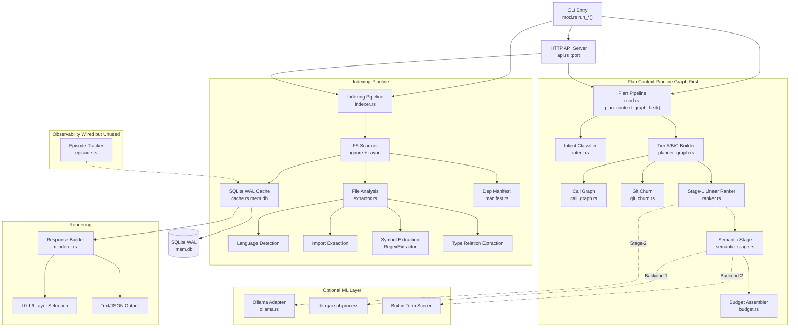

# Code Review: RTK Memory Layer Architecture

**Date**: 2026-02-19T21:00:00
**Reviewer**: IT Architect Agent
**Scope**: `src/memory_layer/` -- 16 modules (mod.rs, api.rs, budget.rs, cache.rs, call_graph.rs, episode.rs, extractor.rs, git_churn.rs, indexer.rs, intent.rs, manifest.rs, planner_graph.rs, ranker.rs, renderer.rs, semantic_stage.rs, ollama.rs)

## Executive Summary

The RTK Memory Layer is a well-structured, incrementally evolved system that provides project-aware context injection for LLM coding agents. The architecture is fundamentally sound -- it follows a clear pipeline (index -> rank -> budget -> render) with good separation of concerns across 16 modules. The graph-first pipeline (PRD R1-R4) is a significant improvement over the legacy flat scan. However, there are several architectural concerns: (1) excessive DB connection churn from `open_mem_db()` being called per-operation rather than per-request, (2) the call graph builds an O(S*F) cross-product on every plan request, (3) the `mod.rs` file at 3751 lines is a maintenance burden, and (4) the episode system is fully wired but never invoked from production code paths.

## Architectural Diagram

## Requirements Compliance

| Requirement | Status | Notes |
|---|---|---|
| PRD R1: Graph-first Tier A/B/C pipeline | OK | Implemented in `planner_graph.rs` with noise filter, hard cap |
| PRD R2: Semantic search stage | OK | `semantic_stage.rs` with rgai + builtin fallback ladder |
| PRD R3: Fusion scoring (0.65g + 0.35s) | OK | Applied in `planner_graph.rs` line ~240 |
| PRD R4: Telemetry fields | OK | pipeline_version, semantic_backend_used, counts |
| PRD R1 hard cap (60 candidates) | OK | Configurable via `plan_candidate_cap` |
| Budget-aware knapsack assembly | OK | `budget.rs` with min-1 guarantee |
| Fail-open to legacy | OK | `plan_fail_open` flag, graceful fallback |
| Cascade invalidation (E3.2) | OK | Import edge graph in `artifact_edges` table |
| Event-driven file watching (E3.1) | OK | `notify` crate with debounce |
| HTTP API (E4.1) | OK | Sync HTTP/1.1 server, PID guard, bounded threads |
| Feature flags (E6.4) | OK | AND-only masking, 8 flags |
| Episodic memory (E8.1) | WARN | Schema + logic complete, but never called from production |
| Ollama ML adapter (E9.2) | OK | Graceful fallback, None on any error |

## Architectural Assessment

### Strengths

1. **Clean pipeline separation**: The index-rank-budget-render pipeline is well decomposed. Each stage has a single responsibility and clear inputs/outputs.

2. **Defensive fail-open design**: Every optional component (Ollama, semantic stage, git churn) degrades gracefully. The system never panics or blocks on external failures.

3. **Incremental indexing**: The `build_incremental_files()` approach with hash-based change detection avoids full rescans. Combined with the `ignore` crate for gitignore-aware traversal and `rayon` for parallel hashing, this is performant.

4. **Configurable feature flags**: The `MemFeatureFlags` AND-only masking pattern is correct -- flags can only disable, never re-enable what the query type already disabled.

5. **Comprehensive test coverage**: 196 tests passing across the module. Budget, intent, ranker, call_graph, cache, and semantic_stage all have thorough unit tests.

6. **SQLite WAL with retry**: WAL mode + busy_timeout + explicit retry with exponential backoff handles multi-agent concurrency correctly.

### Concerns

1. **CRITICAL: DB connection churn** (`cache.rs:52-68`): `open_mem_db()` opens a fresh SQLite connection on every call. In a single `plan_context_graph_first` invocation, this happens 5-8 times (build_state, store_artifact, store_import_edges, record_cache_event, record_event, load_churn, etc.). Each open triggers PRAGMA setup + schema init. At scale, this is wasteful.

2. **HIGH: O(S*F) call graph construction** (`call_graph.rs:48-62`): `build_from_content()` iterates every file against every known symbol with `content.contains()`. For a project with 500 files and 2000 symbols, that is 1,000,000 string searches. This is rebuilt on every plan request.

3. **HIGH: mod.rs is 3751 lines**: This file contains type definitions, CLI entry points, helper functions, hook management, setup/devenv wizards, and 500+ lines of tests. It should be split into at least 3 files: types.rs, cli.rs, hooks.rs.

4. **MEDIUM: Episode system is dead code** (`episode.rs`): `start_episode()` and `record_episode_event()` are marked `#[allow(dead_code)]` with comments "wired up via mod.rs in future". The schema tables exist but are never populated in production. This is technical debt.

5. **MEDIUM: Duplicate noise filters** (`mod.rs:1050-1120` vs `planner_graph.rs:20-80`): Both `is_low_signal_candidate()` and `is_noise()` implement overlapping file exclusion logic with slightly different rules. The legacy pipeline uses one, graph-first uses the other. This risks divergence.

6. **MEDIUM: Call graph regex is naive** (`call_graph.rs:95-130`): `has_call_site()` uses simple string `contains()` matching. "store_artifact" in a comment or string literal counts as a call site. False positives are bounded by the cross-product but not eliminated.

7. **LOW: Churn cache uses global static** (`git_churn.rs:46-50`): `OnceLock<Mutex<HashMap>>` persists across the process lifetime. For the CLI (short-lived), this is fine. For the HTTP API server (long-running), stale entries accumulate. The HEAD SHA invalidation helps but doesn't clean up old repo keys.

### Recommendations

1. **Connection pooling**: Replace per-call `open_mem_db()` with a request-scoped connection passed through the pipeline. Alternatively, use a `thread_local!` connection pool with lazy init.

2. **Cache call graph per HEAD SHA**: The call graph is deterministic for a given HEAD. Cache it alongside `ChurnCache` and invalidate on new commits.

3. **Split mod.rs**: Move types to `types.rs`, CLI run_* functions to `cli.rs`, hook management to `hooks.rs`. Keep `mod.rs` as the re-export hub.

4. **Unify noise filters**: Extract a single `CandidateFilter` trait or function used by both legacy and graph-first pipelines. Parameterize tier-specific behavior via an enum.

5. **Decide on episodes**: Either wire up episode recording in `plan_context_graph_first()` or remove the dead code. Current state accumulates schema complexity with zero value.

## Quality Scores

| Criterion | Score | Justification |
|---|---|---|
| Code Quality | 78/100 | Good naming, consistent error handling with anyhow. Comments explain "why". Deducted for mod.rs size, dead code, duplicate logic. |
| Extensibility | 82/100 | Feature flags, configurable caps, plugin-style backends (Ollama, rgai, builtin). Deducted for tight coupling between plan pipelines. |
| Security | 85/100 | API server is localhost-only, body size capped at 1MB, bounded threads (32), PID guard. No auth needed for localhost. No SQL injection risk (parameterized queries). |
| Performance | 68/100 | Incremental indexing + WAL good. Deducted heavily for O(S*F) call graph, DB connection churn, and uncached call graph on every request. |
| Architecture | 75/100 | Pipeline is clean but mod.rs bloat, duplicate filters, and dead episode code reduce clarity. Diagram above shows good component boundaries. |
| Deploy Cleanliness | 88/100 | No hardcoded secrets, configurable via config.toml, proper env var overrides. .rtk-lock files in gitignore. Thread-local test isolation. |
| **TOTAL** | **79/100** | Solid foundation with clear growth path. Performance and code organization are the main improvement areas. |

## Critical Issues (Must Fix)

1. **DB connection churn in hot path** (`cache.rs:52-68`): Every `open_mem_db()` call creates a new connection with 3 PRAGMAs and a full schema init check. In the plan pipeline, this happens 5-8 times per request. Solution: pass a `&Connection` through the pipeline or use a thread-local cached connection.

2. **O(S*F) call graph on every plan request** (`call_graph.rs:48-62`, `planner_graph.rs:120`): `CallGraph::build()` reads every source file and searches for every symbol. For 500 files * 2000 symbols = 1M string searches plus file I/O. This should be cached per HEAD SHA like `ChurnCache`.

## Recommendations (Should Fix)

1. **Split mod.rs** (3751 lines): Extract at minimum: type definitions -> `types.rs`, hook install/uninstall -> `hooks.rs`, setup/devenv -> `setup.rs`. Current file is difficult to navigate.

2. **Unify noise filters**: `is_low_signal_candidate()` in mod.rs and `is_noise()` in planner_graph.rs implement overlapping logic. Consolidate into a single parameterized filter to prevent rule divergence.

3. **Wire or remove episodes**: `episode.rs` has 4 public functions all marked `#[allow(dead_code)]`. Either integrate into the plan pipeline for debugging telemetry or remove to reduce maintenance surface.

4. **Token estimation accuracy** (`budget.rs:19-31`): `estimate_tokens_for_path()` uses a fixed 14 tokens/line heuristic. For Rust with long type signatures this underestimates; for Python it overestimates. Consider language-aware multipliers.

## Minor Suggestions (Nice to Have)

1. **Call graph false positive reduction** (`call_graph.rs:95`): The `contains()` check matches symbols in comments and strings. A lightweight lexer pass (skip lines starting with `//`, `#`, triple-quotes) would reduce false positives.

2. **Churn cache cleanup for API server** (`git_churn.rs:46-50`): The global `CHURN_CACHE` never evicts old repo entries. Add an LRU or TTL eviction for the long-running API server use case.

3. **Ollama host parsing** (`ollama.rs:38`): `host.parse::<SocketAddr>()` fails for hostnames like "localhost:11434". Use `ToSocketAddrs` instead for DNS resolution support.

4. **Semantic stage subprocess** (`semantic_stage.rs:56-70`): The semantic stage spawns `rtk rgai` as a child process. For the HTTP API server, this creates a new process per plan request. Consider an in-process rgai integration path.

5. **Build-time schema validation**: The SQLite schema in `cache.rs` is a raw string. Consider generating it from a migration file or adding a schema version check beyond `ARTIFACT_VERSION`.
