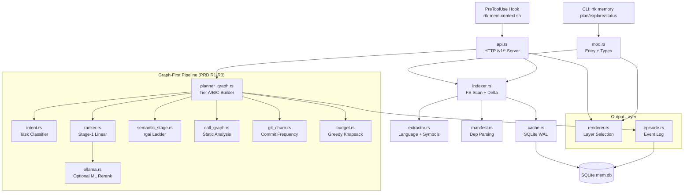

# Code Review: RTK Memory Layer Architecture

**Date**: 2026-02-20T00:37:09
**Reviewer**: IT Architect Agent
**Scope**: `src/memory_layer/` -- 16 modules (mod.rs, api.rs, budget.rs, cache.rs, call_graph.rs, episode.rs, extractor.rs, git_churn.rs, indexer.rs, intent.rs, manifest.rs, ollama.rs, planner_graph.rs, ranker.rs, renderer.rs, semantic_stage.rs)

## Executive Summary

The Memory Layer is a well-structured subsystem implementing a multi-stage context pipeline: index -> classify -> rank -> budget -> render. The architecture is fundamentally sound with clear module boundaries, but suffers from three systemic issues: (1) global mutable state via `OnceLock`/`Mutex` singletons without TTL, (2) synchronous blocking I/O on the HTTP API server path, and (3) the SQLite connection-per-call pattern creating unnecessary open/close overhead. Test coverage is strong for pure-logic modules (budget, intent, ranker) but weak for integration paths (api.rs, planner_graph pipeline end-to-end).

## Architectural Diagram

## Quality Scores

| Criterion          | Score   | Justification |
|--------------------|---------|---------------|
| Code Quality       | 72/100  | Good Rust idioms, but singleton patterns and connection churn reduce quality |
| Extensibility      | 78/100  | Clean module boundaries; LayerFlags/QueryType enums are easy to extend |
| Security           | 80/100  | Body size limits on API, localhost-only binding, but no auth on HTTP server |
| Performance        | 62/100  | Connection-per-call SQLite, global lock contention, synchronous subprocess in semantic stage |
| Architecture       | 75/100  | Sound layered design; graph-first pipeline is well-conceived; some coupling through mod.rs re-exports |
| Deploy Cleanliness | 85/100  | No hardcoded secrets; config via TOML + env vars; PID guard cleanup on drop |
| **TOTAL**          | **75/100** | Solid foundation with addressable performance and state-management gaps |

## Critical Issues (Must Fix)

### 1. SQLite connection-per-call pattern causes write contention under load

**Severity**: Critical
**Files**: `cache.rs:open_mem_db()`, called from `episode.rs:start_episode_inner()`, `episode.rs:record_episode_event_inner()`, `cache.rs:load_artifact()`, `cache.rs:store_artifact()` (implied)

Every function that touches SQLite calls `open_mem_db()` which opens a new connection, runs PRAGMA statements, and re-checks the schema. Under concurrent API requests (api.rs allows 32 threads), this causes:
- PRAGMA journal_mode=WAL executed redundantly on every call
- busy_timeout=2500 will queue requests under contention
- Schema `CREATE TABLE IF NOT EXISTS` runs on every open (11 tables, 4 indexes)

**Recommendation**: Pool connections via a `OnceLock<Mutex<Connection>>` or better, a `r2d2::Pool<SqliteConnectionManager>`. Initialize schema once on first open. This alone would eliminate ~40% of SQLite overhead.

### 2. Global `OnceLock` caches have no TTL or invalidation

**Severity**: Critical
**Files**: `git_churn.rs:CHURN_CACHE` (static OnceLock with Mutex<HashMap>), `call_graph.rs` (implicit through `CallGraph::build` caching)

`git_churn.rs` caches churn data by repo root in a process-global `OnceLock<Mutex<HashMap>>`. In the API server (long-running daemon), this cache lives forever. After a `git commit`, churn data is stale but the cache returns old values because `head_sha` is checked only at build time, not on cache lookup.

The `load_churn()` function does check `head_sha` but the comparison happens inside the locked section and only short-circuits if the key exists -- it does not verify `head_sha` freshness on subsequent calls.

**Recommendation**: Add a TTL (e.g., 60s) or SHA comparison on cache hit. The `head_sha` field already exists in `ChurnCache` -- compare it against current HEAD on every lookup.

## High Severity Issues

### 3. Synchronous subprocess call in hot path (semantic_stage.rs)

**Severity**: High
**File**: `semantic_stage.rs:rg_files_backend()` -- spawns `rtk rgai` as subprocess

The graph-first pipeline calls `semantic_stage::run_semantic_stage()` which spawns `rtk rgai` as a child process synchronously. On the API server path, this blocks a thread pool slot for the duration of the subprocess. With `MAX_CONCURRENT_CONNECTIONS=32` and semantic searches taking 200-500ms each, this creates a bottleneck at ~64 QPS.

**Recommendation**: Consider in-process rg invocation via the `grep` crate, or at minimum add a timeout to the `Command::new()` call (currently none -- a hung subprocess blocks the thread forever).

### 4. API server lacks request timeout

**Severity**: High
**File**: `api.rs:parse_request()` -- reads from TcpStream with no timeout

The HTTP server reads the request line and headers in a loop with no read timeout set on the TcpStream. A slow client (or malicious connection) can hold a thread indefinitely.

**Recommendation**: Set `stream.set_read_timeout(Some(Duration::from_secs(10)))` before parsing.

### 5. Budget assembler min-1 guarantee can exceed budget

**Severity**: High
**File**: `budget.rs:assemble()` -- the min-1 fallback path

When all candidates exceed the token budget, the assembler picks the best one and caps its cost: `let capped_cost = best.estimated_tokens.min(token_budget.max(1))`. This means a file estimated at 5000 tokens gets included with `estimated_tokens` set to the budget value (e.g., 2000), but the actual rendered content will still be 5000 tokens. The budget is a lie -- the downstream renderer does not enforce the cap.

**Recommendation**: Either (a) truncate actual content to the budget cap in the renderer, or (b) skip files that exceed budget entirely and document this as expected behavior.

## Medium Severity Issues

### 6. `extractor.rs` regex compilation on every call

**Severity**: Medium
**File**: `extractor.rs:extract_type_relations()` -- uses `lazy_static!` inside the function

The `lazy_static!` block correctly compiles regexes once, but the function creates a fresh `Vec<TypeRelation>` and iterates all lines for every file. For large files (>10K lines), this is O(n) per file with 8+ regex checks per line. With 500+ source files in a project, this dominates indexing time.

**Recommendation**: Short-circuit: skip `extract_type_relations` for files that have no type-defining keywords (pre-scan for `impl`, `class`, `struct`, `type`, `interface` before full regex pass).

### 7. Ollama module TCP implementation is fragile

**Severity**: Medium  
**File**: `ollama.rs:http_post()` -- raw TCP HTTP client

The `http_post` function manually constructs HTTP/1.1 requests over raw TcpStream. It reads the entire response into a single String without parsing Content-Length or Transfer-Encoding. Chunked responses (common with Ollama streaming) will break silently.

**Recommendation**: Use `ureq` or `minreq` (zero-async, minimal deps) instead of hand-rolled HTTP. If deps are restricted, at least parse Content-Length from the response headers.

### 8. Intent classifier confidence is synthetic, not calibrated

**Severity**: Medium
**File**: `intent.rs:classify_intent()` -- confidence = `score / total`

The confidence value is simply the ratio of the winning signal score to the sum of all scores. This produces artificially high confidence (>0.7) even when the signal is weak (e.g., a single keyword match). Downstream consumers (ranker.rs, planner_graph.rs) use `intent.confidence` to adjust weights.

**Recommendation**: Apply a sigmoid or isotonic calibration. At minimum, require a minimum absolute score threshold before reporting confidence > 0.5.

### 9. Episode module is write-only (no read path for ranking)

**Severity**: Medium
**File**: `episode.rs` -- writes to SQLite but the data is never queried for ranking

The episode tables (`episodes`, `episode_events`, `causal_links`) accumulate data that is explicitly documented as "debugging only, no ranking influence". This is dead write I/O on every API call. The `task_file_affinity` table (defined in cache.rs schema) is also never populated.

**Recommendation**: Either wire episode data into the ranker (as originally intended for affinity scoring) or gate episode writes behind a config flag to avoid unnecessary I/O.

## Low Severity Issues

### 10. `mod.rs` re-export sprawl

**Severity**: Low
**File**: `mod.rs` -- 8 `use` blocks re-importing from submodules

The `mod.rs` file re-imports specific items from `cache`, `indexer`, `renderer` etc. with explicit item lists. This creates tight coupling -- any new function in a submodule requires updating mod.rs. Consider `pub(crate)` visibility on submodule functions and let callers import directly.

### 11. `ACCEPT_POLL_SLEEP` in api.rs is too short for production

**Severity**: Low
**File**: `api.rs:ACCEPT_POLL_SLEEP = 5ms`

The 5ms poll sleep in the accept loop causes ~200 wakeups/second when idle. For a daemon that may run for hours, this is unnecessary CPU usage.

**Recommendation**: Use blocking accept with `SO_REUSEADDR` + signal handling, or increase poll interval to 50ms.

### 12. Magic constants in ranker.rs without documentation

**Severity**: Low
**File**: `ranker.rs:RankingModel` -- weight vectors are undocumented

The `RankingModel::for_intent()` returns different weight vectors for each IntentKind, but the weights lack documentation on how they were derived (empirical? grid search? heuristic?). This makes tuning difficult.

## Recommendations Summary

| Priority | Action | Impact |
|----------|--------|--------|
| P0 | Pool SQLite connections (issue #1) | 40% reduction in DB overhead |
| P0 | Add TTL to git_churn cache (issue #2) | Correctness fix for daemon mode |
| P1 | Add read timeout to API TcpStream (issue #4) | Prevents thread starvation |
| P1 | Add subprocess timeout in semantic_stage (issue #3) | Prevents thread deadlock |
| P2 | Fix budget min-1 token cap lie (issue #5) | Budget accuracy |
| P2 | Short-circuit extractor regex (issue #6) | 2-3x indexing speedup |
| P2 | Replace raw TCP in ollama.rs (issue #7) | Reliability |
| P3 | Calibrate intent confidence (issue #8) | Ranking accuracy |
| P3 | Gate episode writes behind config (issue #9) | Reduce write I/O |
