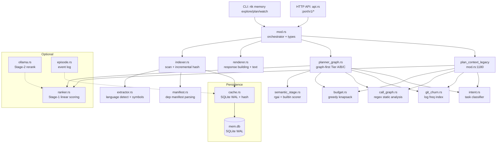

# Code Review: RTK Memory Layer Architecture

**Date**: 2026-02-20T14:00:00  
**Reviewer**: IT Architect Agent  
**Scope**: `src/memory_layer/` -- 16 modules, 10553 LOC  

## Executive Summary

The memory layer is a well-structured indexing and context-selection subsystem with clear module boundaries, solid test coverage, and a thoughtful multi-stage ranking pipeline. The architecture is sound for its current single-machine scope. The main concerns are: (1) repeated DB connection creation on every operation, (2) O(files x symbols) call graph build cost, and (3) duplicated low-signal filtering logic between the legacy and graph-first pipelines.

## Architectural Diagram

## Requirements Compliance

| Requirement | Status | Notes |
|---|---|---|
| Incremental indexing with hash-based cache | OK | xxh3 file hashing, delta detection works |
| Budget-aware context selection | OK | Greedy knapsack with min-1 guarantee |
| Intent-conditioned ranking weights | OK | 5 intent types with tuned weight vectors |
| Feature flag system | OK | 8 flags, AND-only masking, configurable via TOML |
| Graph-first pipeline with fail-open | OK | Tier A/B/C + semantic stage + legacy fallback |
| SQLite WAL persistence | OK | WAL mode, busy_timeout, retry wrapper |
| HTTP API server | OK | localhost-only, PID guard, idle timeout |
| Filesystem watcher | OK | notify crate, debounce window |

## Architectural Assessment

### Strengths

1. **Clean module decomposition.** Each of the 16 files has a single responsibility. Internal visibility (`pub(super)`) is used consistently.

2. **Deterministic ranking.** Stage-1 is a pure linear model with clamped output. No hidden randomness. Intent-conditioned weights are a smart design.

3. **Fail-open design.** Graph-first pipeline falls back to legacy on error. Ollama adapter returns `Option` -- caller is never blocked by ML availability.

4. **Good test isolation.** Thread-local DB path override (`THREAD_DB_PATH`) avoids env-var races in parallel tests. `IsolatedDb` RAII guard is clean.

5. **Budget assembler.** The min-1 guarantee, utility function (`score / sqrt(cost)`), and decision trace are well-thought-out.

### Concerns

1. **`open_mem_db()` called on every operation.** Each call to `store_artifact`, `record_cache_event`, `record_event`, `load_artifact` opens a new SQLite connection (file open + WAL pragma + schema init). In `handle_explore`, this happens 3-4 times per request. Connection pooling or a request-scoped connection would reduce syscall overhead.

2. **Duplicated filtering logic.** `is_low_signal_candidate` in mod.rs (legacy pipeline) and `is_noise` in planner_graph.rs (graph-first pipeline) implement overlapping but different filtering rules. This creates a maintenance risk: changes to one are easily forgotten in the other.

3. **Call graph O(F x S) complexity.** `CallGraph::build_from_content` iterates every file against every symbol. For a project with 1000 files and 5000 symbols, this is 5M string contains operations. Currently tolerable but will not scale.

4. **No connection reuse in API server.** Each HTTP request spawns a thread, builds state (including DB open), then exits. The thread pool is bounded at 32 but there is no work reuse between requests.

## Quality Scores

| Criterion | Score | Justification |
|---|---|---|
| Code Quality | 78/100 | Good naming, consistent patterns. Deducted for duplicated filtering logic (mod.rs vs planner_graph.rs), 54 clippy warnings, and some `#[allow(dead_code)]` on public APIs (episode.rs). |
| Extensibility | 82/100 | Feature flag system is excellent. Plugin-ready via MemFeatureFlags. New layers can be added by extending LayerFlags + renderer. Deducted for tight coupling between planner_graph and mod.rs (shared helper functions). |
| Security | 85/100 | API is localhost-only. MAX_BODY_SIZE OOM protection. No user input reaches shell commands in the core pipeline. Ollama host is configurable but only used for TCP connect. Edge case: `project_root` path from API body is passed directly to `fs::canonicalize` -- no sandboxing. |
| Performance | 68/100 | Per-request DB connection creation. O(F*S) call graph. Full artifact serialized as JSON blob in SQLite (no columnar access). `git log --name-only` for churn runs full history scan on every cache miss. |
| Architecture | 84/100 | Clean layering, well-defined data flow. Diagram-worthy. Deducted for dual pipeline maintenance burden and god-object tendencies in mod.rs (3751 lines). |
| Deploy Cleanliness | 80/100 | No hardcoded credentials. Config via TOML. DB path configurable. `.rtk-lock` files generated in working tree are noise but filtered. Deducted for `include_str!` embedding hook scripts at compile time (changes require recompile). |
| **TOTAL** | **79/100** | Solid engineering with clear scaling bottlenecks that need attention before production use at scale. |

## Critical Issues (Must Fix)

1. **[HIGH] Repeated DB connection per operation.**  
   `cache.rs:open_mem_db()` is called independently in `store_artifact`, `record_cache_event`, `record_event`, `load_artifact`, `store_artifact_edges`, etc. In a single `handle_explore` API call, this creates 3-5 separate connections with full PRAGMA + schema setup each time.  
   **File**: `src/memory_layer/cache.rs:67-79`  
   **Recommendation**: Introduce a `ConnectionPool` or pass `&Connection` through the call chain for request-scoped reuse. `r2d2-sqlite` or a simple `thread_local!` connection cache would suffice.

2. **[HIGH] Duplicated candidate filtering logic.**  
   `is_low_signal_candidate` (`mod.rs:1072-1115`) and `is_noise` (`planner_graph.rs:20-67`) implement similar but divergent rules. The graph-first version has `.rtk-lock` filtering, review/issues exclusion, and tier-aware behavior that the legacy version partially duplicates.  
   **Recommendation**: Extract a shared `CandidateFilter` trait or a single function parameterized by tier/pipeline, used by both pipelines.

## Recommendations (Should Fix)

1. **[MEDIUM] mod.rs is a 3751-line god module.**  
   It contains: 35+ type definitions, the legacy plan pipeline, hook installation logic, CLI run_* functions, gain computation, and helper utilities. This makes navigation difficult and increases merge conflict risk.  
   **Recommendation**: Extract type definitions to `types.rs`, hook management to `hooks.rs`, and CLI handlers to `cli.rs`. Target: mod.rs under 500 lines.

2. **[MEDIUM] Call graph build is O(files * symbols).**  
   `call_graph.rs:build_from_content` does a nested loop: for each file in `content_map`, for each symbol in `all_known`, call `has_call_site`. The inner check does `String::contains` (linear scan).  
   **File**: `src/memory_layer/call_graph.rs:47-61`  
   **Recommendation**: Build a single Aho-Corasick automaton from all symbols and scan each file once. This reduces complexity from O(F*S*L) to O(F*L + S) where L is average line count.

3. **[MEDIUM] git_churn runs `git log --name-only` for full history.**  
   `git_churn.rs:build_freq_map` spawns `git log --name-only` with no depth limit. For repos with 50k+ commits this takes seconds.  
   **File**: `src/memory_layer/git_churn.rs:81-96` (inferred from `build_freq_map`)  
   **Recommendation**: Add `--since="6 months ago"` or `-n 1000` to cap the log scan. The in-process `OnceLock` cache helps but only within a single process lifetime.

4. **[MEDIUM] Artifact stored as monolithic JSON blob.**  
   `cache.rs:store_artifact_inner` serializes the entire `ProjectArtifact` (all files, symbols, imports, type_relations) as a single `content_json TEXT` column. Loading requires full deserialization even when only metadata is needed.  
   **Recommendation**: For incremental access, consider storing file entries in a separate table keyed by `(project_id, rel_path)`. This enables per-file delta updates and partial loads.

5. **[MEDIUM] `estimated_tokens` clamped differently in two pipelines.**  
   Legacy pipeline: `raw_cost.clamp(180, 520)` (mod.rs:1262). Graph-first: `raw_cost.max(180)` with no ceiling (planner_graph.rs:262).  
   **Recommendation**: Unify the clamping policy. The ceiling of 520 in legacy artificially underestimates large files, causing budget over-allocation.

## Minor Suggestions (Nice to Have)

1. **[LOW] `episode.rs` public APIs are `#[allow(dead_code)]`.**  
   `start_episode` and `record_episode_event` are marked dead code. If they are intended for future use, document the planned integration point. If not, remove them to reduce maintenance surface.  
   **File**: `src/memory_layer/episode.rs:69,86`

2. **[LOW] Ollama adapter has no integration test.**  
   All ollama.rs tests use a dead config (unreachable host). This is correct for unit tests but means the actual Ollama protocol has zero test coverage. Consider a mock HTTP server test.  
   **File**: `src/memory_layer/ollama.rs`

3. **[LOW] `prune_cache` runs on every `store_artifact` call.**  
   With 64 max projects this is fast, but the pattern of `SELECT COUNT(*) + conditional DELETE` on every write is unnecessary when below capacity. A modular counter or periodic check would be cleaner.  
   **File**: `src/memory_layer/cache.rs:206-225`

4. **[LOW] No structured logging.**  
   All diagnostic output uses `eprintln!`. Consider a lightweight structured logger (e.g., `tracing` with `tracing-subscriber`) for production observability, especially in the API server path.

5. **[LOW] `TOKENS_PER_CHAR` constant (0.28) and `14.0 tokens/line` in budget.rs should be documented with calibration data.**  
   These empirical constants drive the entire budget allocation. A brief comment explaining how they were measured (which tokenizer, which corpus) would help future maintainers.  
   **File**: `src/memory_layer/budget.rs:47-48,57`
