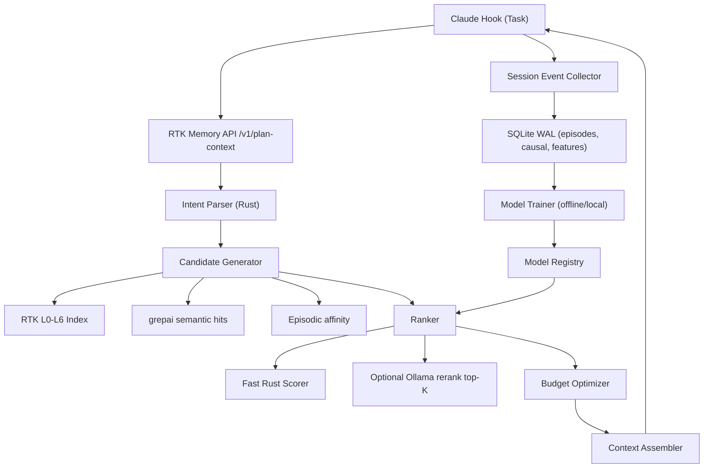

# PRD: RTK Intent Memory Graph (IMG) — Target Implementation (Decision Locked)

**Дата**: 2026-02-18  
**Статус**: Decision Locked (Target, non-MVP)  
**Продукт**: `rtk memory` + `grepai` + `ollama` (локально)  
**Базовая версия**: RTK Memory Layer v4 (SQLite WAL, L0-L6, API `/v1/*`)

## 0. Резюме

Текущий RTK Memory Layer решает структурный кэш и freshness. Следующий уровень уникальности — превратить его в
**Agent Decision Engine**, который:

1. Понимает задачу (task-conditioned retrieval), а не только `query_type`.
2. Помнит, что делали прошлые агентные сессии (episodic + causal memory).
3. Собирает контекст под заданный токен-бюджет (budget-aware context assembly).
4. Использует локальный ML контур (`grepai` + `ollama`) без cloud-зависимостей.

Цель: перейти от "быстрого индексатора" к "системе принятия контекстных решений для LLM-агентов".

---

## 1. Problem Statement

### 1.1 Текущий лимит системы

Сейчас `rtk memory` эффективно снижает re-exploration cost за счет L0-L6 и incremental invalidation, но:

1. Контекст подбирается rule-based по `query_type`, без учета фактического task intent.
2. Память о работе агента отсутствует: следующий агент не знает, какие файлы уже проверяли и почему.
3. Детализация (`compact|normal|verbose`) статична и не оптимизируется под реальный token budget.
4. Нет причинно-следственного контура: issue/task -> read path -> edit path -> outcome.

### 1.2 Почему аналоги не закрывают это

`ctags`, LSP и Sourcegraph индексируют код для навигации человека, но не хранят:

1. Историю шагов агента и успешных/неуспешных траекторий.
2. Runtime-решение "какой контекст дать именно под эту задачу и этот бюджет".
3. Локальный closed-loop learning на уровне агентных сессий.

---

## 2. Product Goals

## 2.1 Primary goals

1. **Task relevance uplift**: +25% к precision@10 релевантных файлов против текущего `query_type` routing.
2. **Token efficiency uplift**: еще -30% median context tokens относительно текущего `rtk memory explore --detail compact`.
3. **First-pass success uplift**: +20% доли сессий, где исправление найдено без второй полной re-explore итерации.
4. **Causal trace completeness**: >=90% сессий с полной цепочкой `task -> reads -> edits -> outcome`.
5. **Reliability parity**: сохранить tri-state freshness policy (`FRESH|STALE|DIRTY`) с `stale incidents = 0`.

## 2.2 Performance/SLO goals

1. `POST /v1/plan-context` p95 <= 150ms (без Ollama rerank).
2. `POST /v1/plan-context` p95 <= 900ms (с Ollama rerank top-K).
3. Cache-hit ratio >= 85% на активных проектах.
4. Multi-agent write contention: `SQLITE_BUSY` recover rate >= 99.9% (через retry/backoff + WAL).

## 2.3 Non-goals

1. Облачный shared cache между машинами.
2. Полный AST/CFG для всех языков (оставляем hybrid extractor, расширяем точечно).
3. Замена grepai/LSP как универсального IDE backend.

---

## 3. Users & Use Cases

1. **Primary**: 2-10 локальных агентных сессий на одном проекте (bugfix, refactor, incident).
2. **Secondary**: одиночная локальная сессия с жестким токен-бюджетом.
3. **Power user**: инженер с локальным Ollama и grepai, желающий оффлайн ML-улучшения без отправки кода в облако.

Ключевые сценарии:

1. `bugfix` с историей похожих прошлых инцидентов.
2. `incident response` с приоритетом delta + deps + risky interfaces.
3. `feature implementation` с авто-подбором модулей и тестовой карты.
4. `refactor` с blast-radius на основе causal graph и task/file affinity.

---

## 4. Architecture Principles (ADR-first)

Все спорные архитектурные решения фиксируются в ADR до реализации.

Связанные ADR:

1. `docs/adr/ADR-0001-intent-memory-graph.md`
2. `docs/adr/ADR-0002-hybrid-retrieval-ranking.md`
3. `docs/adr/ADR-0003-local-ml-ollama.md`
4. `docs/adr/ADR-0004-budget-aware-context.md`
5. `docs/adr/ADR-0005-episodic-causal-memory.md`

Правило: изменение контракта API/схемы БД/модели ранжирования без обновления ADR запрещено.

---

## 5. Target Architecture



### 5.1 Компоненты

1. **Intent Parser (Rust)**: нормализует task, извлекает intent tags, risk class, predicted task_type.
2. **Candidate Generator**: объединяет candidates из структурных индексов RTK, grepai и episodic memory.
3. **Ranker (2-stage)**:
1. Stage-1: deterministic Rust scorer (быстрый, всегда доступен).
2. Stage-2: Ollama rerank для top-K (опционально, по latency budget).
4. **Budget Optimizer**: pack контекста по ценности на токен, учитывая hard budget.
5. **Session Event Collector**: пишет reads/edits/outcome и causal links.
6. **Model Trainer**: локальное переобучение веса ранжирования по данным сессий.

---

## 6. Data Model (SQLite WAL, schema v5)

Существующие таблицы сохраняются: `projects`, `artifacts`, `artifact_edges`, `cache_stats`, `events`.

Новые таблицы:

1. `episodes`
1. `session_id TEXT PRIMARY KEY`
2. `project_id TEXT NOT NULL`
3. `task_text TEXT NOT NULL`
4. `task_fingerprint TEXT NOT NULL`
5. `query_type TEXT NOT NULL`
6. `started_at INTEGER NOT NULL`
7. `ended_at INTEGER`
8. `outcome TEXT` (`success|partial|failed|unknown`)
9. `token_budget INTEGER`
10. `token_used INTEGER`
11. `latency_ms INTEGER`

2. `episode_events`
1. `id INTEGER PRIMARY KEY AUTOINCREMENT`
2. `session_id TEXT NOT NULL`
3. `event_type TEXT NOT NULL` (`read|edit|grepai_hit|delta|decision|feedback`)
4. `file_path TEXT`
5. `symbol TEXT`
6. `payload_json TEXT`
7. `timestamp INTEGER NOT NULL`

3. `task_file_affinity`
1. `task_fingerprint TEXT NOT NULL`
2. `file_path TEXT NOT NULL`
3. `reads INTEGER NOT NULL DEFAULT 0`
4. `edits INTEGER NOT NULL DEFAULT 0`
5. `success_edits INTEGER NOT NULL DEFAULT 0`
6. `last_seen INTEGER NOT NULL`
7. `weight REAL NOT NULL DEFAULT 0.0`
8. `PRIMARY KEY (task_fingerprint, file_path)`

4. `causal_links`
1. `id INTEGER PRIMARY KEY AUTOINCREMENT`
2. `session_id TEXT NOT NULL`
3. `issue_ref TEXT`
4. `commit_sha TEXT`
5. `change_path TEXT NOT NULL`
6. `change_kind TEXT NOT NULL` (`added|modified|removed`)
7. `rationale TEXT`
8. `timestamp INTEGER NOT NULL`

5. `model_registry`
1. `model_id TEXT PRIMARY KEY`
2. `model_kind TEXT NOT NULL` (`rust_linear|ollama_rerank`)
3. `version TEXT NOT NULL`
4. `params_json TEXT NOT NULL`
5. `created_at INTEGER NOT NULL`
6. `active INTEGER NOT NULL DEFAULT 0`

Индексы:

1. `idx_episodes_project_time(project_id, started_at DESC)`
2. `idx_episode_events_session(session_id, timestamp)`
3. `idx_affinity_task_weight(task_fingerprint, weight DESC)`
4. `idx_causal_commit(commit_sha)`

---

## 7. Retrieval & ML Pipeline

## 7.1 Stage A: Intent normalization

Вход: `task`, `project_root`, optional `query_type`, `token_budget`.

Шаги:

1. Нормализация текста задачи (lemmatization-light, stopword trim, entity extraction).
2. Классификация intent (`bugfix|feature|refactor|incident|unknown`) через Rust rules + optional Ollama classify.
3. Построение `task_fingerprint` (stable hash normalized task + repo id + intent tags).

## 7.2 Stage B: Candidate generation

Источники кандидатов:

1. `RTK Structural`: L0-L6, module index, type graph, test map, delta.
2. `grepai Semantic`: top-N по `grepai search --json --compact`.
3. `Episodic`: top-N по `task_file_affinity`.
4. `Causal`: файлы из `causal_links` для похожих fingerprints/issues.

Union + dedupe формирует candidate pool.

## 7.3 Stage C: Feature engineering (Rust)

Для каждого candidate считаются features:

1. `f_structural_relevance` (query_type layer match).
2. `f_semantic_score` (grepai score).
3. `f_affinity_score` (historical success-weighted usage).
4. `f_recency_score` (delta + recent edits).
5. `f_risk_score` (file criticality: auth/payment/core).
6. `f_test_proximity` (наличие рядом тестов и test edits history).
7. `f_token_cost` (estimated tokens contribution).

## 7.4 Stage D: Ranking

1. **Stage-1 (обязательный)**: Rust linear scorer, полностью детерминированный.
2. **Stage-2 (опциональный)**: Ollama rerank top-K с JSON-only scoring prompt.
3. Переключение Stage-2 по параметрам:
1. `ml_mode = off|fast|full`
2. `latency_budget_ms`
3. `token_budget` (малый бюджет -> агрессивнее rerank)

## 7.5 Stage E: Budget-aware assembly

Сборка как constrained optimization:

1. Hard cap: `sum(tokens_i) <= token_budget`.
2. Maximize: `sum(utility_i)` где `utility_i = relevance_i * confidence_i / token_cost_i`.
3. Greedy + tie-break by causal confidence и freshness.

Выход всегда включает:

1. `selected_context`
2. `dropped_candidates` (с причиной)
3. `budget_report`
4. `decision_trace` (почему именно эти слои/файлы выбраны)

---

## 8. API Contract (Target)

## 8.1 New endpoint: `POST /v1/plan-context`

Request:

```json
{
  "project_root": "/abs/path",
  "task": "bug: jwt token not refreshing on 401",
  "query_type": "bugfix",
  "token_budget": 3000,
  "latency_budget_ms": 500,
  "ml_mode": "fast",
  "detail": "compact",
  "strict": true,
  "session_id": "optional-client-session-id"
}
```

Response:

```json
{
  "cache_status": "hit",
  "freshness": "fresh",
  "intent": {
    "predicted": "bugfix",
    "confidence": 0.92,
    "task_fingerprint": "f7c9..."
  },
  "budget_report": {
    "token_budget": 3000,
    "estimated_used": 2860,
    "efficiency_score": 0.81
  },
  "context": {
    "layers": ["L1", "L3", "L5", "L6"],
    "files": ["src/auth.rs", "src/middleware.rs"],
    "text": "..."
  },
  "decision_trace": [
    "src/middleware.rs promoted by grepai_score+affinity",
    "src/auth.rs kept for API surface dependency"
  ],
  "dropped_candidates": [
    {"file": "docs/auth.md", "reason": "low utility per token"}
  ]
}
```

## 8.2 Episodic endpoints

1. `POST /v1/episode/start`
2. `POST /v1/episode/event`
3. `POST /v1/episode/end`
4. `POST /v1/feedback` (успех/неуспех + optional rationale)

## 8.3 Model endpoints

1. `POST /v1/model/train` (local async job)
2. `GET /v1/model/status`
3. `POST /v1/model/activate`

---

## 9. CLI Contract (Target)

Новые команды:

1. `rtk memory plan <project> --task "<text>" --token-budget 3000 [--ml-mode fast] [--json]`
2. `rtk memory episode start|event|end ...`
3. `rtk memory feedback --session <id> --outcome success --note "..."`
4. `rtk memory model train [--since 30d] [--min-samples 500]`
5. `rtk memory model status|activate <model-id>`

Совместимость:

1. `rtk memory explore/delta/refresh/watch/status/gain/serve` сохраняются.
2. `plan` не ломает существующие клиенты API v1.

---

## 10. Hook Integration (Claude)

## 10.1 PreToolUse:Task path

Текущий `hooks/rtk-mem-context.sh` расширяется:

1. извлекает `task prompt`;
2. вызывает `POST /v1/plan-context`;
3. prepend `context.text` + `decision_trace` в `updatedInput.prompt`.

## 10.2 Event capture path

Источники событий для episodic memory:

1. RTK command invocations (`read`, `grep`, `write`, `memory`).
2. `memory delta` между start/end сессии.
3. optional explicit feedback от пользователя/агента.

Если среда поддерживает PostToolUse hooks, подключается дополнительный collector без изменения контракта PRD.

---

## 11. Reliability & Concurrency

1. SQLite WAL + busy_timeout + exponential retry (сохраняем текущую стратегию).
2. Все критичные write-path операции оборачиваются в транзакции.
3. Model activation — atomic switch (`active=1` только для одного `model_id`).
4. Freshness gating обязателен и в `plan-context` (никаких stale artifacts).
5. При деградации ML (`grepai`/`ollama` недоступны) fallback на deterministic Rust ranking.

---

## 12. Security, Privacy, Compliance

1. Local-first: трафик только `localhost`.
2. Данные сессий не отправляются наружу.
3. Configurable redaction:
1. exclude paths (`secrets/`, `.env`, `*.pem`)
2. prompt payload sanitization
4. Model prompt guardrails:
1. JSON-only responses для Ollama rerank/classify
2. hard timeout + max tokens
5. Retention policy:
1. default 90 days for episodes/events
2. configurable purge job

---

## 13. Observability & Metrics

Новые метрики:

1. `plan_context_p50/p95_ms`
2. `context_tokens_median`
3. `first_pass_success_rate`
4. `affinity_hit_rate`
5. `rerank_invocation_rate`
6. `fallback_rate_ml_unavailable`
7. `causal_trace_completeness`

Отчеты:

1. `rtk memory gain` расширяется ML-полями.
2. `rtk memory status` показывает активную модель и episodic stats.

---

## 14. Release Gates (Target)

Release возможен только при выполнении всех условий:

1. **Gate G1 (Correctness)**: `stale incidents = 0` в stress-тесте.
2. **Gate G2 (Perf)**: p95 `/v1/plan-context` <= 150ms (ml_mode=off) на эталонных репо.
3. **Gate G3 (ML Value)**: +25% precision@10 vs baseline query_type routing.
4. **Gate G4 (Token)**: -30% median context tokens vs current `memory explore compact`.
5. **Gate G5 (Reliability)**: no data corruption в 8+ concurrent agents test.
6. **Gate G6 (Fallback)**: 100% functional fallback при выключенных grepai/ollama.

---

## 15. Test Strategy

1. Unit:
1. intent parser, feature calc, ranking, budget packer.
2. schema migration, retention purge.
2. Integration:
1. end-to-end `/v1/plan-context` с live mem.db.
2. grepai and ollama adapters with timeout/error simulation.
3. Chaos:
1. multi-process concurrent writes/reads
2. crash-recovery mid-episode
4. Offline replay benchmark:
1. исторические сессии -> compare baseline vs IMG.
5. Contract tests:
1. JSON schema compatibility для old/new endpoints.

---

## 16. Migration Plan

1. `ARTIFACT_VERSION` bump: `4 -> 5` (schema extension).
2. Zero-downtime migration:
1. create new tables with `IF NOT EXISTS`
2. backfill optional fields lazily
3. old API endpoints continue to operate
3. Hook migration:
1. `rtk memory install-hook` обновляет hook scripts atomically
2. rollback flag: `RTK_MEM_PLAN_CONTEXT=0`

---

## 17. Delivery Plan (Epics, target state)

1. **E7 Intent Engine Core**
1. parser, candidate generator, ranker, budget optimizer.
2. `/v1/plan-context` + `rtk memory plan`.
2. **E8 Episodic/Causal Memory**
1. episode tables + collector + feedback API.
2. affinity and causal graph builders.
3. **E9 ML Integration**
1. grepai adapter hardening.
2. ollama classifier/reranker adapters + fallback policy.
3. local training loop + model registry.
4. **E10 Hardening**
1. stress/chaos/perf suite.
2. security redaction, retention tooling.
3. docs + operational runbooks.

---

## 18. Risks & Mitigations

1. **Risk**: Ollama latency spikes.
1. **Mitigation**: strict timeout, stage-2 optional, fallback stage-1.
2. **Risk**: noisy episodic feedback ухудшает ranking.
1. **Mitigation**: confidence decay, min-sample threshold, canary model activation.
3. **Risk**: рост mem.db и деградация query speed.
1. **Mitigation**: retention jobs, partition-like pruning by project/time, covering indexes.
4. **Risk**: prompt injection через task text в rerank.
1. **Mitigation**: structured scoring prompts + sanitization + schema validation.

---

## 19. Final Product Decision

Продуктовая ставка фиксируется:

**RTK IMG = Structural Memory (L0-L6) + Episodic/Causal Memory + Budget-Aware Decision Engine + Local ML (grepai+ollama)**.

Это не очередной индексатор. Это локальная система принятия решений для агентной разработки, оптимизирующая качество контекста под задачу и бюджет в реальном времени.

